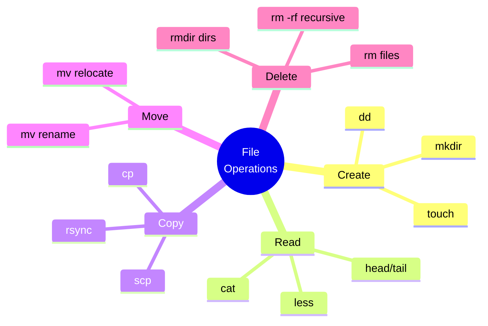
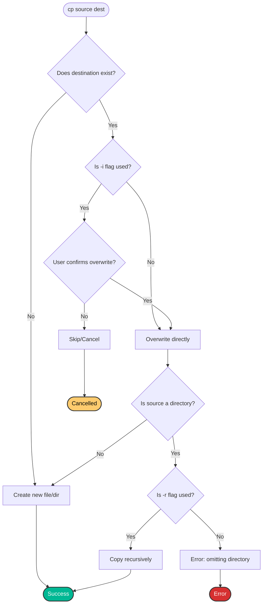
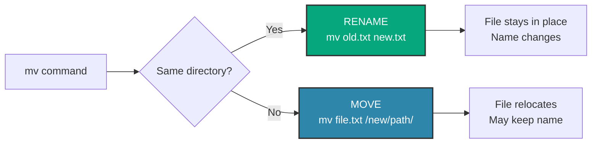
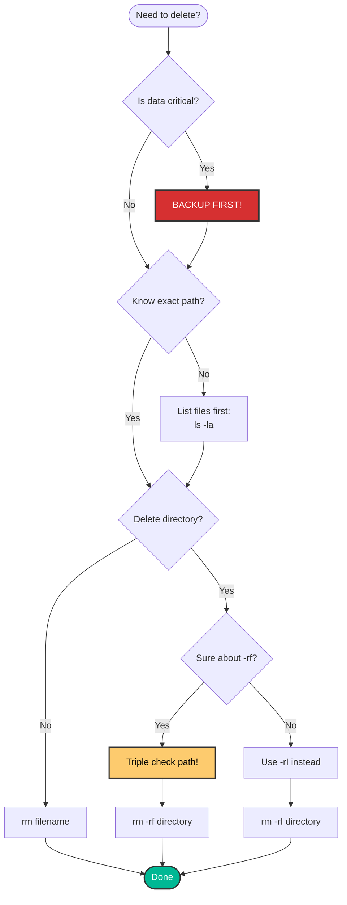

# 📁 Basic File Manipulation
> **"In DevOps, 80% of automation involves creating, moving, copying, and deleting files. Master these operations, and you've mastered the foundation."**
## 📚 Overview
File manipulation is the bread and butter of system administration and DevOps. Whether you're deploying applications, managing configurations, or organizing logs, you'll constantly be working with files and directories.

## 🎓 Learning Objectives
By the end of this module, you will:
- ✅ Create files and directories efficiently
- ✅ Copy files and directories with precision
- ✅ Move and rename files safely
- ✅ Delete files and directories correctly
- ✅ Understand file operation flags and options
- ✅ Execute safe file operations in production
## 🛠️ Essential File Commands
### Command Overview

## 📝 Creating Files: `touch`
### Basic Usage
```bash
# Create a single file
touch file.txt

# Create multiple files
touch file1.txt file2.txt file3.txt

# Create files with brace expansion
touch file{1..10}.txt

# Create files in subdirectory
touch /tmp/testfile.txt
```
### Advanced Usage
```bash
# Update timestamp only (don't create if doesn't exist)
touch -c existing_file.txt

# Set specific timestamp
touch -t 202601101200 file.txt  # YYYYMMDDhhmm

# Match timestamp of another file
touch -r reference.txt target.txt

# Update only access time
touch -a file.txt

# Update only modification time
touch -m file.txt
```
### Real-World DevOps Use Case
```bash
#!/bin/bash
# Create log rotation marker
LOG_DIR="/var/log/myapp"
MARKER="$LOG_DIR/.last_rotation"

# Check if rotation needed (marker older than 24 hours)
if [ ! -f "$MARKER" ] || [ $(find "$MARKER" -mtime +1) ]; then
    # Rotate logs
    mv "$LOG_DIR/app.log" "$LOG_DIR/app.log.$(date +%Y%m%d)"
    
    # Create new log
    touch "$LOG_DIR/app.log"
    
    # Update marker
    touch "$MARKER"
    
    echo "Logs rotated successfully"
fi
```
## 📂 Creating Directories: `mkdir`
### Basic Usage
```bash
# Create single directory
mkdir mydir

# Create multiple directories
mkdir dir1 dir2 dir3

# Create nested directories (parent directories automatically)
mkdir -p path/to/deep/directory

# Create with specific permissions
mkdir -m 755 secure_dir
```
### Directory Structure Creation
```bash
# Create project structure
mkdir -p project/{src,tests,docs,config}

# Result:
# project/
# ├── src/
# ├── tests/
# ├── docs/
# └── config/
```
### DevOps Application: Project Scaffolding
```bash
#!/bin/bash
# Project initialization script

PROJECT_NAME=$1

# Create comprehensive project structure
mkdir -p "$PROJECT_NAME"/{src,tests,docs,config,scripts,logs}
mkdir -p "$PROJECT_NAME"/src/{controllers,models,services}
mkdir -p "$PROJECT_NAME"/tests/{unit,integration,e2e}

# Create essential files
touch "$PROJECT_NAME"/{README.md,.gitignore,Dockerfile}
touch "$PROJECT_NAME"/config/{development.env,production.env}

echo "✅ Project '$PROJECT_NAME' scaffolding complete!"
tree "$PROJECT_NAME"
```
## 📋 Copying Files: `cp`
### Basic Syntax
```bash
cp [options] source destination
```
### Common Operations
```bash
# Copy file
cp file.txt file_backup.txt

# Copy file to directory
cp file.txt /backups/

# Copy multiple files to directory
cp file1.txt file2.txt file3.txt /backups/

# Copy directory (recursive)
cp -r source_dir/ destination_dir/

# Copy preserving attributes (permissions, timestamps)
cp -p file.txt backup/

# Copy with verbose output
cp -v file.txt backup/

# Interactive mode (ask before overwrite)
cp -i file.txt existing_file.txt

# Archive mode (recursive + preserve attributes + preserve symlinks)
cp -a source/ destination/
```
### Flags Explained

| Flag | Description | Use Case |
|------|-------------|----------|
| `-r` | Recursive (copy directories) | Copy entire directory trees |
| `-p` | Preserve attributes | Maintain original permissions/ownership |
| `-v` | Verbose (show what's being copied) | Debug copy operations |
| `-i` | Interactive (confirm overwrites) | Prevent accidental overwrites |
| `-u` | Update (copy only if source is newer) | Incremental backups |
| `-a` | Archive (same as -dR --preserve=all) | Complete directory backups |
| `-n` | No-clobber (never overwrite) | Safe copy operations |
### Copy Operation Flow



### DevOps Example: Configuration Backup
```bash
#!/bin/bash
# Automated configuration backup script

BACKUP_DIR="/backup/configs"
CONFIG_DIR="/etc/nginx"
TIMESTAMP=$(date +%Y%m%d_%H%M%S)

# Create backup directory
mkdir -p "$BACKUP_DIR"

# Copy with archive mode (preserves everything)
cp -av "$CONFIG_DIR" "$BACKUP_DIR/nginx_$TIMESTAMP"

# Keep only last 7 backups
cd "$BACKUP_DIR"
ls -t | tail -n +8 | xargs rm -rf

echo "✅ Nginx configuration backed up to $BACKUP_DIR/nginx_$TIMESTAMP"
```
## 🚚 Moving/Renaming Files: `mv`
The `mv` command serves two purposes: **moving** and **renaming** files.
###  Basic Usage
```bash
# Rename a file
mv oldname.txt newname.txt

# Move file to directory
mv file.txt /destination/

# Move multiple files
mv file1.txt file2.txt file3.txt /destination/

# Rename directory
mv old_dir_name new_dir_name

# Move directory
mv source_dir/ /destination/path/

# Interactive mode (confirm overwrites)
mv -i source.txt destination.txt

# Never overwrite
mv -n source.txt destination.txt

# Overwrite only if source is newer
mv -u source.txt destination.txt

# Verbose output
mv -v source.txt destination.txt
```
### Move vs. Rename

### Bulk Renaming Example
```bash
#!/bin/bash
# Rename all .txt files to .md

for file in *.txt; do
    mv -v "$file" "${file%.txt}.md"
done

# Alternative using rename command (if available)
rename 's/\.txt$/.md/' *.txt
```
### DevOps Use Case: Log Rotation
```bash
#!/bin/bash
# Rotate application logs

APP_LOG="/var/log/myapp/app.log"
ARCHIVE_DIR="/var/log/myapp/archive"
DATE=$(date +%Y%m%d_%H%M%S)

# Create archive directory
mkdir -p "$ARCHIVE_DIR"

# Move current log to archive with timestamp
if [ -f "$APP_LOG" ]; then
    mv "$APP_LOG" "$ARCHIVE_DIR/app_$DATE.log"
    
    # Create new empty log
    touch "$APP_LOG"
    
    # Set proper permissions
    chmod 644 "$APP_LOG"
    
    echo "✅ Log rotated: $ARCHIVE_DIR/app_$DATE.log"
fi

# Compress archives older than 1 day
find "$ARCHIVE_DIR" -name "*.log" -mtime +1 -exec gzip {} \;
```
## 🗑️ Deleting Files: `rm`
### ⚠️ Warning: No Undo!
Unlike GUI file managers, `rm` does **not** move files to trash. Deletion is permanent!
### Basic Usage
```bash
# Delete a file
rm file.txt

# Delete multiple files
rm file1.txt file2.txt file3.txt

# Interactive mode (confirm each deletion)
rm -i file.txt

# Verbose mode
rm -v file.txt

# Force deletion (ignore nonexistent files, never prompt)
rm -f file.txt

# Remove directory and contents (DANGEROUS!)
rm -rf directory/
```
### Flags and Safety

| Flag | Description | Safety Level |
|------|-------------|--------------|
| `-i` | Interactive (confirm each file) | 🟢 Safe |
| `-I` | Prompt once before removing 3+ files | 🟢 Safe |
| `-v` | Verbose (show what's deleted) | 🟡 Medium |
| `-f` | Force (no prompts, ignore errors) | 🔴 Dangerous |
| `-r` | Recursive (delete directories) | 🔴 Dangerous |
| `-rf` | Force recursive deletion | 🔴 **VERY DANGEROUS** |
### Safe Deletion Practices
```bash
# ❌ DANGEROUS - Never do this as root
rm -rf /

# ❌ DANGEROUS - Easy to make typo
rm -rf /var /log  # Deletes /var AND  /root completely!

# ✅ BETTER - Always use absolute paths
rm -rf /var/log/old_logs

# ✅ BETTER - List first, then delete
ls -l directory/
rm -rf directory/

# ✅ BEST - Use interactive mode
rm -rI directory/

# ✅ BEST - Create alias for safety
alias rm='rm -i'
```
### Deletion Decision Flow


### DevOps Example: Cleanup Old Builds
```bash
#!/bin/bash
# Safe cleanup of old build artifacts

BUILD_DIR="/var/builds"
RETENTION_DAYS=7

echo "🔍 Finding builds older than $RETENTION_DAYS days..."

# List what will be deleted (dry run)
find "$BUILD_DIR" -type f -name "*.tar.gz" -mtime +$RETENTION_DAYS -ls

read -p "Delete these files? (y/N): " confirm

if [[ "$confirm" =~ ^[Yy]$ ]]; then
    # Actually delete
    find "$BUILD_DIR" -type f -name "*.tar.gz" -mtime +$RETENTION_DAYS -delete
    echo "✅ Old builds deleted"
else
    echo "❌ Deletion cancelled"
fi
```
## 🏆 Real-World DevOps Story
### 💡 **The Production Disaster That Never Happened**
**Scenario**: A junior DevOps engineer was tasked with cleaning up old log files on a production server.

**What They Almost Did**:
```bash
# Intending to delete /var/log/old_logs
# But accidentally typed:
cd /var/log
rm -rf old logs  # TYPO: space between "old" and "logs"
```
This would have deleted:
1. `/var/log/old` directory
2 `/root` directory (from `logs` being interpreted as a separate argument)

**What Saved Them**:
```bash
# They had this alias in .bashrc
alias rm='rm -I'

# The system prompted:
# rm: remove all arguments recursively? 
```
Seeing "all arguments recursively", they realized the mistake and hit `Ctrl+C`.
**Lesson Learned**:
- Always use `-I` or `-i` flags
- Double-check paths before `rm -rf`
- Test commands in safe environment first
- Use `ls` before `rm` to verify targets

**Company Policy Update**:
```bash
# Added to all server .bashrc files
alias rm='rm -I'
alias cp='cp -i'
alias mv='mv -i'
```
## 🎓 Interview Questions
#### Q1: What's the difference between `cp -r` and `cp -a`?
<details>
<summary>Click to reveal answer</summary>

**`cp -r` (Recursive)**:
- Copies directories recursively
- Does NOT preserve attributes (permissions, ownership, timestamps)
- Symlinks are followed and converted to regular files

**`cp -a` (Archive)**:
- Equivalent to `-dR --preserve=all`
- Copies recursively
- Preserves ALL attributes
- Preserves symlinks as symlinks
- Best for complete backups

**Example**:
```bash
# Original file
-rw-r--r-- 1 root staff 100 Jan 10 10:00 file.txt

# After cp -r
-rw-r--r-- 1 devops devops 100 Jan 10 15:30 file.txt  # New ownership/timestamp

# After cp -a
-rw-r--r-- 1 root staff 100 Jan 10 10:00 file.txt  # Preserved
```

**DevOps Use**: Always use `-a` for configuration backups to maintain exact permissions.
</details>
#### Q2: How do you safely delete a directory with unknown contents?
<details>
<summary>Click to reveal answer</summary>

**Best Practice Approach**:

```bash
## 1. Investigate first
ls -laR /path/to/directory

# 2. Check disk usage
du -sh /path/to/directory

# 3. Search for important files
find /path/to/directory -name "*.conf" -o -name "*.key"

# 4. Create backup if needed
tar -czf backup_$(date +%Y%m%d).tar.gz /path/to/directory

# 5. Use interactive deletion
rm -rI /path/to/directory

# Or even safer:
rm -ri /path/to/directory  # Confirms each file
```

**Never do**:
```bash
rm -rf /path/to/directory  # Without investigation
```
</details>
#### Q3: What happens if you `mv` a file to itself?
<details>
<summary>Click to reveal answer</summary>

```bash
mv file.txt file.txt
```

**Result**: Error message

```
mv: 'file.txt' and 'file.txt' are the same file
```

The file is NOT modified or deleted. Modern `mv` implementations detect this and prevent the operation.

**Edge case**:
```bash
mv /path/to/file.txt ./file.txt
```

If you're already in `/path/to/`, this will also error with the same message.
</details>
#### Q4: How do you rename multiple files at once?
<details>
<summary>Click to reveal answer</summary>

**Method 1: Loop with mv**
```bash
for file in *.jpg; do
    mv "$file" "${file%.jpg}.jpeg"
done
```

**Method 2: Using rename command** (if available)
```bash
# Perl-based rename (most common)
rename 's/\.jpg$/.jpeg/' *.jpg

# On Debian/Ubuntu
rename 'y/A-Z/a-z/' *  # Lowercase all files
```

**Method 3: Parameter expansion**
```bash
for f in log_*.txt; do
    mv "$f" "${f/log_/archive_}"
done
# log_2024.txt → archive_2024.txt
```

**DevOps Real-World: Standardize naming**
```bash
#!/bin/bash
# Convert all spaces to underscores in filenames
for file in *\ *; do
    mv -v "$file" "${file// /_}"
done
```
</details>
#### Q5: What's the difference between `rm` and `rmdir`?
<details>
<summary>Click to reveal answer</summary>

**`rm`** - Remove files or directories
- Can delete files
- Can delete directories (with `-r`)
- Can delete non-empty directories (with `-rf`)
- General purpose deletion

**`rmdir`** - Remove empty directories ONLY
- ONLY deletes directories
- ONLY works on empty directories
- Safer for directory deletion
- Will error if directory has contents

**Examples**:
```bash
# Create test structure
mkdir test
touch test/file.txt

# rmdir fails on non-empty directory
rmdir test
# rmdir: failed to remove 'test': Directory not empty

# rm requires -r flag
rm test
# rm: cannot remove 'test': Is a directory

# rm -r works
rm -r test  # Success

# rmdir only works after emptying
mkdir test
touch test/file.txt
rm test/file.txt
rmdir test  # Now succeeds
```

**Best Practice**: Use `rmdir` when you want to ensure you're not accidentally deleting content.
</details>

## 📝 Quiz
1. **Which command creates a new empty file?**
   - [ ] a) `create file.txt`
   - [x] b) `touch file.txt`
   - [ ] c) `new file.txt`
   - [ ] d) `make file.txt`

2. **What flag creates parent directories automatically?**
   - [ ] a) `mkdir -r`
   - [x] b) `mkdir -p`
   - [ ] c) `mkdir -a`
   - [ ] d) `mkdir -f`

3. **Which preserves file attributes when copying?**
   - [ ] a) `cp -r`
   - [ ] b) `cp -v`
   - [x] c) `cp -p`
   - [ ] d) `cp -i`

4. **What does `mv old.txt new.txt` do?**
   - [ ] a) Copies file
   - [x] b) Renames file
   - [ ] c) Deletes file
   - [ ] d) Creates file

5. **Which is the SAFEST way to delete directories?**
   - [ ] a) `rm -rf directory/`
   - [ ] b) `rm -r directory/`
   - [x] c) `rm -rI directory/`
   - [ ] d) `del directory/`

6. **What does `cp -a` do?**
   - [ ] a) Copies only archives
   - [ ] b) Adds to existing file
   - [x] c) Archive mode (preserves everything)
   - [ ] d) Copies attributes only

7. **Which command deletes ONLY empty directories?**
   - [ ] a) `rm`
   - [x] b) `rmdir`
   - [ ] c) `rm -r`
   - [ ] d) `del`

8. **What's the danger of `rm -rf /`?**
   - [ ] a) Deletes current directory
   - [ ] b) Deletes home directory
   - [x] c) Deletes entire filesystem
   - [ ] d) Nothing, it's safe

9. **Which flag makes `cp` interactive (asks before overwrite)?**
   - [x] a) `-i`
   - [ ] b) `-v`
   - [ ] c) `-p`
   - [ ] d) `-a`

10. **How do you copy a directory?**
    - [ ] a) `cp directory/ dest/`
    - [x] b) `cp -r directory/ dest/`
    - [ ] c) `copy directory/ dest/`
    - [ ] d) `cp -p directory/ dest/`

11. **What does `touch -c file.txt` do?**
    - [ ] a) Creates new file
    - [x] b) Updates timestamp, doesn't create if missing
    - [ ] c) Copies file
    - [ ] d) Changes permissions

12. **Which creates files file1.txt through file10.txt?**
    - [ ] a) `touch file1-10.txt`
    - [x] b) `touch file{1..10}.txt`
    - [ ] c) `touch file[1-10].txt`
    - [ ] d) `touch file*.txt`

13. **What does `mv -n` do?**
    - [ ] a) Renames file with new extension
    - [x] b) Never overwrites existing files
    - [ ] c) Moves with new permissions
    - [ ] d) Nothing

14. **Which shows what's being copied?**
    - [ ] a) `cp -i`
    - [x] b) `cp -v`
    - [ ] c) `cp -p`
    - [ ] d) `cp -s`

15. **What's the safest way to delete important files?**
    - [ ] a) `rm -rf`
    - [ ] b) `rm -f`
    - [ ] c) `del`
    - [x] d) Backup first, then `rm -i`

16. **Which updates copy only if source is newer?**
    - [x] a) `cp -u`
    - [ ] b) `cp -n`
    - [ ] c) `cp -f`
    - [ ] d) `cp -s`

17. **What happens with `mv file.txt file.txt`?**
    - [ ] a) File is deleted
    - [ ] b) File is copied
    - [x] c) Error: same file
    - [ ] d) Nothing

18. **Which command is reversible?**
    - [ ] a) `rm`
    - [ ] b) `rm -rf`
    - [ ] c) `rmdir`
    - [x] d) None (deletions are permanent)

19. **What does `mkdir -m 755 dir` do?**
    - [ ] a) Creates 755 directories
    - [x] b) Creates directory with specific permissions
    - [ ] c) Creates multiple directories
    - [ ] d) Creates and modifies directory

20. **Which is better for complete backups?**
    - [ ] a) `cp -r`
    - [ ] b) `cp -p`
    - [ ] c) `cp -v`
    - [x] d) `cp -a`

**Answers**: 1-b, 2-b, 3-c, 4-b, 5-c, 6-c, 7-b, 8-c, 9-a, 10-b, 11-b, 12-b, 13-b, 14-b, 15-d, 16-a, 17-c, 18-d, 19-b, 20-d
## 🔗 Next Steps
Continue to: **[Hidden Files](../04-Hidden-Files/README.md)** →
## 📚 Additional Resources
- [GNU Coreutils Manual](https://www.gnu.org/software/coreutils/manual/)
- [Linux File Operations Best Practices](https://www.kernel.org/doc/html/latest/filesystems/)
- [rsync: Advanced File Copying](https://rsync.samba.org/)
---
**📌 Pro Tip**: Create a `safe-rm` alias that always asks for confirmation:
```bash
# Add to ~/.bashrc
alias rm='rm -I'
alias cp='cp -i'
alias mv='mv -i'

# For times when you really mean it
alias forcerm='command rm'
```
## 🚨 **Remember**: There is NO undo for <font color="#ff0000">rm</font>. When in doubt, backup first!
