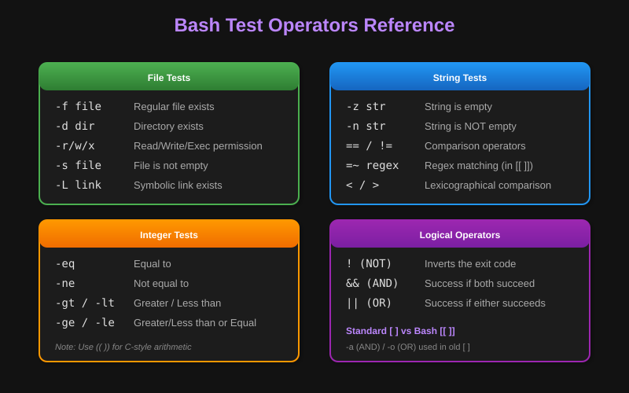
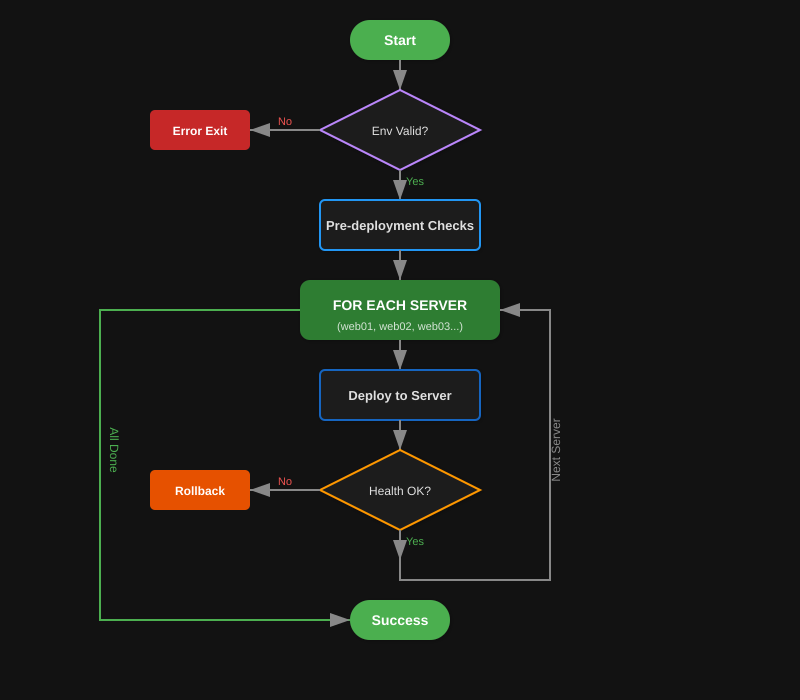

# Logic and Flow Control
*Building Intelligent Automation with Conditional Logic and Loops*
Logic allows your scripts to make decisions and repeat tasks. In DevOps, this is used for everything from checking system health to rolling out deployments across multiple servers, handling different environments, and implementing sophisticated automation workflows.

---
## 🚦 Conditionals (If/Else/Elif)
### **The `if` Statement Architecture**
The syntax uses `[` (which is actually a command called `test`) or `[[` (Bash built-in) to evaluate expressions.
```bash
# Basic if statement
if [ -f "/etc/nginx/nginx.conf" ]; then
    echo "Nginx config found."
else
    echo "Nginx not installed?"
fi

# Extended if-elif-else
if [ "$ENVIRONMENT" = "production" ]; then
    echo "Deploying to production with extra checks"
    run_production_checks
elif [ "$ENVIRONMENT" = "staging" ]; then
    echo "Deploying to staging environment"
    run_staging_deployment
else
    echo "Unknown environment: $ENVIRONMENT"
    exit 1
fi
```
### **Test Operators Comprehensive Reference**

### **Advanced Conditional Patterns**
```bash
# Modern Bash extended test [[ ]]
if [[ $USER == "root" && $PWD == "/root" ]]; then
    echo "Root user in home directory"
fi

# Pattern matching with [[ ]]
if [[ $filename == *.log ]]; then
    echo "Log file detected"
fi

# Regular expression matching
if [[ $email =~ ^[a-zA-Z0-9._%+-]+@[a-zA-Z0-9.-]+\.[a-zA-Z]{2,}$ ]]; then
    echo "Valid email format"
fi

# Multiple conditions with logical operators
if [[ -f "$config_file" && -r "$config_file" ]]; then
    source "$config_file"
else
    echo "Config file not found or not readable" >&2
    exit 1
fi
```
---
## 🔄 Loops (For, While, Until)
### **For Loop Patterns**
```bash
# Iterate over server list
SERVERS=("web01" "web02" "web03" "db01")
for SERVER in "${SERVERS[@]}"; do
    echo "Updating $SERVER..."
    ssh "$SERVER" "sudo yum update -y"
    if [ $? -eq 0 ]; then
        echo "✅ $SERVER updated successfully"
    else
        echo "❌ Failed to update $SERVER" >&2
    fi
done

# Iterate over files with specific pattern
for LOG_FILE in /var/log/app*.log; do
    if [ -f "$LOG_FILE" ]; then
        echo "Processing $LOG_FILE"
        grep "ERROR" "$LOG_FILE" >> error_summary.txt
    fi
done

# C-style for loop for numeric iteration
for ((i=1; i<=10; i++)); do
    echo "Attempt $i of 10"
    if attempt_operation; then
        echo "Operation successful on attempt $i"
        break
    fi
    sleep 2
done
```
### **While Loop Patterns**
```bash
# Wait for service to be ready
echo "Waiting for database to be ready..."
while ! nc -z localhost 3306; do
    echo "Database not ready, waiting..."
    sleep 2
done
echo "✅ Database is ready!"

# Process file line by line
while IFS= read -r line; do
    echo "Processing: $line"
    # Process each line here
done < input_file.txt

# Monitor system resources
while true; do
    CPU_USAGE=$(top -bn1 | grep "Cpu(s)" | awk '{print $2}' | cut -d'%' -f1)
    if (( $(echo "$CPU_USAGE > 80" | bc -l) )); then
        echo "⚠️ High CPU usage: ${CPU_USAGE}%"
        # Send alert or take action
    fi
    sleep 60
done
```
---
## 📊 DevOps Deployment Logic Flow


---
## 📖 Stories from the Field: The "Infinite" Loop
**Scenario**: A script was designed to monitor a log file and alert if it saw "FATAL". It used a `while true` loop.
**Problem**: The script worked fine, but one day the log file was deleted during rotation. The `tail` command inside the loop failed, but the loop kept spinning at 100% CPU because it had no internal checks for the file's existence.
**Discovery**: `top` showed the script consuming an entire core.
**Resolution**: Added an `if [ ! -f "$LOG" ]` check inside the loop to wait or exit gracefully if the file vanishes.
**Prevention**: Always ensure your `while` loops have a "Safe Exit" or a `sleep` interval to prevent CPU starvation.

---
## ❓ Interview Questions
1. **What is the difference between `[` and `[[`?**
    <details>
    <summary>Show Answer</summary>
    `[` is the old POSIX standard tool (`test`). `[[` is a Bash keyword that is safer (no word splitting on variables), supports regex (`=~`), and allows `&&`/`||` instead of `-a`/`-o`.
    </details>
2. **How do you exit a loop prematurely?**
    <details>
    <summary>Show Answer</summary>
    Use the `break` command.
    </details>
3. **What is the `case` statement used for?**
    <details>
    <summary>Show Answer</summary>
    It's a cleaner alternative to multiple `if/elif` blocks when checking a variable against many patterns (often used in service init scripts).
    </details>
4. **How do you iterate through all files in a directory?**
    <details>
    <summary>Show Answer</summary>
    `for FILE in /path/to/dir/*; do ... done`.
    </details>
5. **What does `! command` do in a condition?**
    <details>
    <summary>Show Answer</summary>
    It negates the result. If the command succeeds (exit 0), the condition is false.
    </details>

---
## 🧠 Quiz
1. **Which operator checks if a directory exists?** `(-d)`
2. **Which loop is best for strictly counting or iterating over a list?** `(for)`
3. **How do you check if string A is NOT equal to string B?** `([ "$A" != "$B" ])`
4. **True/False: Spaces are required inside the brackets `[ ... ]`.** `(True - [ is a command and ] is its last argument)`
5. **What operator checks if a string is empty?** `(-z)`