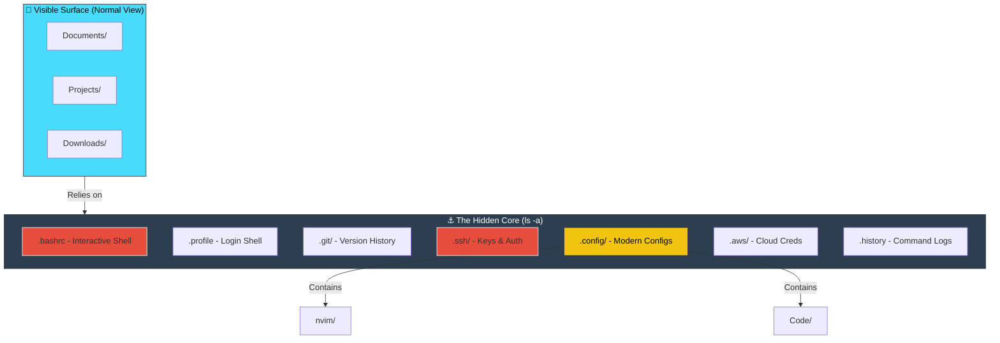

# 🕵️ Hidden Files (Dotfiles) Mastery
> **"In Linux, what you don't see controls everything you do. The invisible configuration layer."**

```mermaid
graph LR
    subgraph System ["🐧 Linux System"]
        direction TB
        Visible[📄 Normal Files<br/>(Visible)]
        Hidden[🕵️ .Hidden Files<br/>(Configuration)]
    end
    
    Visible -->|Controlled by| Hidden
    Hidden -->|Configures| Shell[.bashrc]
    Hidden -->|Secures| SSH[.ssh/]
    Hidden -->|Version| Git[.git/]

    style Hidden fill:#2c3e50,stroke:#fff,stroke-width:2px,color:#fff
    style Visible fill:#ecf0f1,stroke:#333,stroke-width:2px
    style Shell fill:#e74c3c,color:#fff
    style SSH fill:#e74c3c,color:#fff
    style Git fill:#f1c40f,color:#000
```
## 📚 Overview
In the Unix/Linux world, files starting with a dot (`.`) are "hidden" from normal view. These aren't just for secrets; they represent the **nervous system** of your user environment. From shell behavior (`.bashrc`) to identity management (`.ssh`) and version control (`.git`), mastering dotfiles is what separates a casual user from a DevOps professional.
### 🏛️ The "Bug" That Became a Feature
Why do hidden files start with `.`? 
In the early days of Unix, the creators wrote code to hide the current directory `.` and parent directory `..` from the `ls` command output.

The code was essentially:
```c
if (filename[0] == '.') return; // Skip
```
They intended to skip *only* `.` and `..`, but this lazy coding accidentally hid *any* file starting with a dot. Users started using this "bug" to hide configuration files, and it became a permanent standard.
## 🎓 Learning Objectives
By the end of this module, you will:
- ✅ Understand the "dotfile" ecosystem and XDG Base Directory standards
- ✅ Master critical configurations: `.bashrc` vs `.profile` vs `.bash_profile`
- ✅ Audit hidden files for security vulnerabilities
- ✅ Manage dotfiles professionally using **Git** and **GNU Stow**
- ✅ Detect malicious hidden files used by attackers

## 🏗️ The Iceberg Theory of Configuration
Most of a Linux system's user customization happens below the surface.

## 🔍 Seeing the Unseen
### Basic vs Advanced Detection
The `ls` command ignores dotfiles by default. 
```bash
# Standard listing (Clean view)
$ ls
Desktop  Documents  Downloads

# Reveal hidden files (The "God Mode" view)
$ ls -a
.  ..  .bash_history  .bashrc  .git  .ssh  .config

# Reveal HIDDEN files ONLY (Advanced)
$ ls -ld .?*
.bashrc .ssh .config
```
## 🛠️ Critical DevOps Dotfiles Explained
### 1. The Shell Startup Chain
Bash loads files in a specific order depending on how you log in.

| File | Loaded When? | Purpose |
|------|--------------|---------|
| `.bash_profile` | **Login Shell** (SSH, GUI Login) | Environment variables (`PATH`, `USER`) |
| `.bashrc` | **Non-Login Shell** (New Terminal Tab) | Aliases, Prompt, History settings |
| `.profile` | **Fallback** | Used if `.bash_profile` is missing (dash/sh compatible) |
| `.bash_logout` | **Exit** | Cleanup tasks when logging out |
**Best Practice**: Put almost everything in `.bashrc`, and source it from `.bash_profile`.
```bash
# Inside ~/.bash_profile
if [ -f ~/.bashrc ]; then
    source ~/.bashrc
fi
```
### 2. The Credential Vault: `.ssh/`
This directory keys to your infrastructure.

| File | Purpose | Security Level |
|------|---------|----------------|
| `id_rsa` | **Private Key**. Your identity. | 🔴 CRITICAL (600) |
| `id_rsa.pub` | **Public Key**. Your lock. | 🟢 PUBLIC (644) |
| `known_hosts` | Fingerprints of trusted servers. | 🟡 IMPORTANT |
| `authorized_keys`| Public keys allowed to log into THIS machine. | 🔴 CRITICAL (600) |
| `config` | SSH shortcuts and options. | 🟢 SAFE |
### 3. Modern Configs: `~/.config/`
Historically, home directories were cluttered with `~/.vimrc`, `~/.gitconfig`, `~/.npmrc`.
The **XDG Base Directory Specification** standardized this. Modern apps place configs in `~/.config/appname/`.

**Example**:
- Old: `~/.nvimrc`
- New: `~/.config/nvim/init.vim`
## 🔒 Security & Forensics

### Finding Malicious Dotfiles
Attackers love dotfiles because admins rarely check them. 
**Suspicious Indicators**:
1.  **Space Dot**: Files named `. ` (dot space) or `.. ` (dot dot space). Visually look like current/parent directory but are files.
2.  **Symlink Hijacking**: `.bash_history` pointed to `/dev/null` (prevents history logging).
3.  **Hidden Scripts**: `.systemd-service.sh` in the home folder.

**Audit Command**:
```bash
# Find all hidden files modified in the last 7 days
find ~ -name ".*" -mtime -7 -ls
```
### The `.env` Trap
In modern DevOps, we store secrets (API keys, passwords) in `.env` files.
**⛔ DANGER:** Never commit `.env` files to Git!
**✅ BEST PRACTICE:**
1. Add `.env` to `.gitignore`.
2. Commit a `.env.example` with dummy values.
## 📋 Dotfiles Management as Code
Experienced engineers treat their shell configuration like software. They store their dotfiles in Git!
### Method 1: The Symlink Script (Manual)
```bash
mkdir ~/dotfiles
mv ~/.bashrc ~/dotfiles/bashrc
ln -s ~/dotfiles/bashrc ~/.bashrc
```
### Method 2: GNU Stow (Professional)
`stow` is a symlink farm manager.

**Setup**:
```
~/dotfiles/
├── bash/
│   ├── .bashrc
│   └── .bash_profile
├── git/
│   └── .gitconfig
└── vim/
    └── .vimrc
```

**Deploy**:
```bash
cd ~/dotfiles
stow bash  # Automatically symlinks contents of bash/ to ~/
stow git
stow vim
```
This allows you to manage modular configurations and sync them across machines using GitHub.
## 🏆 Real-World DevOps Story

#### 💡 **The Missing History Mystery**
**Scenario**: A senior engineer logged into a jump server and realized standard commands like `ls` were behaving strangely (showing colorful output by default, which wasn't standard). They typed `history` to see who logged in before, but the history was empty.

**The Investigation**:
They ran `ls -la`.
They noticed `.bash_history` was a **symlink**.
```bash
lrwxrwxrwx 1 root root 9 Jan 10 02:00 .bash_history -> /dev/null
```
**The Discovery**:
An intruder had compromised the server and "hidden their tracks" by redirecting the history file so commands wouldn't be saved to disk. Because they only modified a hidden file, previous admins hadn't noticed.

**The Fix**:
1. Server isolated for forensics.
2. Implemented **Immutable** bash history logs sent to remote syslog.
3. Added file integrity monitoring (FIM) for all dotfiles.
## 🎓 Interview Questions

#### Q1: What is the difference between specific `.` and `..`?
<details>
<summary>Click to reveal answer</summary>

- `.` represents the **current directory**. When you run `./script.sh`, you are saying "run the script located in current directory".
- `..` represents the **parent directory**. `cd ..` moves you up one level.
These are actual directory entries present in every folder on the filesystem.
</details>
#### Q2: Why define aliases in `.bashrc` instead of `.bash_profile`?
<details>
<summary>Click to reveal answer</summary>

`.bash_profile` is only read once when you log in (Login Shell).
`.bashrc` is read every time you open a new terminal window or run a new shell (Interactive Non-Login Shell).
If you put aliases in `.bash_profile`, simple terminal windows often won't see them.
</details>
#### Q3: How do you harden permissions for `.ssh`?
<details>
<summary>Click to reveal answer</summary>

SSH requires strict permissions or it will refuse to work (Permission denied):
- `~/.ssh` directory: **700** (`drwx------`) - Only owner can enter.
- `~/.ssh/id_rsa` (Private): **600** (`-rw-------`) - Only owner can read/write.
- `~/.ssh/id_rsa.pub` (Public): **644** (`-rw-r--r--`) - Public can read.
- `~/.ssh/authorized_keys`: **600** (`-rw-------`).
</details>
## 📝 Quiz
1. **Which command reveals hidden files?**
   - [ ] a) `ls -h`
   - [x] b) `ls -a`
   - [ ] c) `show hidden`
   - [ ] d) `view -a`

2. **Where should you store application configuration according to modern standards?**
   - [ ] a) `~/`
   - [ ] b) `/etc`
   - [x] c) `~/.config/`
   - [ ] d) `~/.local`

3. **What is `.gitignore` used for?**
   - [ ] a) Ignoring Git errors
   - [x] b) Preventing files from being tracked
   - [ ] c) Deleting files
   - [ ] d) Hiding files from users

4. **Which file is loaded for non-login interactive shells?**
   - [ ] a) `.bash_profile`
   - [x] b) `.bashrc`
   - [ ] c) `.profile`
   - [ ] d) `.login`

5. **Why do hidden files start with a dot?**
   - [ ] a) It stands for "Delete"
   - [ ] b) It stands for "Data"
   - [ ] c) It was a planned security feature
   - [x] d) It was a historical coding bug in `ls`

**Answers**: 1-b, 2-c, 3-b, 4-b, 5-d

## 🔗 Next Steps

Continue to: **[Searching in Files](../05-Searching-in-Files/README.md)** →

## 📚 Additional Resources
- [The XDG Base Directory Specification](https://specifications.freedesktop.org/basedir-spec/basedir-spec-latest.html)
- [Dotfiles.github.io](https://dotfiles.github.io/) - Community dotfile manager
- [GNU Stow Manual](https://www.gnu.org/software/stow/)

---
**📌 Pro Tip**: Create a local `.bin` folder for your personal scripts and add it to your path in `.bashrc`.
```bash
# In .bashrc
export PATH="$HOME/.bin:$PATH"
```
