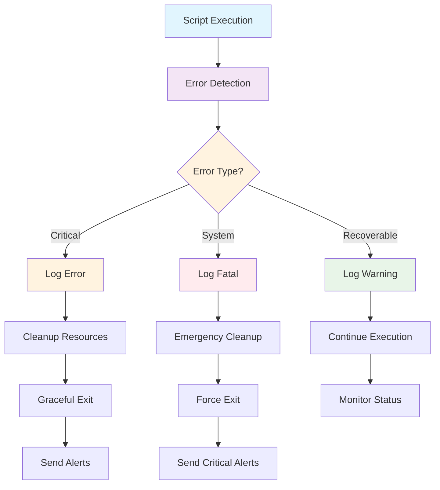

# Module 5: Robust Scripting and Error Handling - Production-Ready DevOps Automation

## 🎯 Learning Objectives
- Master advanced error handling and debugging techniques
- Implement production-grade logging and monitoring
- Build resilient automation scripts with proper cleanup
- Create enterprise-level script templates and patterns

## 📚 Core Concepts

### Error Handling Architecture in DevOps



## 🚀 The "Strict Mode" (Fail Fast)

At the top of every production-grade script, you should include these settings:

```bash
#!/bin/bash
set -euo pipefail
```

-   **`-e` (errexit)**: Exit immediately if any command returns a non-zero exit status.
-   **`-u` (nounset)**: Treat unset variables as an error and exit immediately.
-   **`-o pipefail`**: If any command in a pipeline fails, the whole pipeline's return status is the failure code. Without this, `false | true` returns success (0).

### Advanced Strict Mode Configuration
```bash
#!/bin/bash
# Production-grade script header
set -euo pipefail  # Exit on error, undefined vars, pipe failures
IFS=$'\n\t'       # Secure Internal Field Separator

# Script metadata
SCRIPT_NAME="$(basename "$0")"
SCRIPT_DIR="$(cd "$(dirname "${BASH_SOURCE[0]}")" && pwd)"
LOG_FILE="/var/log/${SCRIPT_NAME%.sh}.log"
PID_FILE="/var/run/${SCRIPT_NAME%.sh}.pid"

# Trap handlers for cleanup
trap 'cleanup_and_exit $?' EXIT
trap 'emergency_cleanup' ERR
trap 'handle_interrupt' INT TERM
```

## 🪤 Handling Cleanups with `trap`

Scripts often create temporary files or locks. If the script crashes or is killed, these files remain. `trap` allows you to run a cleanup function when the script receives a specific signal.

```bash
# Define cleanup logic
cleanup() {
    echo "Cleaning up temp files..."
    rm -rf "$TMP_DIR"
}

# Trap Signals: EXIT (script ends), SIGINT (Ctrl+C), SIGTERM (Kill)
trap cleanup EXIT SIGINT SIGTERM

TMP_DIR=$(mktemp -d)
# ... script logic ...
```

### Comprehensive Cleanup Functions
```bash
# Emergency cleanup for critical failures
emergency_cleanup() {
    local exit_code=$?
    echo "[EMERGENCY] Script failed at line $BASH_LINENO" >&2
    
    # Kill child processes
    jobs -p | xargs -r kill 2>/dev/null || true
    
    # Remove temporary files
    [[ -n "${TEMP_DIR:-}" ]] && rm -rf "$TEMP_DIR" 2>/dev/null || true
    
    # Release locks
    [[ -f "$PID_FILE" ]] && rm -f "$PID_FILE" 2>/dev/null || true
    
    # Send critical alert
    send_alert "CRITICAL" "Script $SCRIPT_NAME failed unexpectedly"
    
    exit $exit_code
}

# Graceful cleanup for normal exits
cleanup_and_exit() {
    local exit_code=$?
    
    if [[ $exit_code -eq 0 ]]; then
        log_message "INFO" "Script completed successfully"
    else
        log_message "ERROR" "Script exited with code $exit_code"
    fi
    
    # Cleanup temporary resources
    cleanup_temp_resources
    
    # Update status files
    update_execution_status $exit_code
    
    exit $exit_code
}

# Handle user interruption
handle_interrupt() {
    log_message "WARN" "Script interrupted by user"
    cleanup_and_exit 130
}
```

## 🔍 Debugging Your Scripts

Sometimes you need to see exactly what the shell is doing line-by-line.

-   **`set -x` (xtrace)**: Prints every command before executing it (useful for debugging logic).
-   **`set -v` (verbose)**: Prints shell input lines as they are read.
-   **Bash Debugger**: For very complex scripts, tools like `bashdb` can be used for step-through debugging.

### Advanced Debugging Framework
```bash
# Debug configuration
DEBUG_MODE="${DEBUG:-false}"
VERBOSE_MODE="${VERBOSE:-false}"

# Debug function
debug() {
    [[ "$DEBUG_MODE" == "true" ]] || return 0
    log_message "DEBUG" "$*" "DEBUG"
}

# Verbose output
verbose() {
    [[ "$VERBOSE_MODE" == "true" ]] || return 0
    echo "[VERBOSE] $*" >&2
}

# Function execution tracing
trace_function() {
    local func_name="$1"
    shift
    
    debug "Entering function: $func_name with args: $*"
    
    # Execute function with error handling
    if "$func_name" "$@"; then
        debug "Function completed successfully: $func_name"
        return 0
    else
        local exit_code=$?
        debug "Function failed: $func_name (exit code: $exit_code)"
        return $exit_code
    fi
}
```

## 📝 Production Logging Framework

### Multi-Level Logging System
```bash
# Logging configuration
declare -A LOG_LEVELS=([DEBUG]=0 [INFO]=1 [WARN]=2 [ERROR]=3 [FATAL]=4)
LOG_LEVEL="${LOG_LEVEL:-INFO}"
LOG_FORMAT="${LOG_FORMAT:-%Y-%m-%d %H:%M:%S}"

# Advanced logging function
log_message() {
    local level="$1"
    local message="$2"
    local component="${3:-MAIN}"
    
    # Check if message should be logged
    [[ ${LOG_LEVELS[$level]} -lt ${LOG_LEVELS[$LOG_LEVEL]} ]] && return 0
    
    local timestamp=$(date "+$LOG_FORMAT")
    local log_entry="[$timestamp] [$level] [$component] [$$] $message"
    
    # Output to appropriate stream
    case "$level" in
        DEBUG|INFO) echo "$log_entry" | tee -a "$LOG_FILE" ;;
        WARN) echo "$log_entry" | tee -a "$LOG_FILE" >&2 ;;
        ERROR|FATAL) echo "$log_entry" | tee -a "$LOG_FILE" >&2 ;;
    esac
    
    # Send to syslog for centralized logging
    logger -t "$SCRIPT_NAME" -p "user.$level" "$message"
    
    # Trigger alerts for critical messages
    [[ "$level" == "FATAL" ]] && send_alert "CRITICAL" "$message"
    [[ "$level" == "ERROR" ]] && send_alert "ERROR" "$message"
}

# Performance timing
time_operation() {
    local operation_name="$1"
    shift
    
    local start_time=$(date +%s.%N)
    log_message "DEBUG" "Starting operation: $operation_name"
    
    # Execute the operation
    "$@"
    local exit_code=$?
    
    local end_time=$(date +%s.%N)
    local duration=$(echo "$end_time - $start_time" | bc -l)
    
    if [[ $exit_code -eq 0 ]]; then
        log_message "INFO" "Operation completed: $operation_name (${duration}s)"
    else
        log_message "ERROR" "Operation failed: $operation_name (${duration}s)"
    fi
    
    return $exit_code
}
```

## 🚫 Input Validation and Sanitization

### Comprehensive Validation Framework
```bash
# Input validation functions
validate_required() {
    local var_name="$1"
    local var_value="$2"
    
    if [[ -z "$var_value" ]]; then
        log_message "ERROR" "Required parameter missing: $var_name"
        return 1
    fi
}

validate_file_exists() {
    local file_path="$1"
    local description="${2:-file}"
    
    if [[ ! -f "$file_path" ]]; then
        log_message "ERROR" "Required $description not found: $file_path"
        return 1
    fi
}

validate_directory_exists() {
    local dir_path="$1"
    local description="${2:-directory}"
    
    if [[ ! -d "$dir_path" ]]; then
        log_message "ERROR" "Required $description not found: $dir_path"
        return 1
    fi
}

validate_command_exists() {
    local command="$1"
    
    if ! command -v "$command" >/dev/null 2>&1; then
        log_message "ERROR" "Required command not found: $command"
        return 1
    fi
}

# Input sanitization
sanitize_input() {
    local input="$1"
    local type="${2:-string}"
    
    case "$type" in
        "filename")
            # Remove dangerous characters for filenames
            echo "$input" | tr -d '\0' | sed 's/[^a-zA-Z0-9._-]/_/g'
            ;;
        "path")
            # Resolve and validate path
            realpath -m "$input" 2>/dev/null || echo "/tmp/sanitized_path"
            ;;
        "alphanumeric")
            # Keep only alphanumeric characters
            echo "$input" | sed 's/[^a-zA-Z0-9]//g'
            ;;
        *)
            # Basic sanitization - remove null bytes and control characters
            echo "$input" | tr -d '\0\r' | tr -c '\n[:print:]' '_'
            ;;
    esac
}
```

## 🔄 Retry and Recovery Mechanisms

### Intelligent Retry Logic
```bash
# Retry function with exponential backoff
retry_with_backoff() {
    local max_attempts="$1"
    local base_delay="$2"
    local max_delay="$3"
    shift 3
    
    local attempt=1
    local delay="$base_delay"
    
    while [[ $attempt -le $max_attempts ]]; do
        log_message "INFO" "Attempt $attempt/$max_attempts: $*"
        
        if "$@"; then
            log_message "INFO" "Operation succeeded on attempt $attempt"
            return 0
        fi
        
        if [[ $attempt -eq $max_attempts ]]; then
            log_message "ERROR" "Operation failed after $max_attempts attempts"
            return 1
        fi
        
        log_message "WARN" "Attempt $attempt failed, retrying in ${delay}s"
        sleep "$delay"
        
        # Exponential backoff with jitter
        delay=$(echo "$delay * 2" | bc -l)
        delay=$(echo "if ($delay > $max_delay) $max_delay else $delay" | bc -l)
        
        # Add jitter (±25%)
        local jitter=$(echo "$delay * 0.25 * (2 * $RANDOM / 32767 - 1)" | bc -l)
        delay=$(echo "$delay + $jitter" | bc -l)
        
        ((attempt++))
    done
}
```

## 📊 Health Checks and Monitoring

### System Health Monitoring
```bash
# Comprehensive health check
perform_health_check() {
    local component="$1"
    local health_status=0
    
    log_message "INFO" "Starting health check for $component"
    
    case "$component" in
        "system")
            check_disk_space || health_status=1
            check_memory_usage || health_status=1
            check_cpu_load || health_status=1
            ;;
        "services")
            check_required_services || health_status=1
            check_network_connectivity || health_status=1
            ;;
        "application")
            check_application_endpoints || health_status=1
            check_database_connectivity || health_status=1
            ;;
        *)
            log_message "ERROR" "Unknown health check component: $component"
            return 1
            ;;
    esac
    
    if [[ $health_status -eq 0 ]]; then
        log_message "INFO" "Health check passed for $component"
    else
        log_message "ERROR" "Health check failed for $component"
    fi
    
    return $health_status
}

# Individual health check functions
check_disk_space() {
    local threshold="${DISK_THRESHOLD:-90}"
    local usage
    
    while read -r filesystem size used avail percent mount; do
        [[ "$percent" =~ ^[0-9]+% ]] || continue
        usage="${percent%\\%}"
        
        if [[ $usage -gt $threshold ]]; then
            log_message "ERROR" "Disk usage critical: $mount ($usage%)"
            return 1
        elif [[ $usage -gt $((threshold - 10)) ]]; then
            log_message "WARN" "Disk usage high: $mount ($usage%)"
        fi
    done < <(df -h | tail -n +2)
    
    return 0
}
```

## 📧 Alerting and Notifications

### Multi-Channel Alert System
```bash
# Alert configuration
ALERT_EMAIL="${ALERT_EMAIL:-admin@company.com}"
ALERT_SLACK_WEBHOOK="${ALERT_SLACK_WEBHOOK:-}"

# Send alert to multiple channels
send_alert() {
    local severity="$1"
    local message="$2"
    local component="${3:-$SCRIPT_NAME}"
    
    local alert_message="[$severity] $component: $message"
    
    # Log the alert
    log_message "$severity" "ALERT: $message" "ALERT"
    
    # Send email alert
    [[ -n "$ALERT_EMAIL" ]] && send_email_alert "$severity" "$alert_message"
    
    # Send Slack alert
    [[ -n "$ALERT_SLACK_WEBHOOK" ]] && send_slack_alert "$severity" "$alert_message"
}

send_email_alert() {
    local severity="$1"
    local message="$2"
    
    echo "$message" | mail -s "[$severity] DevOps Alert" "$ALERT_EMAIL" 2>/dev/null || \
        log_message "WARN" "Failed to send email alert"
}
```

---

## 📖 Stories from the Field: The Script that Deleted `/`

**Scenario**: A maintenance script was supposed to delete a specific application folder: `rm -rf "$APP_DIR/*"`.
**Problem**: The `APP_DIR` variable was set via a config file that failed to load. Because `-u` (nounset) was NOT set, Bash treated `$APP_DIR` as an empty string. The command became `rm -rf /*`.
**Outcome**: The script started deleting the entire root filesystem of the production server.
**Resolution**: The sysadmin caught it quickly, but significant damage was done.
**Prevention**: **ALWAYS** use `set -u`. If `$APP_DIR` was empty, the script would have exited immediately with an "unbound variable" error before running the `rm` command.

---

## ❓ Interview Questions

1.  **What does `set -e` do, and why might it be dangerous?**
    *   *Answer*: It stops the script on failure. It can be dangerous if you expect certain commands to fail (e.g., `grep` not finding a match) but want to continue. In those cases, you can use `command || true`.
2.  **How do you debug a script without changing the code?**
    *   *Answer*: Run it as `bash -x script.sh`.
3.  **What is a "Dead Man's Switch" in scripting?**
    *   *Answer*: It's often implemented using `trap`. If the script doesn't reach a successful completion and clear the trap, the trap function runs to alert someone or cleanup state.
4.  **What is the difference between `SIGINT` and `SIGTERM`?**
    *   *Answer*: `SIGINT` (Signal 2) is triggered by `Ctrl+C`. `SIGTERM` (Signal 15) is the default termination signal sent by the `kill` command.
5.  **How do you handle a command that might fail in a script with `set -e`?**
    *   *Answer*: Use `command || [logic_if_failed]` or wrap it in an `if` block.
6.  **What's the purpose of exponential backoff in retry logic?**
    *   *Answer*: It prevents overwhelming a failing service by increasing delays between retry attempts, giving the service time to recover.
7.  **How do you implement circuit breaker pattern in shell scripts?**
    *   *Answer*: Track failure counts and timestamps, open the circuit after threshold failures, and allow test requests after timeout periods.

---

## 🧠 Quiz

1.  **Which `set` option stops the script if a variable is undefined?** `(-u)`
2.  **What command ensures a "cleanup" function runs even if the script crashes?** `(trap)`
3.  **Which `set` option is required to catch errors inside a pipe like `A | B | C`?** `(pipefail)`
4.  **True/False: `set -x` is only useful for production logs.** `(False - it is primarily a debugging tool)`
5.  **Which signal is sent when a user presses `Ctrl+C`?** `(SIGINT)`
6.  **What's the recommended approach for handling temporary files in production scripts?** `(Use mktemp and trap cleanup functions)`
7.  **How do you validate that a required command exists before using it?** `(Use 'command -v' or 'which' in validation functions)`

## 📝 Best Practices Summary

1. **Error Handling**:
   - Use `set -euo pipefail` for strict error detection
   - Implement comprehensive cleanup functions
   - Use trap handlers for graceful exits
   - Provide meaningful error messages and exit codes

2. **Logging and Monitoring**:
   - Implement structured logging with multiple levels
   - Include performance metrics and timing
   - Send logs to centralized systems (syslog)
   - Set up automated alerting for critical issues

3. **Input Validation**:
   - Validate all inputs before processing
   - Sanitize user-provided data
   - Check for required dependencies and files
   - Use type-specific validation functions

4. **Resilience Patterns**:
   - Implement retry logic with exponential backoff
   - Use circuit breaker patterns for external services
   - Create health check mechanisms
   - Design for graceful degradation

5. **Production Readiness**:
   - Include comprehensive documentation
   - Implement proper signal handling
   - Use lock files to prevent concurrent execution
   - Create rollback mechanisms for critical operations

## 🔗 Integration with Other Modules
- **Module 1**: Environment setup for production scripts
- **Module 2**: Variable validation and sanitization
- **Module 3**: Error handling in control structures
- **Module 4**: Function-level error handling and cleanup

## 📚 Additional Resources
- [Bash Error Handling Best Practices](https://mywiki.wooledge.org/BashFAQ/105)
- [Production Shell Scripting](https://google.github.io/styleguide/shellguide.html)
- [DevOps Monitoring Patterns](https://sre.google/sre-book/monitoring-distributed-systems/)