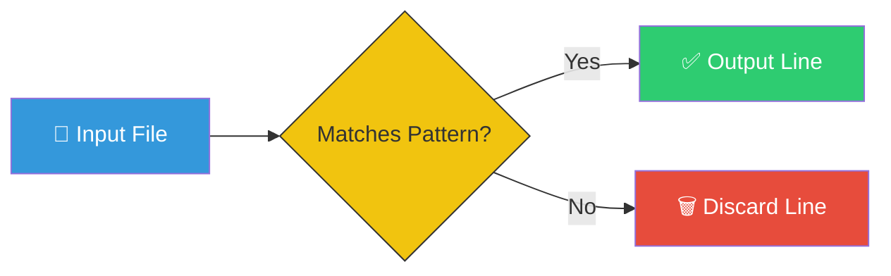

# 🔍 Searching in Files (Grep Mastery)

> **"Finding a needle in a haystack is easy... if you have a magnet."**


## 📚 Overview

In DevOps, you rarely write code from scratch. You spend 80% of your time reading logs, debugging errors, and searching through configuration files. `grep` (Global Regular Expression Print) is the ultimate search tool. It allows you to find specific text patterns across thousands of files instantly.

## 🎓 Learning Objectives

By the end of this module, you will:

- ✅ Master the `grep` command syntax
- ✅ Perform case-insensitive and recursive searches
- ✅ Use Regular Expressions (Regex) for powerful pattern matching
- ✅ Filter search results (invert match, line numbers)
- ✅ Combine `grep` with other commands using pipes

## 🏗️ How Grep Works

`grep` acts as a filter. It reads data (from a file or pipe), checks line by line if it matches your pattern, and outputs only the matching lines.



## 🛠️ The Grep Toolkit

### Basic Syntax
```bash
grep [OPTIONS] "PATTERN" FILE
```

### Essential Flags Chart

| Flag | Mnemonic | Function | Example |
|------|----------|----------|---------|
| `-i` | **I**nsensitive | Case-insensitive search | `grep -i "error" log.txt` |
| `-r` | **R**ecursive | Search in directories | `grep -r "config" /etc/` |
| `-v` | **V**oid/Invert | Show lines that do **NOT** match | `grep -v "info" app.log` |
| `-n` | **N**umber | Show line numbers | `grep -n "TODO" main.py` |
| `-l` | **L**ist | Show filename only (not content) | `grep -l "secret" *` |
| `-c` | **C**ount | Count matches per file | `grep -c "fail" build.log` |

## 🧩 Advanced Patterns (Regex)

Grep becomes a superpower when combined with Regular Expressions.

| Pattern | Meaning | Example | Matches |
|---------|---------|---------|---------|
| `^` | Start of line | `^Error` | "Error: Failed" |
| `$` | End of line | `success$` | "Build success" |
| `.` | Any character | `b.t` | "bat", "bit", "bot" |
| `*` | Zero or more | `ab*c` | "ac", "abc", "abbc" |
| `[]` | Character set | `[0-9]` | Any digit |

**Example:**
Find all lines starting with "Error" followed by any 3 digits:
```bash
grep -E "^Error [0-9]{3}" server.log
```

## 🪜 Workflow Integration

### The "Log Diver" Workflow
A common DevOps task is analyzing live logs.

```mermaid
graph TD
    A[Output Logs] -->|tail -f app.log| B(Stream Data)
    B -->|grep "ERROR"| C{Filter Errors}
    C -->|grep -v "timeout"| D[Ignore Timeouts]
    D --> E[Final Alert]
    
    style A fill:#95a5a6
    style C fill:#f39c12
    style E fill:#e74c3c
```

**Command:**
```bash
tail -f /var/log/syslog | grep --line-buffered "error" | grep -v "harmless"
```

## 🏆 Real-World DevOps Story

### 💡 **The API Key Leak**

**Scenario**: A company was billed $50,000 for cloud usage overnight. Someone had committed an AWS Access Key to a public GitHub repository. They needed to find *every* instance of that key in their extensive codebase immediately to revoke access and patch the code.

**The Fix**:
The DevOps Lead used `grep` to scan the entire project directory recursively:

```bash
grep -r "AKIA" ./projects/
```
*(AWS Access Keys always start with "AKIA")*

**Result**:
- Located 3 files containing hardcoded keys in seconds.
- Revoked keys immediately.
- Implemented a "pre-commit hook" using `grep` to prevent future leaks:
    - `grep -r "AKIA" . && echo "❌ Security Violation" && exit 1`

**Outcome**: Saved the company from bankruptcy and hardened security forever.

## 🎓 Interview Questions

### Q1: How do I find a string in a file but only print the filename, not the line?
<details>
<summary>Click to reveal answer</summary>

Use the `-l` (list) flag.
```bash
grep -l "config_v2" *.yaml
```
This is useful when you want to pipe the list of files to another command (like `xargs` or `sed`).
</details>

### Q2: How can I search for a string across an entire directory tree?
<details>
<summary>Click to reveal answer</summary>

Use the `-r` (recursive) flag.
```bash
grep -r "function_name" /var/www/html/
```
Add `-n` to see the line numbers too!
</details>

### Q3: How do I exclude specific directories (like `node_modules` or `.git`) from a search?
<details>
<summary>Click to reveal answer</summary>

Use the `--exclude-dir` flag.
```bash
grep -r "user_id" . --exclude-dir={node_modules,.git,vendor}
```
Alternatively, most engineers install tools like `ripgrep` (`rg`) which respect `.gitignore` by default.
</details>

## 📝 Quiz

1. **Which flag makes the search case-insensitive?**
   - [ ] a) `-c`
   - [ ] b) `-r`
   - [x] c) `-i`
   - [ ] d) `-v`

2. **What does `grep -v` do?**
   - [ ] a) Verbose mode
   - [ ] b) Verify match
   - [x] c) Invert match (show lines NOT matching)
   - [ ] d) View file

3. **Which Regex anchor matches the start of a line?**
   - [x] a) `^`
   - [ ] b) `$`
   - [ ] c) `*`
   - [ ] d) `.`

4. **How do you count the number of matching lines?**
   - [ ] a) `grep --count`
   - [ ] b) `grep -n`
   - [x] c) `grep -c`
   - [ ] d) `wc -l`

5. **Why is `grep` named "grep"?**
   - [ ] a) General Read Execute Program
   - [ ] b) Get Regular Expression Pattern
   - [x] c) Global Regular Expression Print (`g/re/p`)
   - [ ] d) Global Read Entry Point

**Answers**: 1-c, 2-c, 3-a, 4-c, 5-c

## 🔗 Next Steps

Continue to: **[Paging Files](../06-Paging-Files/README.md)** →

## 📚 Additional Resources
- [Grep Man Page](https://linux.die.net/man/1/grep)
- [Regex101.com](https://regex101.com/) - Test your patterns
- [RipGrep](https://github.com/BurntSushi/ripgrep) - A faster, modern alternative to grep

---
**📌 Pro Tip**: "Colorize" your output to make matches stand out!
Add this to your `.bashrc`: `alias grep='grep --color=auto'`
