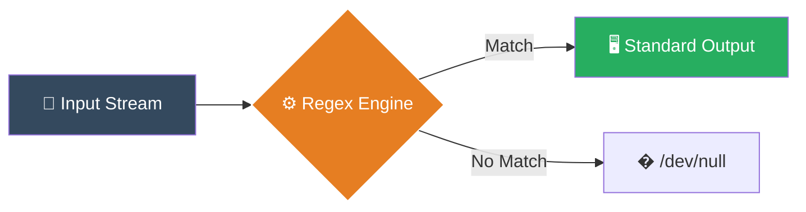

# 🔍 Searching in Files (Grep Mastery)

> **"Finding a needle in a haystack is easy... if you have a magnet."**


## 📚 Overview
In DevOps, you rarely write code from scratch. You spend 80% of your time reading logs, debugging errors, and searching through configuration files. `grep` (Global Regular Expression Print) is the ultimate search tool. It allows you to find specific text patterns across thousands of files instantly.
## 🎓 Learning Objectives
By the end of this module, you will:
- ✅ Master the `grep` command syntax and essential flags (`-i`, `-r`, `-n`, `-v`)
- ✅ Understand **Context Searching** (`-A`, `-B`, `-C`) to see what happened *before* an error
- ✅ Use **Regular Expressions (Regex)** for powerful pattern matching
- ✅ Filter search results (invert match, counting)
- ✅ Performance tuning: `grep` vs `ripgrep` (`rg`)

## 🏗️ How Grep Works

`grep` acts as a stream filter. It reads data line-by-line, checks against a pattern, and decides whether to print or discard.



## 🛠️ The Grep Toolkit

### Basic Syntax
```bash
grep [OPTIONS] "PATTERN" FILE
```
### 1. Essential Flags (The Daily Drivers)

| Flag | Mnemonic | Function | Example |
|------|----------|----------|---------|
| `-i` | **I**nsensitive | Case-insensitive search | `grep -i "error" log.txt` |
| `-r` | **R**ecursive | Search in directories | `grep -r "config" /etc/` |
| `-v` | **V**oid/Invert | Show lines that do **NOT** match | `grep -v "info" app.log` |
| `-n` | **N**umber | Show line numbers | `grep -n "TODO" main.py` |
| `-l` | **L**ist | Show filename only (not content) | `grep -l "secret" *` |
| `-c` | **C**ount | Count matches per file | `grep -c "fail" build.log` |
### 2. Context Flags (The Context Kings)
Finding an error is useless if you don't know *why* it happened. Context flags show lines specific surrounding the match.
- **`-A <num>` (After)**: Show N lines *after* the match.
- **`-B <num>` (Before)**: Show N lines *before* the match.
- **`-C <num>` (Context)**: Show N lines *around* (before + after) the match.
**Example**:
```bash
# Show the error AND the 5 lines of stack trace after it
grep -A 5 "Exception" application.log
```
## 🧩 Advanced Patterns (Regex)
Grep becomes a superpower when combined with Regular Expressions.

| Pattern | Meaning | Example | Matches |
|---------|---------|---------|---------|
| `^` | Start of line | `^Error` | "Error: Failed" |
| `$` | End of line | `success$` | "Build success" |
| `.` | Any character | `b.t` | "bat", "bit", "bot" |
| `*` | Zero or more | `ab*c` | "ac", "abc", "abbc" |
| `[ ]` | Character set | `[0-9]` | Any digit |
| `\|` | OR (Requires -E) | `error\|fail` | "error" OR "fail" |
**Pro Tip**: Use `grep -E` (Extended Regex) or `egrep` to avoid escaping characters like `|` and `+`.
```bash
# Find lines starting with "Error" followed by 3 digits (Error 404, Error 500)
grep -E "^Error [0-9]{3}" server.log
```
## ⚡ Performance: Grep vs. The World
Standard `grep` is fast, but modern tools are faster.

| Tool | Speed | Features | Use Case |
|------|-------|----------|----------|
| **grep** | ⚡ Fast | Standard, installed everywhere | Scripts, Servers |
| **ack** | ⚡⚡ Faster | Optimized for code | Dev Workstations |
| **ag** (Silver Searcher) | ⚡⚡⚡ Very Fast | Ignores .git, binary files | Large Codebases |
| **rg** (RipGrep) | 🚀🚀🚀 Insane | Rust-based, multithreaded | Massive Monorepos |
**Recommendation**: Use `grep` in scripts (portability), use `rg` on your laptop.
## 🏆 Real-World DevOps Story

### 💡 **The API Key Leak**
**Scenario**: A company was billed $50,000 for AWS usage overnight. Someone had committed an Access Key to a public GitHub repository. They needed to find *every* instance of that key pattern in their 10GB codebase immediately.
**The Fix**:
The DevOps Lead used `grep` to scan recursively:
```bash
grep -rEq "AKIA[0-9A-Z]{16}" ./projects/
```
*(AWS Access Keys start with "AKIA" followed by 16 alphanumeric chars)*

**The "Pre-Commit" hook**:
To prevent this from happening again, they added this to their Git hooks:
```bash
# .git/hooks/pre-commit
if grep -rE "AKIA[0-9A-Z]{16}" .; then
    echo "❌ SECURITY ALERT: Potential AWS Key found!"
    exit 1
fi
```
**Outcome**: The hook now blocks any commit containing a secret key.
## 🎓 Interview Questions
#### Q1: How do I search for a string across an entire directory tree but exclude `node_modules`?
<details>
<summary>Click to reveal answer</summary>

Use the `--exclude-dir` flag.
```bash
grep -r "user_id" . --exclude-dir={node_modules,.git,dist}
```
Or use `ripgrep` (`rg`), which respects `.gitignore` automatically.
</details>
#### Q2: What is the difference between `grep`, `egrep`, and `fgrep`?
<details>
<summary>Click to reveal answer</summary>

- `grep`: Standard basic regex.
- `egrep`: Extended regex (Same as `grep -E`). Supports `?`, `+`, `|` without escaping.
- `fgrep`: Fixed string (Same as `grep -F`). Treats characters literally ( `.` is just a dot, not "any char"). Faster for simple strings.
</details>
#### Q3: How do you count how many times "Error" appears in a file?
<details>
<summary>Click to reveal answer</summary>

Use the `-c` (count) flag.
```bash
grep -c "Error" logfile.txt
# Output: 42
```
To count *total occurrences* (if multiple per line), use `grep -o "Error" | wc -l`.
</details>

## 📝 Quiz

1. **Which flag shows 3 lines of context AFTER the match?**
   - [ ] a) `-C 3`
   - [x] b) `-A 3`
   - [ ] c) `-B 3`
   - [ ] d) `-Next 3`

2. **What does `grep -v` do?**
   - [ ] a) Verbose mode
   - [ ] b) Verify match
   - [x] c) Invert match (Show lines NOT matching)
   - [ ] d) View file

3. **Which Regex matches the START of a line?**
   - [x] a) `^`
   - [ ] b) `$`
   - [ ] c) `*`
   - [ ] d) `.`

4. **Why use `fgrep` (or `grep -F`)?**
   - [ ] a) It uses colors
   - [x] b) It treats patterns as fixed strings (faster, no regex)
   - [ ] c) It finds files only
   - [ ] d) It formats output

5. **Which tool is generally considered the fastest modern alternative to grep?**
   - [ ] a) `sed`
   - [ ] b) `awk`
   - [x] c) `ripgrep` (`rg`)
   - [ ] d) `cat`

**Answers**: 1-b, 2-c, 3-a, 4-b, 5-c

## 🔗 Next Steps

Continue to: **[Paging Files](../06-Paging-Files/README.md)** →

## 📚 Additional Resources
- [Grep Man Page](https://linux.die.net/man/1/grep)
- [Regex101.com](https://regex101.com/) - Test your patterns
- [RipGrep GitHub](https://github.com/BurntSushi/ripgrep)

---
**📌 Pro Tip**: "Colorize" your output to make matches stand out!
Add this to your `.bashrc`: `alias grep='grep --color=auto'`
