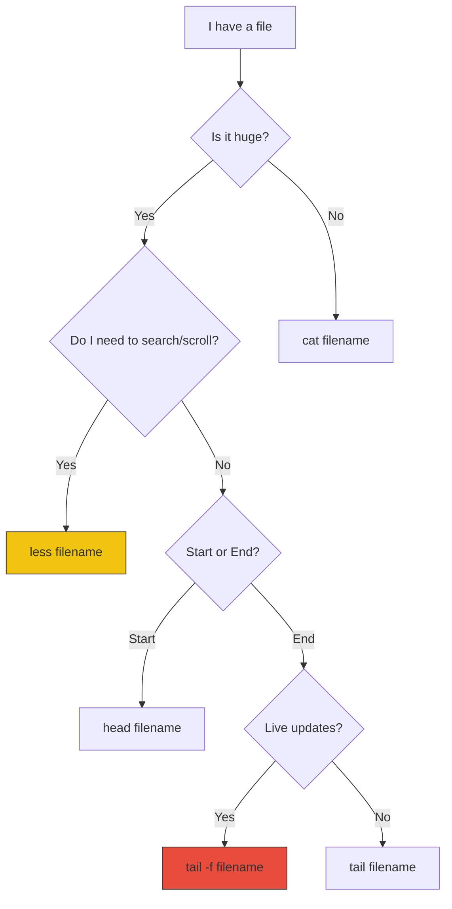

# 📜 Paging Files (Less is More)

> **"Don't drink from the firehose. Sip from the glass."**


## 📚 Overview

When you `cat` a file with 100,000 lines, your terminal scrolls uncontrollably, and you miss the content. This is where **pagers** come in. Tools like `less` and `more` allow you to view file contents one screen at a time, scroll, and search interactively—without loading the entire file into memory.

## 🎓 Learning Objectives

By the end of this module, you will:

- ✅ Understand the difference between `cat`, `more`, and `less`
- ✅ Master navigation shortcuts in `less` (vim-style)
- ✅ Search effectively *within* an open file
- ✅ Use `head` and `tail` for inspecting file ends
- ✅ Monitor live logs using `tail -f`

## 🏗️ Memory Management: Cat vs. Less

Why use `less`? It handles massive files gracefully using lazy loading.

```mermaid
graph TD
    subgraph CAT ["❌ Cat (The Memory Eater)"]
        F1[Input File (50GB)] -->|Loads 100%| RAM[Memory]
        RAM -->|Crash/Lag| Term1[Terminal Display]
    end

    subgraph LESS ["✅ Less (The Smart Buffer)"]
        F2[Input File (50GB)] -->|Loads Buffer Only| Buff[Small Buffer]
        Buff -->|Smooth Scroll| Term2[Terminal Display]
        Term2 -->|User Scrolls Down| F2
    end
    
    style CAT fill:#e74c3c,stroke:#333
    style LESS fill:#2ecc71,stroke:#333
```

## 🛠️ Essential Tools

### 1. `less` - The Standard Pager
The gold standard for viewing text files. "Less is more" (literally, it has more features than `more`).

**Navigation Shortcuts:**
| Key | Action |
|-----|--------|
| `Space` / `f` | Scroll down one page |
| `b` | Scroll back one page |
| `j` / `↓` | Scroll down one line |
| `k` / `↑` | Scroll up one line |
| `G` | Jump to **end** of file |
| `g` | Jump to **start** of file |
| `/text` | Search forward for "text" |
| `n` | Next match |
| `q` | **Quit** |

### 2. `head` - First N Lines
Perfect for checking CSV headers or script shebangs.

```bash
head -n 5 data.csv  # Show first 5 lines
```

### 3. `tail` - Last N Lines
Crucial for `log files` since new errors appear at the end.

```bash
tail -n 20 error.log  # Show last 20 lines
```

### 4. `tail -f` - Follow Mode (Live)
The most used command by SysAdmins. It keeps the file open and prints new lines as they are added.

```bash
tail -f production.log
```

## 🪜 Decision Flow: How to View a File?



## 🏆 Real-World DevOps Story

### 💡 **The Server Meltdown**

**Scenario**: A web server crashed. The disk was 100% full due to a runaway `access.log` file that had grown to **40 GB**.

**The Mistake**:
A junior admin tried to open it with `nano` (a text editor). The server froze completely because `nano` tried to load 40GB into 4GB of RAM.

**The Fix**:
A senior engineer SSH'd in (barely) and used `tail`:

```bash
tail -n 100 access.log
```

They instantly saw millions of requests from a single IP address (a DDoS attack). 

**Outcome**: blocked the IP, deleted the log, and restarted nginx.
**Lesson**: Never open large logs with an editor. Use `tail` or `less`.

## 🎓 Interview Questions

### Q1: Can I run shell commands while inside `less`?
<details>
<summary>Click to reveal answer</summary>

Yes! You can type `!command` inside `less` to execute a shell command.
For example, typing `!ls` inside less will list files in the current directory, then return to the file view.
</details>

### Q2: How do you exit `tail -f`?
<details>
<summary>Click to reveal answer</summary>

Press `Ctrl + C`. This sends the SIGINT signal to the process, terminating it.
</details>

### Q3: What does the `F` key do inside `less`?
<details>
<summary>Click to reveal answer</summary>

It switches `less` into "follow mode", effectively behaving like `tail -f`. New lines will appear as they are written. To stop following and scroll back up, press `Ctrl + C`.
</details>

## 📝 Quiz

1. **Which command is best for viewing the headers of a CSV file?**
   - [ ] a) `tail`
   - [x] b) `head`
   - [ ] c) `cat`
   - [ ] d) `grep`

2. **How do you search for "error" inside `less`?**
   - [x] a) `/error`
   - [ ] b) `find error`
   - [ ] c) `grep error`
   - [ ] d) `s/error`

3. **How do you quit `less`?**
   - [ ] a) `Esc`
   - [ ] b) `Ctrl + C`
   - [ ] c) `exit`
   - [x] d) `q`

4. **What does `tail -f` do?**
   - [ ] a) Tail file (end only)
   - [x] b) Follow file (watch for changes)
   - [ ] c) Force tail
   - [ ] d) Find in tail

5. **Which tool loads the entire file into RAM?**
   - [ ] a) `less`
   - [ ] b) `head`
   - [x] c) `nano` / `vim` / `cat`
   - [ ] d) `tail`

**Answers**: 1-b, 2-a, 3-d, 4-b, 5-c

## 🔗 Next Steps

Continue to: **[Man Pages](../07-Man-Pages/README.md)** →

## 📚 Additional Resources
- [Less Manual](https://man7.org/linux/man-pages/man1/less.1.html)
- [Vim Cheat Sheet (Shortcuts apply to Less)](https://vim.rtorr.com/)

---
**📌 Pro Tip**: You can pipe *any* command output to less!
`ls -R / | less` (Browse your entire filesystem interactively)
