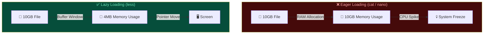
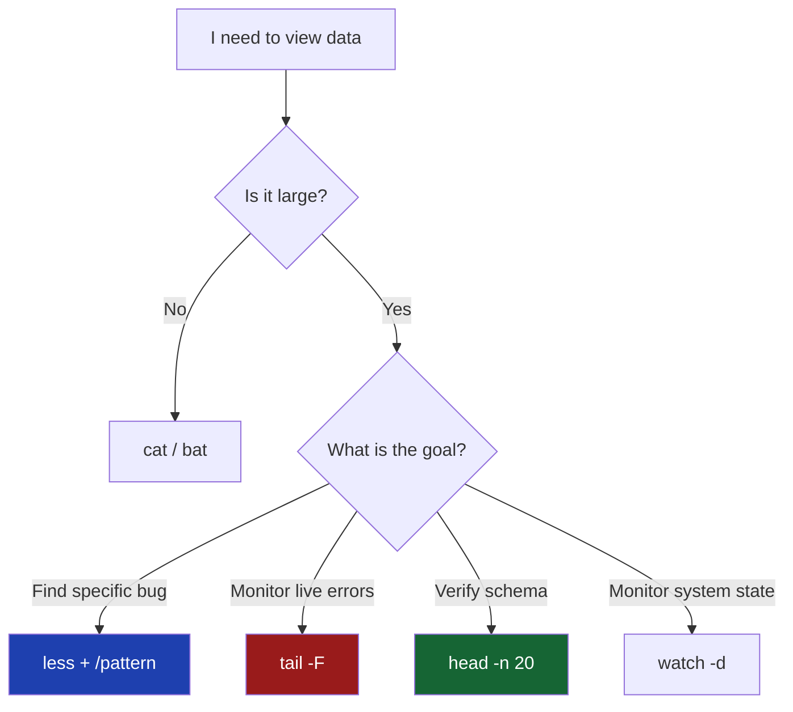

# 📜 Paging Files (Mastering Large Data Streams)

> **"A senior engineer never drinks from the firehose. They use a pager to sip precisely what is needed."**

```mermaid
graph TD
    subgraph Pager_Architecture ["🔍 THE PAGING ECOSYSTEM"]
        direction LR
        Disk[([� 100GB Log File])] -->|File Descriptor| Kernel{🐧 Linux Kernel}
        Kernel -->|Memory-Mapped / Buffer| Pager[📜 Pager: LESS]
        Pager -->|ViewPort| Screen[🖥️ User Terminal]
        
        style Pager_Architecture fill:#0f172a,stroke:#3b82f6,stroke-width:2px,color:#fff
        style Disk fill:#1e293b,color:#fff
        style Kernel fill:#334155,color:#fff
        style Pager fill:#2563eb,color:#fff
        style Screen fill:#10b981,color:#fff
    end
```
## 📚 Overview
In the DevOps world, log files are the "black boxes" of our infrastructure. When an application crashes, it doesn't leave a note; it leaves a 40GB trace. Attempting to `cat` or `nano` such a file will lock up your terminal or crash your server. **Paging Utilities** allow you to navigate these massive data streams with surgical precision, constant memory usage, and powerful search capabilities.
## 🎓 Learning Objectives
By the end of this module, you will:
- ✅ Understand the **Memory Mechanics** of Pagers (Lazy Loading).
- ✅ Master **Vim-style navigation** inside `less`.
- ✅ Efficiently monitor live log rotations using `tail -F`.
- ✅ Perform **Reverse Searching** and **Filtering** inside active streams.
- ✅ Combine `head` and `tail` for range-based data extraction.
---
## 🏗️ Memory Mechanics: Why Pagers Matter
Most text editors (Notepad, Nano, VS Code) are **"Eager Loaders"**. They attempt to read the entire file into RAM before showing you the first line. 

**Key Takeaway**: `less` doesn't care if the file is 1MB or 1TB; its memory footprint remains minuscule.

---
## 🛠️ The Professional Toolkit

### 1. `less` - The Power User's Pager
"Less is more" is a pun on the older `more` command which couldn't scroll backward.
#### 🚀 Navigation Shortcuts
| Key | Action | DevOps Context |
|-----|--------|----------------|
| `G` | Jump to **Absolute End** | Checking the latest timestamp in a log. |
| `g` | Jump to **Absolute Start** | Verifying service initialization logs. |
| `f` / `b` | Page Forward / Backward | Scanning through hourly log rotations. |
| `/pattern` | Search Forward (Regex) | Finding a specific `RequestID`. |
| `?pattern` | Search Backward (Regex) | Finding the *previous* occurrence of an error. |
| `&pattern` | **Filter Mode** | Hide all lines that DON'T match (High Value). |
| `v` | Open in Editor | Instantly jump from `less` to `vim` to fix a config. |
#### ⚙️ Pro Configuration
Add this to your `.bashrc` to make `less` a powerhouse:
```bash
export LESS="-R -S -M -i"
# -R: Show colors (ANSI)
# -S: Chop long lines (don't wrap)
# -M: Show verbose prompt with line %
# -i: Case-insensitive search
```
---
### 2. `tail` - Real-time Forensics
`tail` is your eyes on a live system.
- **`tail -n 50 app.log`**: Shows the last 50 lines.
- **`tail -f app.log`**: (Follow) Watch logs as they happen.
- **`tail -F app.log`**: (Follow + Retry) **Required for Production.** If a log-rotation tool (like `logrotate`) moves the file, `-F` detects the name change and automatically starts following the new file.
### 3. `head` - Structural Analysis
Usually used to check CSV headers or configuration metadata.
```bash
# Get the JSON schema but not the 1M records
head -n 20 data.json
```
### 4. `watch` - The Observer
Runs a command repeatedly and highlights the differences.
```bash
# Watch disk space usage every 1 second
watch -d -n 1 df -h
```
---
## 🪜 Decision Logic: Which tool to use?



---

## 🏆 Real-World DevOps Case Study

### � **The Incident: The Silent Disk Exhaustion**

**The Scenario**: A Postgres database stopped accepting connections. The logs were growing at 500MB per minute. The support team tried to `grep` the file, but it was too slow because the disk `I/O` was saturated.

**The Solution**:
Instead of `grep`, the lead SRE used `less` to jump straight to the end of the file:
1. `less /var/log/postgresql/main.log`
2. Pressed `G` (End of file)
3. Pattern recognized: `FATAL: extreme disk pressure at block...`
4. Used `&` (Filter) to isolate the PID causing the loop: `&PID 4122`

**The Outcome**:
The team identified an unoptimized query loop in seconds. They killed the process and reclaimed 200GB of space by truncating the log.

**Lesson**: Search tools like `grep` scan the whole file. Pagers like `less` let you skip 99% of the noise to find the root cause.

---

## 🎓 Interview Prep

#### Q1: What is the difference between `tail -f` and `tail -F`?
<details>
<summary>Click to reveal answer</summary>
`tail -f` follows the **File Descriptor**. If the file is renamed or rotated, `tail` stops receiving updates. `tail -F` follows the **Filename**. It will wait for the file to reappear if it's deleted/rotated, making it robust for production logging systems.
</details>

#### Q2: How do you view lines 500 to 520 of a million-line file?
<details>
<summary>Click to reveal answer</summary>
Use a pipe between `head` and `tail`:
```bash
head -n 520 large_file.txt | tail -n 20
```
Explain: `head` takes the first 520, then `tail` takes the last 20 of *that* subset.
</details>

---

## 📝 Knowledge Check

1. **Which `less` command hides lines that don't match your keyword?**
   - [ ] a) `/`
   - [ ] b) `?`
   - [x] c) `&`
   - [ ] d) `f`

2. **In a high-traffic production environment, which is safer?**
   - [ ] a) `tail -f`
   - [x] b) `tail -F`
   - [ ] c) `cat | tail`
   - [ ] d) `less +G`

3. **How do you scroll BACKWARD in `less`?**
   - [x] a) `b`
   - [ ] b) `f`
   - [ ] c) `u`
   - [ ] d) `k` (backward line only)

4. **Which tool is designed to monitor the *changing* output of a command?**
   - [ ] a) `pager`
   - [x] b) `watch`
   - [ ] c) `loop`
   - [ ] d) `monitor`

**Answers**: 1-c, 2-b, 3-a, 4-b

## 🔗 Additional Resources
- [Mastering the Less Pager](https://www.linuxjournal.com/content/mastering-less-pager)
- [GNU Coreutils: Tail Documentation](https://www.gnu.org/software/coreutils/manual/html_node/tail-invocation.html)
- [Vim Keybindings Reference](https://vim.rtorr.com/)
