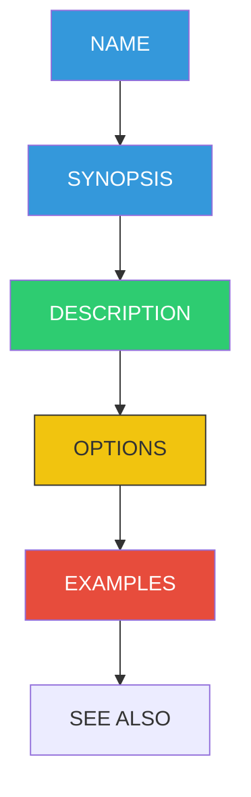

# 📖 Man Pages (The Built-in Manual)

> **"Give a person a fish, you feed them for a day. Teach them to use `man`, and they solve their own problems forever."**


## 📚 Overview

The name comes from **Manual**. Before Google and Stack Overflow, there were Man pages. They are the definitive, offline documentation for every command on your system. Unlike online tutorials which might be outdated, `man` pages exactly match the version of the software installed on your machine.

## 🎓 Learning Objectives

By the end of this module, you will:

- ✅ Access documentation for any command using `man`
- ✅ Navigate and search inside manual pages
- ✅ Understand the different "Sections" of the manual (1 vs 5 vs 8)
- ✅ Use `apropos` to find commands when you don't know the name
- ✅ Become self-sufficient in debugging arguments

## 🏗️ Anatomy of a Man Page



**Key Sections:**
- **NAME**: The command and a one-line description.
- **SYNOPSIS**: The syntax diagram (shows required vs optional flags).
- **DESCRIPTION**: Detailed explanation of behavior.
- **OPTIONS**: The flag list (e.g., what `-r` or `--recursive` does).

## 🗺️ The 8 Sections of the Manual

Sometimes a name exists in multiple places (e.g., `printf` is a command AND a C function). The manual is divided into numbered sections:

| Section | Description | Example |
|---------|-------------|---------|
| **1** | **User Commands** (Executable programs) | `ls`, `grep` |
| **2** | System Calls (Kernel functions) | `read`, `write` |
| **3** | Library Calls (C libraries) | `printf` (C) |
| **4** | Special Files (Devices) | `/dev/null` |
| **5** | **File Formats** (Config files) | `passwd`, `ssh_config` |
| **8** | **System Admin Commands** (Root only) | `useradd`, `fdisk` |

**Selecting a section:**
```bash
man 1 printf  # Shows the shell command
man 3 printf  # Shows the C library function
```

## 🔍 Searching for Commands: `apropos`

Don't remember the command name? Search the manual descriptions with `apropos` (or `man -k`).

```bash
$ apropos "directory"
mkdir (1)            - make directories
rmdir (1)            - remove empty directories
pwd (1)              - print name of current/working directory
...
```

## 🏆 Real-World DevOps Story

### 💡 **The RTFM Moment**

**Scenario**: A DevOps team was migrating from Linux to macOS for development. Their automated scripts suddenly broke. The `sed` command was throwing errors: `sed: illegal option -- i`.

**The Panic**:
engineers started rewriting the regex, thinking the syntax was wrong. They copied "fixes" from Stack Overflow that made it worse.

**The Fix**:
One engineer ran `man sed` on Linux and `man sed` on macOS.
- **Linux** uses `GNU sed`.
- **macOS** uses `BSD sed`.

Reading the **SYNOPSIS**, they realized `BSD sed -i` *requires* an empty string argument for backups (`sed -i ''`), whereas GNU sed makes it optional.

**Outcome**: They adjusted the script to detect the OS and pass the correct flag. Problem solved in 5 minutes by reading the manual.

## 🎓 Interview Questions

### Q1: How do I exit a man page?
<details>
<summary>Click to reveal answer</summary>

Press `q`. Man pages open in a pager (usually `less`), so all `less` shortcuts work.
</details>

### Q2: What if I only want a one-line description of a command?
<details>
<summary>Click to reveal answer</summary>

Use `whatis`:
```bash
$ whatis cat
cat (1)              - concatenate files and print on the standard output
```
</details>

### Q3: How do I search *inside* a man page?
<details>
<summary>Click to reveal answer</summary>

Press `/` followed by your keyword, then `Enter`. Use `n` to jump to the next match.
Example: `/recursive` inside `man cp`.
</details>

## 📝 Quiz

1. **Which command searches manual page descriptions?**
   - [ ] a) `findman`
   - [x] b) `apropos`
   - [ ] c) `search`
   - [ ] d) `grep`

2. **Section 5 of the manual covers:**
   - [ ] a) User commands
   - [ ] b) System calls
   - [x] c) File formats and configurations
   - [ ] d) Games

3. **What is the `SYNOPSIS` section?**
   - [x] a) Syntax usage diagram
   - [ ] b) History of the command
   - [ ] c) Author credits
   - [ ] d) Installation guide

4. **Which tool is typically used to display man pages?**
   - [ ] a) `cat`
   - [ ] b) `vim`
   - [x] c) `less`
   - [ ] d) `tail`

5. **Where would you find documentation for `/etc/passwd`?**
   - [ ] a) `man 1 passwd` (Command)
   - [x] b) `man 5 passwd` (File Format)
   - [ ] c) `man 8 passwd` (Admin)
   - [ ] d) `help passwd`

**Answers**: 1-b, 2-c, 3-a, 4-c, 5-b

## 🔗 Next Steps

Continue to: **[Programs and Commands](../08-Programs-and-Commands/README.md)** →

## 📚 Additional Resources
- [Man7.org (Online Man Pages)](https://man7.org/linux/man-pages/)
- [TLDR Pages](https://tldr.sh/) - Simplified community-driven man pages

---
**📌 Pro Tip**: Install `tldr` for a modern experience.
`tldr tar` gives you just the 5 most common examples instead of the 50-page technical manual!
