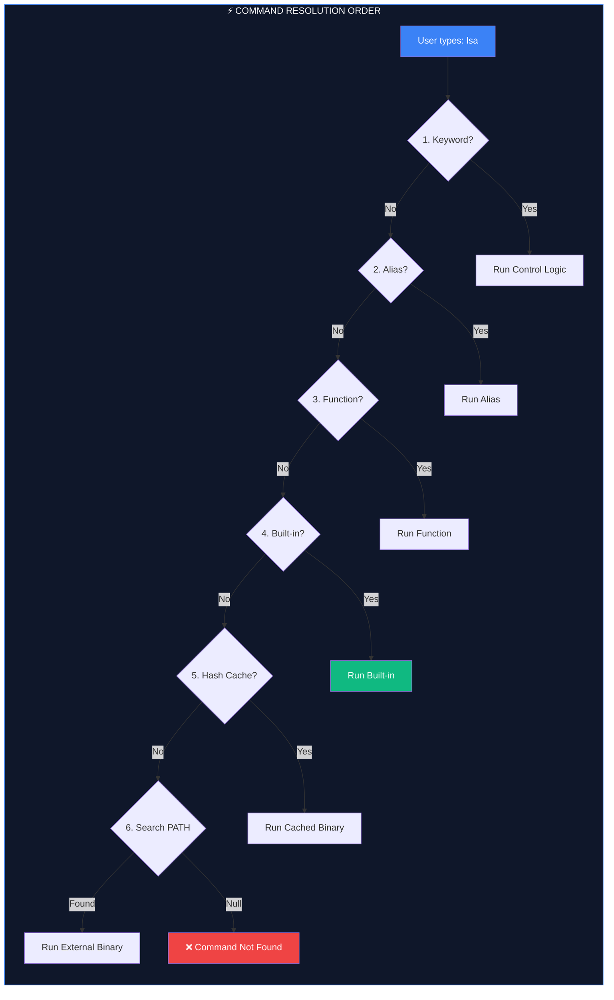

# 💻 Programs and Commands (Execution Architecture)

> **"Not all commands are created equal. Knowing what executes is half the battle."**



## 📚 Overview

When you type a command in your terminal, the shell (Bash/Zsh) doesn't just "run a file." It performs a complex lookup procedure to decide which logic to execute. Understanding this **Command Resolution Order** is critical for DevOps engineers to debug PATH issues, avoid naming collisions, and ensure scripts behave predictably across different environments.

---

## 🎓 Learning Objectives

By the end of this module, you will:

- ✅ Identify the **4 Categories** of commands (Built-in, External, Alias, Function).
- ✅ Master the shell's **Search Precedence** logic.
- ✅ Audit command sources using `type`, `which`, and `hash`.
- ✅ Understand the **Security Implications** of `PATH` manipulation.
- ✅ Debug "Ghost Commands" caused by caching.

---

## 🏗️ The Four Pillars of Execution

### 1. Shell Keywords & Built-ins
These are compiled directly into the shell binary (e.g., `bash`).
- **Precedence**: Extremely High.
- **Speed**: Fastest (No process creation).
- **Example**: `cd`, `echo`, `if`, `while`.
- **Note**: `cd` MUST be a built-in because a child process cannot change the parent's directory.

### 2. Aliases & Functions
User-defined shortcuts and logic blocks residing in memory (`.bashrc`).
- **Precedence**: Aliases are applied first during text expansion.
- **Speed**: Very Fast (Memory-based).
- **Example**: `alias ll='ls -la'`, `function git_sync() { ... }`.

### 3. Hash Table (The Cache)
To avoid searching the disk every time, the shell remembers where it found a binary last time in a "Hash Table".
- **Precedence**: Higher than disk search.
- **Gotcha**: If you move a binary to a different folder, the shell might still try to run it from the old path until you clear the hash.
- **Command**: `hash` (view cache), `hash -d cmd` (delete one), `hash -r` (reset all).

### 4. External Binaries (The Disk)
Files located in directories listed in your `$PATH`.
- **Precedence**: Lowest (Last resort).
- **Speed**: Slower (Requires `fork()` and `exec()`).
- **Example**: `grep`, `docker`, `terraform`.

---

## 🛠️ Investigative Tools

### `type` - The Only Source of Truth
Never use `which` to verify what is actually running. `which` only searches for files on disk. `type` understands aliases and built-ins.

```bash
$ type cd
cd is a shell builtin

$ type ll
ll is aliased to `ls -alF`

$ type -a python
python is /usr/local/bin/python
python is /usr/bin/python
```

### `PATH` - The Road Map
The `$PATH` variable is a colon-separated list of directories. The shell searches them from **Left to Right**.

```bash
$ echo $PATH
/usr/local/bin:/usr/bin:/bin:/usr/sbin:/sbin
```

⚠️ **SECURITY WARNING**: Never put `.` (current directory) at the start of your PATH. An attacker could place a malicious `ls` binary in a folder, and if you `cd` there and type `ls`, you'd run their virus instead of the real command.

---

## 🏆 Real-World DevOps Case Study

### 💡 **The Case of the Outdated Tool**

**The Scenario**: A platform team upgraded their global `terraform` binary from `0.12` to `1.5` in `/usr/bin/`. However, one engineer's machine kept running `0.12`. 

**The Investigation**:
1. Engineer ran `which terraform` -> Result: `/usr/bin/terraform`.
2. Engineer ran `terraform version` -> Result: `0.12`.
3. Team Lead ran `type -a terraform`.

**The Discovery**:
```bash
$ type -a terraform
terraform is /home/user/bin/terraform
terraform is /usr/bin/terraform
```
The engineer had an old version in their personal `~/bin/` folder. Because `~/bin/` appeared earlier in their `$PATH` than `/usr/bin/`, the shell chose the old one every time.

**The Fix**:
The engineer removed the local binary and updated their `$PATH` structure.

---

## 🎓 Interview Questions

#### Q1: Why does `which cd` return nothing, but `type cd` works?
<details>
<summary>Click to reveal answer</summary>
`which` is an external tool that only searches the filesystem (`$PATH`) for executable files. `cd` is a shell built-in; it doesn't exist as a separate file on disk. `type` is a shell built-in itself, so it has internal knowledge of the shell's state.
</details>

#### Q2: How do you bypass an alias temporarily?
<details>
<summary>Click to reveal answer</summary>
Prepend a backslash `\` to the command:
```bash
\ls  # Runs the real binary, ignoring any 'ls' alias.
```
Alternatively, use the full path: `/bin/ls`.
</details>

#### Q3: What is the "Hash" in shell execution?
<details>
<summary>Click to reveal answer</summary>
The shell caches the absolute path of external binaries it has found in the PATH to avoid expensive disk lookups. If you install a new version of a tool in a different directory during a session, you might need to run `hash -r` to force the shell to look again.
</details>

---

## 📝 Knowledge Check

1. **What is the search order for commands?**
   - [ ] a) Path -> Alias -> Built-in
   - [x] b) Alias -> Function -> Built-in -> Path
   - [ ] c) Built-in -> Path -> Alias
   - [ ] d) Random

2. **Which command is used to clear the shell's path cache?**
   - [ ] a) `clear`
   - [ ] b) `reset path`
   - [x] c) `hash -r`
   - [ ] d) `rehash`

3. **Where should you check for the "Truth" about a command?**
   - [ ] a) `which`
   - [ ] b) `whereis`
   - [x] c) `type`
   - [ ] d) `ls`

4. **Why is `cd` a built-in?**
   - [ ] a) To save space
   - [x] b) Because a child process cannot change the parent's environment
   - [ ] c) Because it is faster
   - [ ] d) It isn't, it's a binary

**Answers**: 1-b, 2-c, 3-c, 4-b

## 🔗 Additional Resources
- [GNU Bash: Command Search and Execution](https://www.gnu.org/software/bash/manual/html_node/Command-Search-and-Execution.html)
- [How the Shell Finds Commands](https://www.linux.com/training-tutorials/how-bash-shell-finds-commands/)

---
**📌 Pro Tip**: Use `command -v <cmd>` in your shell scripts instead of `which`. It is more portable and handles built-ins better.
