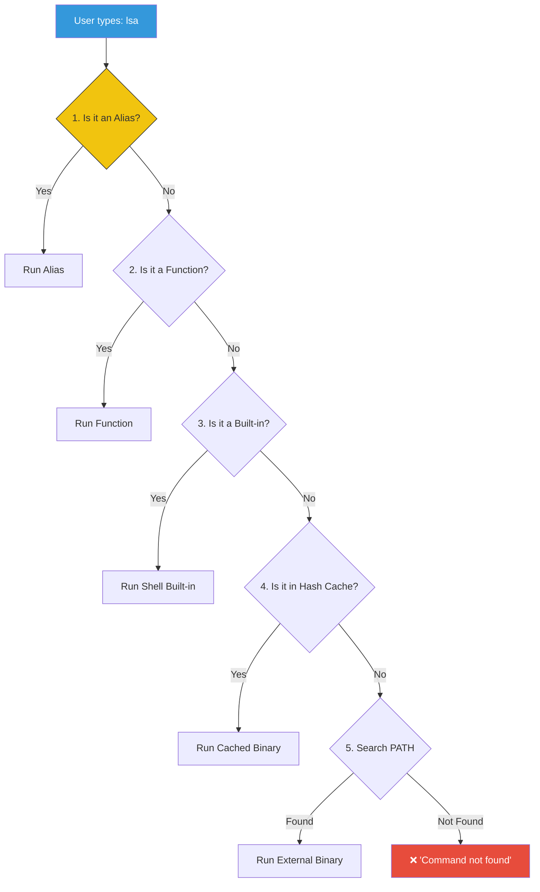

# 💻 Programs and Commands (Execution Flow)

> **"Not all commands are created equal."**


## 📚 Overview

When you type `ls` or `cd`, magic happens. But *what* exactly executes? Is it a file on the disk? A function in your shell? An alias? Understanding the **Command Resolution Order** is critical for debugging why a script works on your machine but fails in CI/CD.

## 🎓 Learning Objectives

By the end of this module, you will:

- ✅ Distinguish between Alias, Function, Built-in, and External Binary
- ✅ Understand the `PATH` environment variable
- ✅ Use `type`, `which`, and `whereis` to investigate commands
- ✅ Master the order of execution precedence

## 🏗️ Command Resolution Order

The shell follows a strict hierarchy when checking what to run:



## 🔍 Investigation Tools

### 1. `type` - The Truth Teller
The most robust way to see what a command is.

```bash
$ type cd
cd is a shell builtin

$ type grep
grep is /usr/bin/grep

$ type ll
ll is aliased to `ls -alF`
```

### 2. `which` - The Binary Finder
Only searches for **external binaries** in your PATH. It ignores aliases and built-ins.

```bash
$ which python3
/usr/bin/python3
```

### 3. `PATH` - The Map
The exact list of directories the shell searches for binaries, separated by colons (`:`).

```bash
$ echo $PATH
/usr/local/bin:/usr/bin:/bin:/usr/sbin:/sbin
```

## 🧠 Types of Commands

| Type | Description | Optimization | Example |
|------|-------------|--------------|---------|
| **Alias** | Shortcut for another command text. | Fast text replacement. | `ll` |
| **Function** | Code block loaded in shell memory. | Very Fast execution. | `mkdir_cd` |
| **Built-in** | Compiled into the shell binary itself. | Fastest (no process fork). | `cd`, `echo` |
| **Binary** | Separate executable file on disk. | Slowest (requires creating new process). | `grep`, `docker` |

## 🏆 Real-World DevOps Story

### 💡 **The Phantom Python**

**Scenario**: A CI/CD pipeline was failing with `ImportError: No module named requests`, even though the engineer insisted they installed it.

**The Debug**:
The engineer ran `pip install requests` and it said "Requirement already satisfied".
Then they ran `python script.py` and it failed.

**The Discovery**:
They used `type -a python`:

```bash
$ type -a python
python is /usr/local/bin/python (Python 3.9)
python is /usr/bin/python       (Python 2.7)
```

And `type pip`:
```bash
$ type pip
pip is /usr/local/bin/pip (linked to Python 3.9)
```

**The Issue**: `python` invoked Python 2.7, but `pip` installed to Python 3.9. They were mismatched.

**The Fix**:
They updated the script to explicitly use `python3` instead of `python`.

## 🎓 Interview Questions

### Q1: Why is `cd` a shell built-in?
<details>
<summary>Click to reveal answer</summary>

Because built-ins run inside the current shell process. An external binary runs in a **child process**. A child process cannot change the working directory of its parent. If `cd` were a binary, it would change its own directory and then exit, leaving your shell exactly where it was.
</details>

### Q2: How do you bypass an alias to run the real command?
<details>
<summary>Click to reveal answer</summary>

Quote the command or use a backslash:
```bash
\ls
# OR
'ls'
```
This forces the shell to skip alias lookup and go straight to functions/built-ins/path.
</details>

### Q3: What happens if I have two scripts with the same name in my PATH?
<details>
<summary>Click to reveal answer</summary>

The shell executes the one found in the directory that appears **earlier** in the PATH variable. This is why `/usr/local/bin` is usually before `/usr/bin`—so user-installed versions override system defaults.
</details>

## 📝 Quiz

1. **Which command runs fastest?**
   - [ ] a) External Binary
   - [ ] b) Alias
   - [x] c) Shell Built-in
   - [ ] d) Script

2. **Which tool shows if a command is an alias?**
   - [ ] a) `which`
   - [x] b) `type`
   - [ ] c) `whereis`
   - [ ] d) `locate`

3. **What separator is used in the PATH variable?**
   - [ ] a) Comma (`,`)
   - [ ] b) Semicolon (`;`)
   - [x] c) Colon (`:`)
   - [ ] d) Space

4. **If `node` is in `/bin` and `/usr/local/bin`, and PATH=`/bin:/usr/local/bin`, which runs?**
   - [x] a) `/bin/node`
   - [ ] b) `/usr/local/bin/node`
   - [ ] c) Both
   - [ ] d) Random

5. **`which cd` usually returns nothing. Why?**
   - [ ] a) `cd` is not installed
   - [x] b) `cd` is a built-in, not a binary
   - [ ] c) `cd` is hidden
   - [ ] d) Permission denied

**Answers**: 1-c, 2-b, 3-c, 4-a, 5-b

## 🔗 Next Steps

Continue to: **[Basic Variables](../09-Basic-Variables/README.md)** →

## 📚 Additional Resources
- [Bash Reference: Command Search](https://www.gnu.org/software/bash/manual/html_node/Command-Search-and-Execution.html)
- [The PATH Variable](http://www.linfo.org/path_env_var.html)

---
**📌 Pro Tip**: Use `type -a command_name` to see ALL locations containing that command, not just the first one found!
