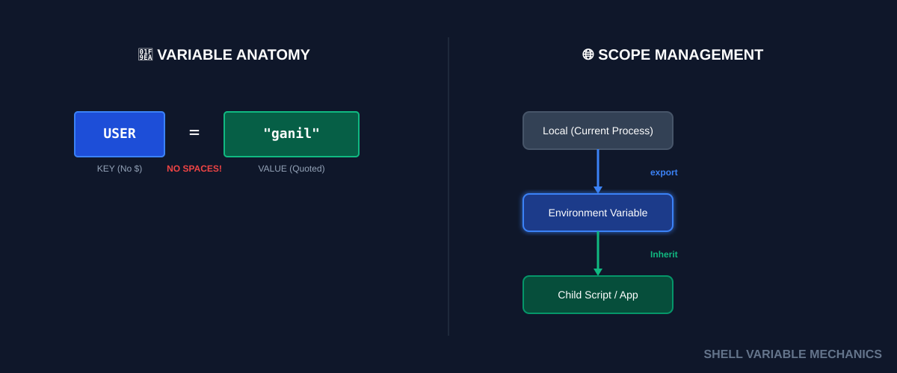
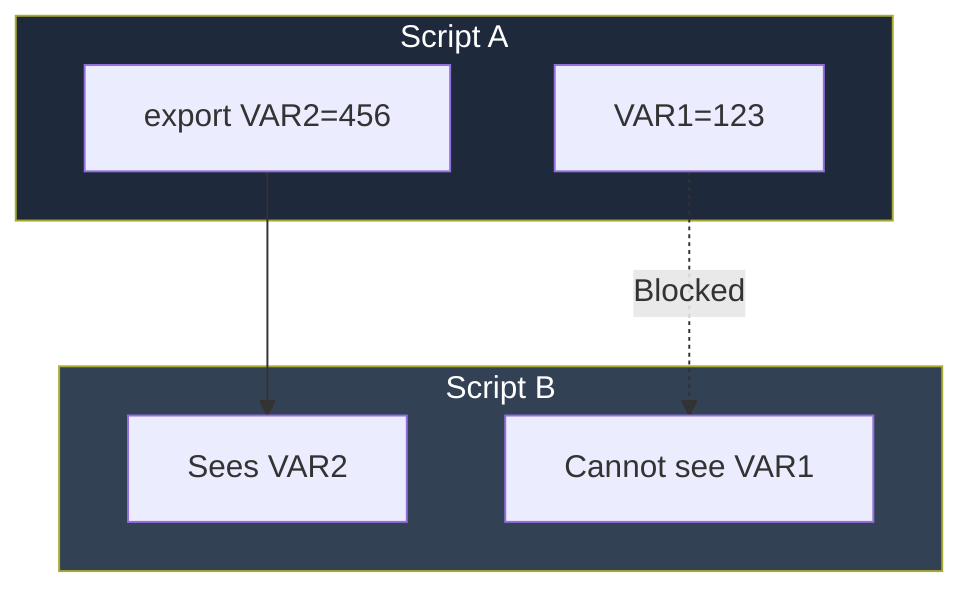

# 📦 Basic Variables (State & Abstraction)

> **"Hardcoding is a technical debt you pay every day. Variables are the currency of automation."**



## 📚 Overview

Variables are the foundation of dynamic infrastructure. In DevOps, we use them to store API keys, target server IPs, deployment tags, and temporary compute results. Without variables, every script would be a static, fragile set of commands that breaks the moment the environment changes.

---

## 🎓 Learning Objectives

By the end of this module, you will:

- ✅ Master the **Assignment Syntax** (and why spaces break your script).
- ✅ Understand **Parent-Child Inheritance** using `export`.
- ✅ Decode **Quoting Rules**: Single (`'`) vs Double (`"`) vs Backticks (`` ` ``).
- ✅ Leverage **Parameter Expansion** for smart defaults (`${var:-fallback}`).
- ✅ Use **Command Substitution** to store command output in variables.

---

## 🏗️ The Rules of Engagement

### 1. The Syntax (No Spaces!)
In Bash, spaces are command delimiters. Adding a space around `=` changes the meaning entirely.

| Syntax | Action |
|--------|--------|
| `PORT=80` | **✅ Assignment**: Stores 80 in PORT. |
| `PORT = 80` | **❌ Executing**: Tries to run a command named `PORT` with arguments `=` and `80`. |
| `PORT= 80` | **❌ Setting Env**: Tries to run a command named `80` with an empty variable `PORT`. |

### 2. Quoting: The Great Decider
The type of quotes you use determines whether a variable is "expanded" or treated as literal text.

```bash
USER="Ganil"

# 🟢 Double Quotes: "Expansion allowed"
echo "Hello $USER"  # Output: Hello Ganil

# 🔴 Single Quotes: "Strict Literal"
echo 'Hello $USER'  # Output: Hello $USER

# ⚙️ Backticks / $(...): "Command Execution"
NOW=$(date)
echo "Current time is $NOW"
```

---

## 🚀 Advanced Parameter Expansion (DevOps Gold)

Senior engineers don't just use `$VAR`. They use expansion logic to handle edge cases.

| Syntax | Description | Use Case |
|--------|-------------|----------|
| `${VAR:-default}` | If VAR is empty, use `default`. | **CI/CD Default Regions** |
| `${VAR:?error}` | If VAR is empty, **STOP** script and print error. | **Missing API Keys** |
| `${#VAR}` | Returns the length of the string. | **Password Complexity Validation** |
| `${VAR/old/new}` | Replace first occurrence of `old` with `new`. | **Path Rewriting** |

**Example (Defensive Automation):**
```bash
# Crash if the Target Directory isn't provided
TARGET_DIR=${1:?"Error: You must provide a target directory!"}

# Use 'development' environment if none specified
ENV=${ENVIRONMENT:-"development"}
```

---

## 🌍 The Hierarchy of Scope

Variables do not automatically move between scripts unless you explicitly **export** them.



### Investigating your Scope:
- `set`: Shows **ALL** variables (local and global).
- `env`: Shows only **Environment** (Global) variables.
- `unset VAR`: Deletes a variable from memory.

---

## 🏆 Real-World DevOps Case Study

### 🚨 **The Incident: The Truncated Database Backup**

**The Scenario**: A nightly backup script was supposed to upload a file named `backup_2023_10_01.tar.gz`. 
Instead, it created a folder named `backup_` and an empty file.

**The Script**:
```bash
TIMESTAMP=$(date +%F)
BACKUP_FILE="backup_$TIMESTAMP_v2.tar.gz"
tar -czf "$BACKUP_FILE" /data
```

**The Bug**:
The shell looked for a variable named `$TIMESTAMP_v2`. Since it didn't exist, it evaluated to an empty string. The resulting filename was `backup_.tar.gz`.

**The Fix (Brace Ambiguity)**:
Always use curly braces to separate the variable name from surrounding text.
```bash
# ✅ Robust Syntax
BACKUP_FILE="backup_${TIMESTAMP}_v2.tar.gz"
```

---

## 🎓 Interview Questions

#### Q1: What is the benefit of `$(command)` over backticks `` `command` ``?
<details>
<summary>Click to reveal answer</summary>
Nestable and readable. You can do `FILE_PATH=$(dirname $(which terraform))` easily with `$()`. With backticks, you have to use messy escaping like `` `dirname \`which terraform\`` ``.
</details>

#### Q2: How do you make a variable "Read Only"?
<details>
<summary>Click to reveal answer</summary>
Use the `readonly` command.
```bash
readonly API_URL="https://prod.api.com"
API_URL="http://hacker.com" # 🛑 This will throw an error and fail to change
```
Useful for critical configuration in complex scripts.
</details>

#### Q3: How do you list all environment variables?
<details>
<summary>Click to reveal answer</summary>
Use the `env` command (or `printenv`). To see everything including local shell variables, use `set`.
</details>

---

## 📝 Knowledge Check

1. **If `NAME=Ant`, what does `echo '$NAME'` print?**
   - [ ] a) Ant
   - [x] b) $NAME
   - [ ] c) Empty String
   - [ ] d) Error

2. **Which syntax ensures a script stops if a variable is missing?**
   - [ ] a) `${VAR:-Error}`
   - [ ] b) `${VAR:=Error}`
   - [x] c) `${VAR:?Error}`
   - [ ] d) `${VAR}!!`

3. **What is the result of `echo $(( 10 + 5 ))`?**
   - [ ] a) 10 + 5
   - [x] b) 15
   - [ ] c) 105
   - [ ] d) Error

4. **Variables defined in `.bashrc` are available to...**
   - [ ] a) Only that specific terminal window
   - [x] b) All future terminal windows for that user
   - [ ] c) All users on the system
   - [ ] d) Only when running sudo

**Answers**: 1-b, 2-c, 3-b, 4-b

## 🔗 Additional Resources
- [ShellCheck: Common Variable Issues](https://www.shellcheck.net/)
- [Advanced Bash-Scripting Guide: Variables](https://tldp.org/LDP/abs/html/variables.html)

---
**📌 Pro Tip**: Use **ShellCheck** on your scripts. It will automatically detect $VAR vs ${VAR} bugs and quoting issues before they hit production!
