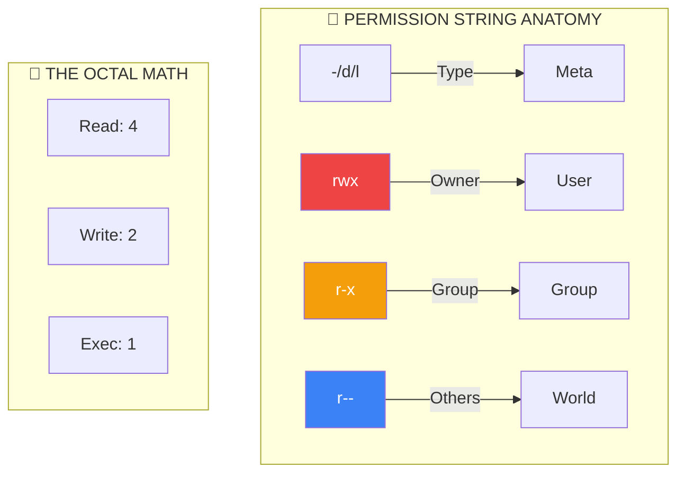

# 🔒 File Permissions (The Gatekeeper Architecture)

> **"With great power comes great responsibility. Don't `chmod 777` your problems away; you're just inviting new ones."**



## 📚 Overview

Linux is a multi-user environment where security is enforced through an elegant ownership model. Every file and directory is a gated resource with strict access rules for three layers of society: the **Owner**, the **Group**, and the **World**. 

As a DevOps engineer, you will spend half your life fixing "Permission Denied" errors and the other half securing sensitive keys (`.pem`, `.ssh`). Mastering `chmod` and `chown` is non-negotiable.

---

## 🎓 Learning Objectives

By the end of this module, you will:

- ✅ Decode the **10-character permission string** with ease.
- ✅ Master **Octal Binary Math** for precise permission setting.
- ✅ Understand the **Directory Execute Bit** (`x`) mystery.
- ✅ Manipulate ownership with `chown` and `chgrp`.
- ✅ Configure **Special Permissions** (SUID, SGID, Sticky Bit).
- ✅ Calculate your system **Umask**.

---

## 🏗️ The Permission Matrix

| Permission | Symbol | Value | File Effect | Directory Effect |
|------------|--------|-------|-------------|------------------|
| **Read** | `r` | **4** | View contents | List files (`ls`) |
| **Write** | `w` | **2** | Edit/Save | Add/Delete files |
| **Execute** | `x` | **1** | Run as program | Enter/Pass through (`cd`) |

### Standard DevOps Patterns:
- **`755` (rwxr-xr-x)**: Scripts and Directories. Owner can do everything; others can only list and run.
- **`644` (rw-r--r--)**: Configuration files. Owner can edit; others can only read.
- **`600` (rw-------)**: Private SSH keys. NO ONE but the owner can see the contents.
- **`400` (r--------)**: Immutable secrets. Read-only for the owner; locked for all others.

---

## 🔐 The Special Bits (Advanced)

Sometimes standard permissions aren't enough. We use "special bits" (the 4th digit in `4755`).

| Bit | Name | Octal | Function |
|-----|------|-------|----------|
| **SUID** | Set User ID | **4** | Run file as the **Owner** (e.g., `passwd`). |
| **SGID** | Set Group ID | **2** | Files created in a dir inherit the **Dir's Group**. |
| **Sticky**| Sticky Bit | **1** | Only the **Owner** can delete their file in a shared dir. |

**Example**: `/tmp` uses the Sticky Bit (`drwxrwxrwt`) so users can't delete each other's temporary files.

---

## 🛠️ Commands of the Trade

### 1. `chmod` (Change Mode)
Use **Symbolic** for simple tweaks and **Octal** for full resets.
```bash
# Symbolic: Targeted change
chmod u+x script.sh      # User + Execute
chmod go-rw secret.txt   # Group/Others - Read/Write

# Octal: Hard reset
chmod 600 id_rsa         # Secure SSH key
```

### 2. `chown` (Change Owner)
```bash
# Syntax: chown <user>:<group> <target>
chown -R www-data:www-data /var/www/html
```

### 3. `umask` (The Default Mask)
When you create a file, why is it `644` and not `777`? 
**Math**: `666 - umask = Final Perms`.
If your umask is `022`, your files are created as `644`.

---

## 🏆 Real-World DevOps Case Study

### 🚨 **The Incident: The Private Key Security Warning**

**The Scenario**: An automated deployment job was failing to connect to an EC2 instance. The logs showed: `@@@@@@@@@@@@ WARNING: UNPROTECTED PRIVATE KEY FILE! @@@@@@@@`. SSH refused to use the key and stopped the connection.

**The Investigation**:
The engineer ran `ls -l deploy_key.pem`.
Result: `-rw-rw-r--` (`664`).
The key was readable by the user's group. SSH's security policy requires private keys to be **exclusively** readable by the owner.

**The Fix**:
```bash
chmod 400 deploy_key.pem
```
**Outcome**: The deployment passed immediately.
**Lesson**: Security tools (SSH, GPG, Docker) often enforce "Safe Permissions" via software checks. Being "too generous" with permissions is seen as a failure by professional tools.

---

## 🎓 Interview Questions

#### Q1: You have a directory with `r--` permissions. Can you `cd` into it?
<details>
<summary>Click to reveal answer</summary>
**No.** You need the Execute (`x`) bit to "traverse" or enter a directory. With only Read (`r`), you can list the names of files inside (`ls`), but you cannot access their data or subdirectories.
</details>

#### Q2: What happens if I `chmod 777` a system binary?
<details>
<summary>Click to reveal answer</summary>
You create a massive security hole. Any user on the system could replace that binary with a malicious one (a Trojan horse). Next time the admin runs it, the system is compromised. **Never** use 777 in production.
</details>

#### Q3: Difference between `chown` and `chgrp`?
<details>
<summary>Click to reveal answer</summary>
`chown` can change both the owner and the group (`user:group`). `chgrp` is a legacy tool that can *only* change the group. In modern DevOps, `chown` is used for both.
</details>

---

## 📝 Knowledge Check

1. **What is the numeric value of `rwx r-x r--`?**
   - [ ] a) 751
   - [x] b) 754
   - [ ] c) 644
   - [ ] d) 777

2. **Which bit allows a user to run a file with the owner's identity?**
   - [x] a) SUID
   - [ ] b) SGID
   - [ ] c) Sticky Bit
   - [ ] d) Immutable

3. **How do you recursively change a folder's owner to 'webuser'?**
   - [ ] a) `chown webuser folder`
   - [x] b) `chown -R webuser folder`
   - [ ] c) `chmod -R webuser folder`
   - [ ] d) `setowner -r webuser folder`

4. **What does `chmod +x` do by default?**
   - [ ] a) Adds execute to World only
   - [x] b) Adds execute to User, Group, and World (respecting umask)
   - [ ] c) Adds execute to User only
   - [ ] d) Deletes the file

**Answers**: 1-b, 2-a, 3-b, 4-b

## 🔗 Additional Resources
- [Understanding SUID, SGID and Sticky Bit](https://www.linuxnix.com/suid-sgid-sticky-bit-linux-explained/)
- [Chmod Calculator & Helper](https://chmod-calculator.com/)

---
**📌 Pro Tip**: Use `stat -c %a <file>` to see only the octal number (e.g., `755`) without the confusing string!
