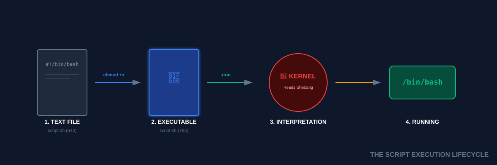

# 📜 Finally Scripting (The Automation Handshake)

> **"If you have to type it twice, script it once. If you have to script it twice, automate it for life."**



## 📚 Overview

You have mastered the terminal's individual notes. Shell Scripting is the art of composing those notes into a **Symphony of Automation**. A script is simply a text file containing the exact same commands you type manually, but executed by the system with speed and reliability. 

This module transitions you from a manual operator to an **Automation Engineer**.

---

## 🎓 Learning Objectives

By the end of this module, you will:

- ✅ Understand the **Shebang** (`#!`) and the Kernel-Interpreter handshake.
- ✅ Master the **Script Lifecycle**: Write → Chmod → Run.
- ✅ Implement **Bash Strict Mode** (`set -e`) for fail-fast reliability.
- ✅ Utilize **Trace Debugging** (`set -x`) to watch data flow.
- ✅ Effectively use **Exit Codes** to communicate success/failure.

---

## 🏗️ Anatomy of a Professional Script

A professional DevOps script is structured for readability and maintainability.

### 1. The Shebang (`#!`)
The first two bytes of the file tell the Kernel "This is not a binary, use this program to read me."
- **Standard**: `#!/bin/bash`
- **Portable**: `#!/usr/bin/env bash` (Recommended: Searches `$PATH` for the bash binary).

### 2. The Header (Metadata)
Always include who wrote it and what it does.
```bash
# Author: Ganil
# Date: 2026-01-11
# Description: Automates local database backups to S3.
```

### 3. The "Strict Mode" (Safety First)
Bash is notoriously "forgiving," which is dangerous in production. 
Add these flags to the top of every script:
```bash
set -e          # Exit immediately if a command fails
set -u          # Exit if you use an undeclared variable
set -o pipefail # If any part of a pipe fails, the whole script fails
```

---

## 🛠️ The DevOps Workflow: Write, Chmod, Run

### Step 1: Create
```bash
vim deploy.sh
```

### Step 2: Make Executable
Files are created as `644` (Non-executable) by default.
```bash
chmod +x deploy.sh
```

### Step 3: Run
```bash
./deploy.sh
```
**Why `./`?** For security specific reasons, Linux does not search the current directory for programs. You must specify the path explicitly.

---

## 🐛 The Debugging Arsenal

### The Trace Mode (`set -x`)
Don't wonder what happened; watch it. 
```bash
# Option 1: Run the script in debug mode
bash -x deploy.sh

# Option 2: Wrap a specific block in your script
set -x
# Dangerous code here
set +x
```
*Output*: Every line is printed prefixed with `+` after variables are expanded.

### The Linter (ShellCheck)
**ShellCheck** is the "Spell Check" of DevOps. It analyzes your code for security leaks, logic errors, and bad habits before you ever run the script.

---

## 🏆 Real-World DevOps Case Study

### 🚨 **The Ghost Backup Failure**

**The Scenario**: A backup script was running every night. The admin checked it, and it always said `✅ Backup Complete`. One day the server crashed, and they realized the backups were **empty files**.

**The Bug**:
```bash
#!/bin/bash
tar -czf /backups/data.tar.gz /important/dir
echo "✅ Backup Complete"
```
If `tar` failed due to "Disk Full," the script ignored it and printed the success message anyway. 

**The Fix**:
```bash
#!/bin/bash
set -e  # Crucial!

tar -czf /backups/data.tar.gz /important/dir
echo "✅ Backup Complete"
```
With `set -e`, the moment `tar` hits an error, the script **dies** instantly. It never reaches the "Success" echo, and the scheduler (Cron) sends an alert about the failure.

---

## 🎓 Interview Questions

#### Q1: What is an "Exit Code" and why does it matter?
<details>
<summary>Click to reveal answer</summary>
Every command returns an integer (0-255). `0` means success; anything else is an error. Automation platforms (Jenkins, GitHub Actions) use these codes to decide if a pipeline step passed or failed. You check it with `echo $?`.
</details>

#### Q2: Difference between `sh` and `bash`?
<details>
<summary>Click to reveal answer</summary>
`sh` (Bourne Shell) is the old POSIX standard with limited features. `bash` (Bourne Again Shell) is a modernized version with arrays, improved logic, and better string manipulation. Most Linux scripts use `bash`.
</details>

#### Q3: Why use `#!/usr/bin/env bash`?
<details>
<summary>Click to reveal answer</summary>
It's more portable. On Ubuntu, bash is at `/bin/bash`. On FreeBSD or some macOS systems, it might be in `/usr/local/bin/bash`. `env` finds it wherever it is in the user's `$PATH`.
</details>

---

## 📝 Knowledge Check

1. **What is the meaning of `set -e`?**
   - [ ] a) Enable colors
   - [x] b) Exit on error
   - [ ] c) Edit mode
   - [ ] d) Export all

2. **How do you access the exit code of the last run command?**
   - [ ] a) `$!`
   - [x] b) `$?`
   - [ ] c) `$@`
   - [ ] d) `$$`

3. **Which permission is required to run `./script.sh`?**
   - [ ] a) `r` (Read)
   - [ ] b) `w` (Write)
   - [x] c) `x` (Execute)
   - [ ] d) `s` (Sticky)

4. **Which tool checks shell scripts for bugs and security issues?**
   - [ ] a) `bashlint`
   - [ ] b) `greplint`
   - [x] c) `ShellCheck`
   - [ ] d) `AutoFix`

**Answers**: 1-b, 2-b, 3-c, 4-c

## 🔗 Additional Resources
- [ShellCheck Online Linter](https://www.shellcheck.net/)
- [Google Shell Style Guide](https://google.github.io/styleguide/shellguide.html)
- [Explaining the Shell Shebang](https://stackabuse.com/what-is-the-shebang-in-bash-and-linux-scripts/)

---
**📌 Pro Tip**: Treat your scripts like software. Version control them in **Git**, lint them with **ShellCheck**, and never run them as `root` unless absolutely necessary!
