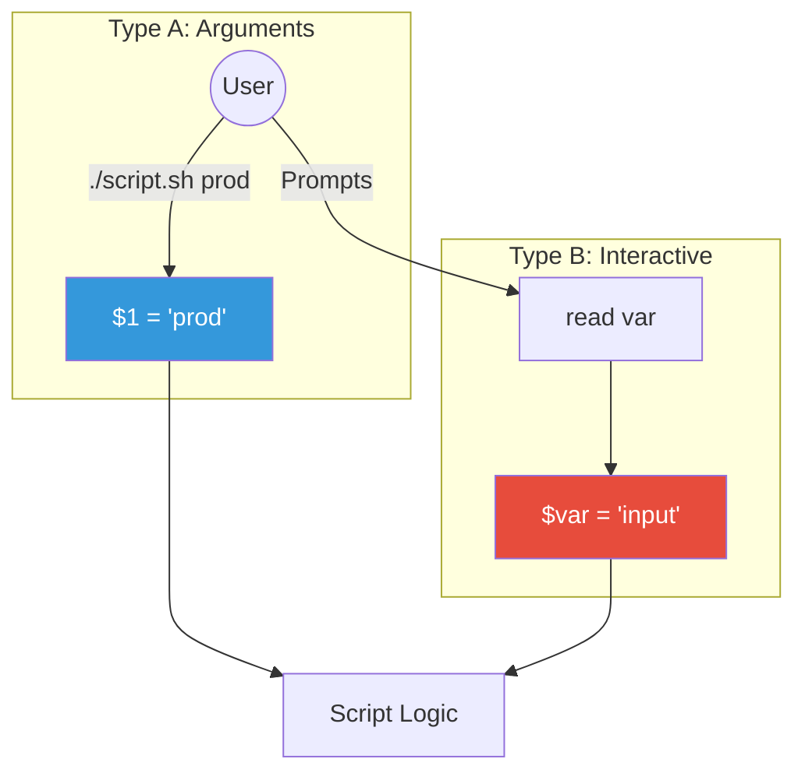

# ⌨️ User Input (Interactive Scripts)

> **"A script that talks to itself is fine. A script that talks to you is powerful."**


## 📚 Overview

Automation doesn't always mean "zero touch." Sometimes you need to ask the user for confirmation ("Are you sure?"), a username, or a filename. Bash provides two main ways to digest input: **Positional Arguments** (passed at startup) and the **Read** command (interactive prompting).

## 🎓 Learning Objectives

By the end of this module, you will:

- ✅ Handle command-line arguments (`$1`, `$2`, `$@`)
- ✅ Prompt users for input interactively with `read`
- ✅ Securely read passwords (`read -s`)
- ✅ Build a simple "Yes/No" confirmation loop
- ✅ Check if arguments are missing

## 🏗️ Input Methods



## 🛠️ Positional Arguments

These are variables automatically populated based on order.

| Variable | Description |
|----------|-------------|
| `$0` | Name of the script itself |
| `$1` | First argument |
| `$2` | Second argument |
| `$#` | Total **number** of arguments |
| `$@` | All arguments (as a list) |

**Example**: `deploy.sh production v2.0`
- `$0` = `deploy.sh`
- `$1` = `production`
- `$2` = `v2.0`
- `$#` = `2`

## 💬 Interactive Input: `read`

Ask the user a question while the script runs.

```bash
# Basic prompt
echo "Enter your name:"
read NAME
echo "Hello, $NAME!"

# One-liner with prompt (-p)
read -p "Enter project name: " PROJECT

# Silent input for passwords (-s)
read -s -p "Enter password: " PASSWORD
echo # Print newline
```

## 🏆 Real-World DevOps Story

### 💡 **The Dangerous Deployment**

**Scenario**: A deployment script was written to take the target directory as `$1`.
```bash
# deploy.sh
TARGET=$1
rm -rf "$TARGET/"*  # Clear directory
cp -r build/* "$TARGET/"
```

**The Accident**:
An engineer ran `./deploy.sh` without any arguments, thinking it would show a help menu.
- `$TARGET` was empty.
- The command became `rm -rf / *`.
- It failed (thankfully due to permissions), but it scared everyone.

**The Fix**:
Always check for argument count (`$#`) at the start!

```bash
if [ $# -eq 0 ]; then
    echo "Usage: $0 <target_directory>"
    exit 1
fi
```

## 🎓 Interview Questions

### Q1: How do you access all arguments passed to a script at once?
<details>
<summary>Click to reveal answer</summary>

Use `$@` or `$*`.
- `$@`: Expands each argument as a separate word (Best for looping).
- `$*`: Expands all arguments as a single string.
</details>

### Q2: How do you set a default value if an argument is missing?
<details>
<summary>Click to reveal answer</summary>

Use **Parameter Expansion**:
```bash
ENV=${1:-dev}  # If $1 is unset/null, use "dev"
```
</details>

### Q3: What is `shift`?
<details>
<summary>Click to reveal answer</summary>

`shift` moves all arguments to the left. `$2` becomes `$1`, `$3` becomes `$2`, and the original `$1` is lost.
This is useful for processing flags in a `while` loop (e.g., handling `-f` or `--verbose`).
</details>

## 📝 Quiz

1. **Which variable holds the script's own filename?**
   - [ ] a) `$1`
   - [x] b) `$0`
   - [ ] c) `$NAME`
   - [ ] d) `$$`

2. **How do you read a password securely (hidden input)?**
   - [ ] a) `read -h`
   - [ ] b) `read --safe`
   - [x] c) `read -s`
   - [ ] d) `read -p`

3. **If I run `./test.sh alpha beta`, what is `$2`?**
   - [ ] a) test.sh
   - [ ] b) alpha
   - [x] c) beta
   - [ ] d) 2

4. **What does `$#` represent?**
   - [ ] a) The first argument
   - [x] b) The number of arguments
   - [ ] c) The exit code
   - [ ] d) A comment

5. **Which creates a prompt on the same line?**
   - [ ] a) `read -n`
   - [x] b) `read -p`
   - [ ] c) `read -echo`
   - [ ] d) `echo -r`

**Answers**: 1-b, 2-c, 3-c, 4-b, 5-b

## 🔗 Next Steps

Continue to: **[Functions](../14-Functions/README.md)** →

## 📚 Additional Resources
- [Bash Hackers Wiki: Arguments](https://wiki.bash-hackers.org/scripting/posparams)
- [Handling Flags in Bash (getopts)](https://sookocheff.com/post/bash/parsing-bash-script-arguments-with-shopts/)

---
**📌 Pro Tip**: Combine logic! Use `read -p "Confirm? [y/N] " confirm` and check `[[ $confirm == [yY] || $confirm == [yY][eE][sS] ]]` for robust confirmation.
