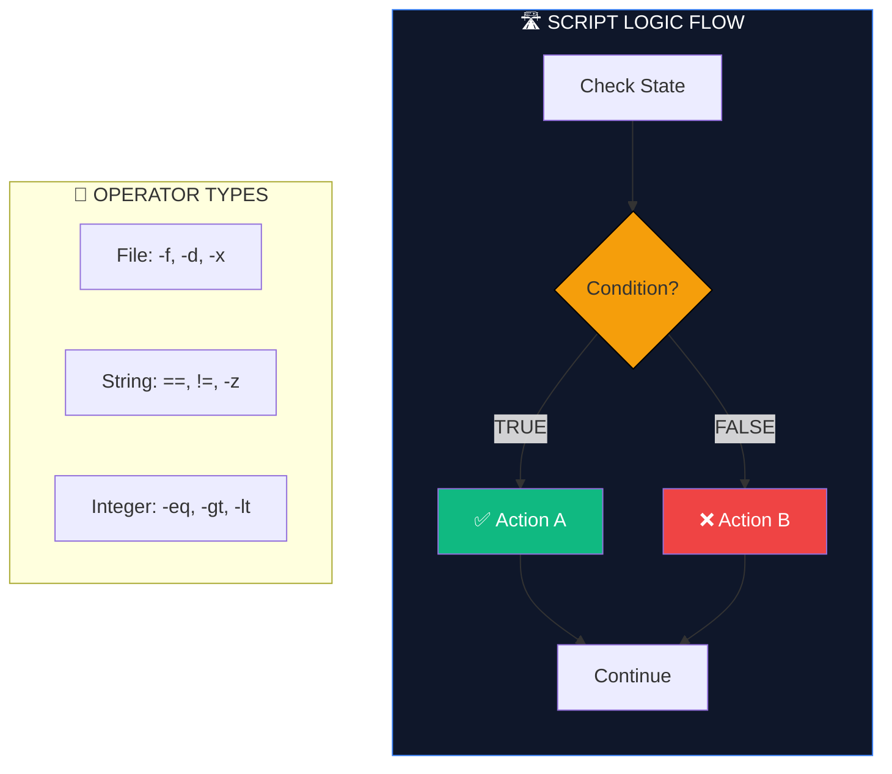

# 🔀 Conditionals (The Logic of Automation)

> **"A script without conditionals is just a list. A script with conditionals is a decision-maker."**



## 📚 Overview

Conditionals are the "Brain" of your automation. They allow your script to perceive the environment and adapt. Instead of running a deployment blindly, a smart script asks: "Is the database reachable?", "Is this file already backed up?", or "Is the disk nearly full?". 

In Bash, we primarily use `if` statements and `case` switches to handle these branching paths.

---

## 🎓 Learning Objectives

By the end of this module, you will:

- ✅ Master the **Triple-Option** `if/elif/else` anatomy.
- ✅ Understand the **Comparison Partition**: Strings (`==`) vs Integers (`-eq`).
- ✅ Leverage **File Test Operators** (`-f, -d, -s, -z`) for system auditing.
- ✅ Adopt the **Superior `[[ ]]` Syntax** for safer, modern Bash code.
- ✅ Implement **Case Patterns** for complex menu and flag handling.

---

## 🏗️ The Modern Anatomy: `[[ ]]`

Bash provides an old test tool `[` and a new one `[[ ]]`. **Always use `[[ ]]`.** It handles spaces, empty variables, and logic (&&, ||) without crashing.

### 1. Integer vs. String Comparisons
This is the #1 mistake beginners make. Bash treats numbers and text differently.

| Target | Match | Not Match | Greater |
|--------|-------|-----------|---------|
| **String** | `==` | `!=` | `>` (Alphabetical) |
| **Integer**| `-eq` | `-ne` | `-gt` (Greater Than) |

**Example**:
```bash
# Correct String check
[[ "$ENV" == "production" ]]

# Correct Integer check
[[ $STATUS_CODE -eq 200 ]]
```

### 2. File & String Tests (DevOps Staples)
| Operator | Logic | Use Case |
|----------|-------|----------|
| **`-f`** | Is a **File** | Check if config exists. |
| **`-d`** | Is a **Directory**| Check if logs folder exists. |
| **`-s`** | Has **Size** (> 0) | Check if backup is empty/failed. |
| **`-z`** | String is **Zero** | Check if a required variable is missing. |
| **`-n`** | String is **Not Zero**| Check if user provided input. |

---

## 🕹️ Logic Flow Control

### The Case Statement (The Menu Master)
When you have 5+ options, `if/elif` becomes ugly. Use `case`.

```bash
case "$ACTION" in
    start|START)
        systemctl start nginx
        ;;
    stop)
        systemctl stop nginx
        ;;
    status)
        systemctl status nginx
        ;;
    *)
        echo "Usage: $0 {start|stop|status}"
        exit 1
        ;;
esac
```

### Short-Circuit Logic (The One-Liner)
Experienced engineers use `&&` (AND) and `||` (OR) for quick checks.
- `A && B`: Run B only if A succeeds.
- `A || B`: Run B only if A fails.

```bash
# Pro Pattern: Ensure directory exists
[[ -d logs ]] || mkdir logs

# Pro Pattern: Check and report
grep "Error" app.log && notify_admin "Panic!"
```

---

## 🏆 Real-World DevOps Case Study

### 🚨 **The Disk Space Disaster**

**The Scenario**: A developer wrote a script to move logs to an archive. 
`mv /logs/* /archive/`
One night, the archive disk was full. The `mv` command failed, but the script then ran its next command: `rm -rf /logs/*` (thinking the move was done). Logs were lost forever.

**The Fix (Logic Guard)**:
```bash
if mv /logs/* /archive/; then
    echo "Logs moved successfully. Cleaning source..."
    rm -rf /logs/*
else
    echo "ERROR: Move failed! Perserving original logs."
    exit 1
fi
```
**Outcome**: The `if` statement checks the **exit code** of the `mv` command. If it's not `0` (Success), the destructive cleanup never runs.

---

## 🎓 Interview Questions

#### Q1: Difference between `[ ]` and `[[ ]]`?
<details>
<summary>Click to reveal answer</summary>
`[` is a legacy POSIX command (synonym for `test`). It is fragile with spaces and requires quoting everything. `[[ ]]` is a Bash keyword that is more robust, supports regex (`=~`), and handles empty variables without throwing "too many arguments" errors.
</details>

#### Q2: How do you verify if a string matches a regular expression?
<details>
<summary>Click to reveal answer</summary>
Use the `=~` operator inside `[[ ]]`. 
```bash
if [[ $IP =~ ^[0-9]{1,3}\.[0-9]{1,3}\. ]]; then
  echo "Looks like an IP"
fi
```
</details>

#### Q3: What is the `-p` test?
<details>
<summary>Click to reveal answer</summary>
It checks if the file exists and is a **named pipe** (FIFO). Rare in simple scripts, but used in advanced inter-process communication.
</details>

---

## 📝 Knowledge Check

1. **Which operator checks if two INTEGERS are equal?**
   - [ ] a) `==`
   - [x] b) `-eq`
   - [ ] c) `-is`
   - [ ] d) `-eql`

2. **What does `[[ -z $VAR ]]` check for?**
   - [ ] a) Variable starts with Z
   - [x] b) Variable is empty (zero length)
   - [ ] c) Variable is a number zero
   - [ ] d) Variable is zapped

3. **Which file test checks if a path is a directory?**
   - [ ] a) `-f`
   - [x] b) `-d`
   - [ ] c) `-e`
   - [ ] d) `-x`

4. **In a `case` statement, what does `*)` represent?**
   - [ ] a) Match all stars
   - [ ] b) The first option
   - [x] c) The default (catch-all) option
   - [ ] d) A syntax error

**Answers**: 1-b, 2-b, 3-b, 4-c

## 🔗 Additional Resources
- [Bash Comparison Operators Guide](https://tldp.org/LDP/abs/html/comparison-ops.html)
- [ShellCheck: SC2086 (Quoting in conditionals)](https://github.com/koalaman/shellcheck/wiki/SC2086)

---
**📌 Pro Tip**: Use `[[ $var == pattern* ]]` for simple wildcard matching without needing heavy regex!
```bash
if [[ $HOSTNAME == web* ]]; then 
  echo "This is a web server"
fi
```
