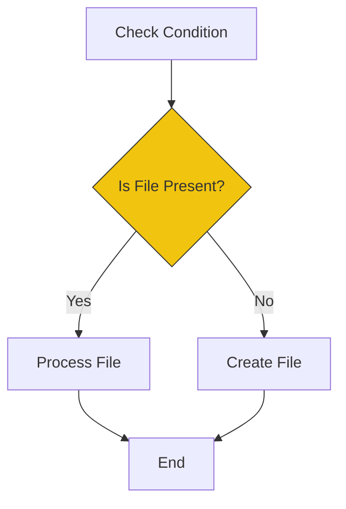

# 🔀 Conditionals (Making Decisions)

> **"If this, then that. Else, panic."**


## 📚 Overview

Scripts are useless if they can't adapt. Conditionals allow your script to make logic commands based on the state of the system ("Does this file exist?", "Is the server up?", "Is the user root?").

## 🎓 Learning Objectives

By the end of this module, you will:

- ✅ Write `if`, `elif`, `else` statements
- ✅ Master file tests (`-f`, `-d`, `-e`)
- ✅ Master string and integer comparisons
- ✅ Use the superior `[[ ]]` syntax over `[ ]`
- ✅ Implement `case` statements for menus

## 🏗️ Logic Flow



## 🛠️ The `if` Syntax

```bash
if [[ condition ]]; then
    # commands
elif [[ other_condition ]]; then
    # commands
else
    # commands
fi
```

### Essential Tests

| Flag | Meaning | Example |
|------|---------|---------|
| `-e` | Exists | `[[ -e file.txt ]]` |
| `-f` | Is File | `[[ -f file.txt ]]` |
| `-d` | Is Directory | `[[ -d /tmp ]]` |
| `-z` | Is Empty String | `[[ -z $VAR ]]` |
| `-n` | Is Non-Empty String | `[[ -n $VAR ]]` |

### Comparison Operators

| Type | Equal | Not Equal | Greater Than |
|------|-------|-----------|--------------|
| **String** | `==` | `!=` | N/A |
| **Integer** | `-eq` | `-ne` | `-gt` |

**Example:**
```bash
if [[ "$USER" == "root" ]]; then
    echo "Access Granted"
fi

if [[ $COUNT -gt 10 ]]; then
    echo "Limit Exceeded"
fi
```

## 🛡️ `[ ]` vs `[[ ]]`

Always use double brackets `[[ ]]` in Bash.
- **Safer**: Handles spaces and empty variables gracefully.
- **Powerful**: Supports regex `=~`.
- **Logic**: Use `&&` and `||` inside directly.

```bash
# Old Way (Fragile)
[ $name = "Bob" ]   # Crashes if $name is empty

# New Way (Robust)
[[ $name == "Bob" ]] # Works perfectly even if empty
```

## 🏆 Real-World DevOps Story

### 💡 **The Server Wiper**

**Scenario**: A maintenance script checked if a directory existed before deleting it.
```bash
if [ -d $DIR ]; then ...
```

**The Bug**:
The variable `$DIR` contained a space: `My Folder`.
The `[` command saw: `if [ -d My Folder ]`.
It threw a syntax error because it expected 1 operator, got 2. The script continued (because error handling wasn't enabled) and ran the `else` block... which contained fatal commands.

**The Fix**:
```bash
if [[ -d "$DIR" ]]; then ...
```
Double brackets handle spaces correctly.

## 🎓 Interview Questions

### Q1: How do you handle multiple conditions?
<details>
<summary>Click to reveal answer</summary>

Combine them with logical AND (`&&`) / OR (`||`).
```bash
if [[ -f config.yml && -w config.yml ]]; then
    echo "Editable config found"
fi
```
</details>

### Q2: What is a `case` statement?
<details>
<summary>Click to reveal answer</summary>

A cleaner alternative to many `if-elif` blocks, useful for menus or flag processing.
```bash
case "$1" in
    start) echo "Starting..." ;;
    stop)  echo "Stopping..." ;;
    *)     echo "Usage: $0 {start|stop}" ;;
esac
```
</details>

### Q3: How do you check if the previous command failed?
<details>
<summary>Click to reveal answer</summary>

Check exit code `$?` immediate after (or simply put the command in the if statement).
```bash
if ! mkdir /protected/dir; then
    echo "Failed to create dir!"
fi
```
</details>

## 📝 Quiz

1. **Which tests if a file exists?**
   - [ ] a) `-x`
   - [x] b) `-e`
   - [ ] c) `-z`
   - [ ] d) `-n`

2. **Which operator checks if numbers are equal?**
   - [ ] a) `==`
   - [ ] b) `=`
   - [x] c) `-eq`
   - [ ] d) `===`

3. **What ends a `case` statement?**
   - [ ] a) `end`
   - [ ] b) `done`
   - [c] c) `fi`
   - [x] d) `esac`

4. **Which syntax is safer?**
   - [ ] a) `( )`
   - [ ] b) `[ ]`
   - [x] c) `[[ ]]`
   - [ ] d) `{ }`

5. ** `-z` checks for:**
   - [ ] a) Zero value
   - [ ] b) Zipped file
   - [x] c) Empty string (Zero length)
   - [ ] d) Zombie process

**Answers**: 1-b, 2-c, 3-d, 4-c, 5-c

## 🔗 Next Steps

Continue to: **[For Loops](../16-For-Loops/README.md)** →

## 📚 Additional Resources
- [Bash Conditional Expressions](https://www.gnu.org/software/bash/manual/html_node/Bash-Conditional-Expressions.html)
- [Test Command](https://linux.die.net/man/1/test)

---
**📌 Pro Tip**: Use `&&` short-circuiting for simple checks.
`[[ -d log ]] || mkdir log` (Create directory ONLY if it doesn't exist).
