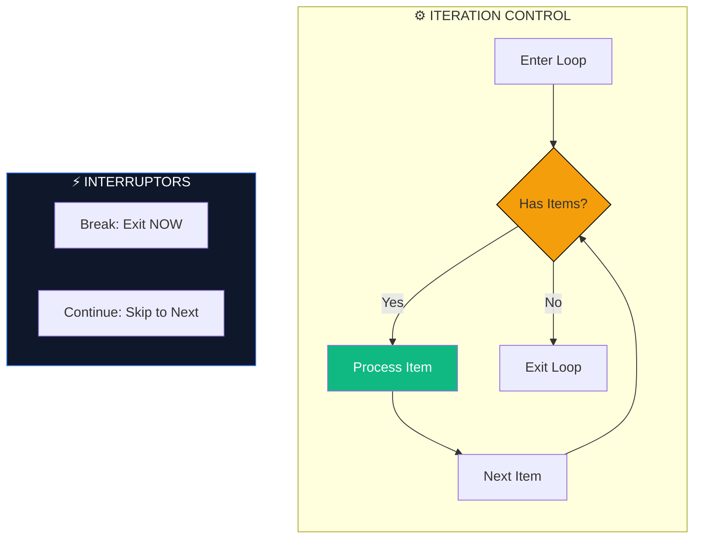

# 🔁 Loops (Repetitive Automation)

> **"If you do it more than 3 times, write a loop. If you do it more than 10 times, rewrite the loop to be parallel."**



## 📚 Overview

Automation is the art of repeating a task perfectly a thousand times. **Loops** are the engine of bulk processing in the shell. Whether you are checking the health of 500 microservices, renaming 10,000 log files, or waiting for a database to come online, loops give you the power of scale.

---

## 🎓 Learning Objectives

By the end of this module, you will:

- ✅ Master **For-In Loops** for known lists and file globs.
- ✅ Understand the **"Parse LS" Trap** and how to avoid it.
- ✅ Build robust **While-Read** loops for high-performance file processing.
- ✅ Use **Until Loops** for service readiness probes (Health checks).
- ✅ Control flow using **Break** and **Continue** keywords.
- ✅ Implement basic **Parallelism** inside loops.

---

## 🛠️ The Looping Toolkit

### 1. The List Loop (`for ... in`)
Best for when you have a specific list of items or use file globbing (`*`).

```bash
# Iterating over strings
for region in us-east-1 eu-west-1 ap-south-1; do
    echo "Deploying to $region..."
done

# Iterating over files (GLOBBING)
for log in /var/log/*.gz; do
    echo "Processing compressed log: $log"
done
```

### 2. The Logic Loop (`while`)
Runs as long as a condition is **TRUE**. Best for reading streams or polling.

```bash
# Polling a health check
while ! curl -s localhost:8080/health; do
    echo "Waiting for service..."
    sleep 2
done
```

### 3. The Negative Loop (`until`)
Runs as long as a condition is **FALSE**.
```bash
until [[ -f /tmp/locked ]]; do
    echo "System is unlocked. Processing..."
    break # Just an example
done
```

---

## 🚫 The DevOps Sin: Parsing `ls`

**NEVER** do this: `for f in $(ls *.txt)`. 
**Why?** If a filename contains a space (e.g., `My Data.txt`), the shell splits it into two items: `My` and `Data.txt`. Your script will likely delete or corrupt both.

**The Pro Way**: Use Globbing.
```bash
# ✅ Handles spaces perfectly
for f in *.txt; do
    mv "$f" "${f}.bak"
done
```

---

## 🚀 Advanced: High-Performance Reading

Standard `for` loops are slow for reading large text files. Use a `while read` loop with a pipe or redirection.

```bash
# The Robust File Reader
while IFS= read -r line; do
    echo "User: $line"
done < users.txt
```
- **`IFS=`**: Prevents leading/trailing whitespace from being trimmed.
- **`-r`**: Prevents backslashes from being interpreted.

---

## 🏆 Real-World DevOps Case Study

### 🚨 **The Infinite API Bill**

**The Scenario**: A junior engineer wrote a script to monitor a message queue. 
```bash
while true; do
    # Check if a message exists
    MESSAGE=$(get_message_command)
    [[ -n "$MESSAGE" ]] && process_message "$MESSAGE"
done
```
**The Bug**: There was no `sleep`. The script ran billions of times per hour. Even when the queue was empty, it constantly hammered the cloud provider's API. The company received a $4,000 bill for "Excessive API Requests" in a single weekend.

**The Fix**:
Always add a `sleep` to poller loops, even if it's small.
```bash
while true; do
  # ... logic ...
  sleep 1 # Drastically reduces API cost and CPU load
done
```

---

## 🎓 Interview Questions

#### Q1: Difference between 'break' and 'continue'?
<details>
<summary>Click to reveal answer</summary>
- **`break`**: Terminates the loop entirely and moves to the first command after `done`.
- **`continue`**: Skips the *rest* of the code in the current iteration and jumps back to the top of the loop for the next item.
</details>

#### Q2: How do you run loop iterations in parallel?
<details>
<summary>Click to reveal answer</summary>
Use the `&` operator to send each iteration to the background.
```bash
for host in "${hosts[@]}"; do
  patch_server "$host" &
done
wait # Wait for all background patches to finish
```
Warning: This can overwhelm a system if the list is too long!
</details>

#### Q3: What is the "C-style" for loop in Bash?
<details>
<summary>Click to reveal answer</summary>
It uses double parentheses:
```bash
for (( i=0; i<10; i++ )); do
  echo $i
done
```
Useful for when you need a numeric counter specifically.
</details>

---

## 📝 Knowledge Check

1. **Which loop syntax is safer for files with spaces?**
   - [ ] a) `for f in $(ls)`
   - [x] b) `for f in *`
   - [ ] c) `while f in ls`
   - [ ] d) `for f in `find .``

2. **What does `IFS=` do in a `read` loop?**
   - [ ] a) Increases File Speed
   - [x] b) Prevents whitespace trimming
   - [ ] c) Ignore File System
   - [ ] d) Internal File Search

3. **How do you perform a loop exactly 100 times?**
   - [ ] a) `for i in 100`
   - [x] b) `for i in {1..100}`
   - [ ] c) `loop 100`
   - [ ] d) `repeat 100`

4. **Which loop is best for waiting until a server responds?**
   - [ ] a) `for`
   - [x] b) `until` (or `while !`)
   - [ ] c) `cat`
   - [ ] d) `if`

**Answers**: 1-b, 2-b, 3-b, 4-b

## 🔗 Additional Resources
- [Bash For Loop Examples](https://linuxize.com/post/bash-for-loop/)
- [Why you shouldn't parse ls](https://mywiki.wooledge.org/ParsingLs)
- [Parallelizing Shell Loops](https://medium.com/@petehouston/parallelize-bash-loop-effectively-6b45fdb1767d)

---
**📌 Pro Tip**: Use **`bash -x script.sh`** to watch your loop expand and execute. It’s the fastest way to understand why a loop is behaving unexpectedly!
