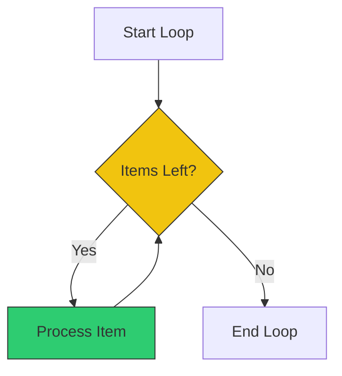

# 🔁 For Loops (Iteration)

> **"If you have to do it more than 3 times, write a loop."**


## 📚 Overview

Automation is about repetition. Whether you need to resize 100 images, ping 50 servers, or read every line of a CSV file, loops are the engine of bulk processing.

## 🎓 Learning Objectives

By the end of this module, you will:

- ✅ Write C-style loops and "For-in" loops
- ✅ Iterate over files (`*.txt`) safely
- ✅ Use `while` loops for reading streams
- ✅ Control loops with `break` and `continue`
- ✅ Avoid the "Parse LS" anti-pattern

## 🏗️ The Logic of Looping



## 🛠️ Loop Syntaxes

### 1. The "List" Loop (Most Common)
Iterate over a list of items or files.

```bash
# Strings
for server in web01 web02 web03; do
    echo "Pinging $server..."
done

# Files (Globbing)
for file in *.log; do
    echo "Compressing $file"
    gzip "$file"
done
```

### 2. The "Range" Loop
```bash
for i in {1..5}; do
    echo "Count: $i"
done
```

### 3. The `while` Loop
Runs as long as the condition is true. Perfect for reading files line-by-line.

```bash
# Read a file line by line
while read -r line; do
    echo "Processing: $line"
done < users.txt
```

## 🚫 The Anti-Pattern: Parsing LS

**NEVER DO THIS:**
```bash
for f in $(ls *.txt)  # ❌ BAD! Breaks on spaces
```

**DO THIS:**
```bash
for f in *.txt        # ✅ GOOD! Handles spaces
```

## 🏆 Real-World DevOps Story

### 💡 **The Infinite Backup**

**Scenario**: A script ran a loop to copy logs to S3.
```bash
while true; do
    cp /var/log/app.log s3://bucket/
done
```

**The Bug**:
There was no `sleep` or exit condition. It spun the CPU to 100% and uploaded the same file 50 times per second, costing $2000 in API fees within hours.

**The Fix**:
Always ensure `while` loops have a delay or a break condition.

```bash
while true; do
    cp /var/log/app.log s3://bucket/
    sleep 3600  # Run hourly
done
```

## 🎓 Interview Questions

### Q1: What does `break` do inside a loop?
<details>
<summary>Click to reveal answer</summary>

It exits the loop immediately, skipping any remaining iterations.
</details>

### Q2: What does `continue` do?
<details>
<summary>Click to reveal answer</summary>

It skips the **rest** of the current iteration and jumps back to the top of the loop to start the next item.
</details>

### Q3: How do you loop through an array?
<details>
<summary>Click to reveal answer</summary>

```bash
servers=("db1" "db2")
for s in "${servers[@]}"; do
    echo "$s"
done
```
</details>

## 📝 Quiz

1. **Which loop syntax handles filenames with spaces correctly?**
   - [ ] a) `for f in $(ls)`
   - [x] b) `for f in *`
   - [ ] c) `for f in `ls``
   - [ ] d) `foreach f`

2. **What command stops the current iteration but continues the loop?**
   - [ ] a) `break`
   - [ ] b) `stop`
   - [x] c) `continue`
   - [ ] d) `next`

3. **How do you generate a sequence 1 to 10?**
   - [ ] a) `[1-10]`
   - [x] b) `{1..10}`
   - [ ] c) `seq(1,10)`
   - [ ] d) `range(10)`

4. **Which loop is best for reading a file line-by-line?**
   - [ ] a) `for`
   - [ ] b) `until`
   - [x] c) `while`
   - [ ] d) `do`

5. **Where do you redirect input for a while loop?**
   - [ ] a) At the top
   - [x] b) After `done` (`done < file`)
   - [ ] c) Inside `do`
   - [ ] d) You can't

**Answers**: 1-b, 2-c, 3-b, 4-c, 5-b

## 🔗 Next Steps

Continue to: **[Input Output](../17-Input-Output/README.md)** →

## 📚 Additional Resources
- [Bash Loops Guide](https://linuxize.com/post/bash-for-loop/)
- [Wooledge Loop Parsing](https://mywiki.wooledge.org/BashFAQ/001) (How to read files safely)

---
**📌 Pro Tip**: Use `xargs` for parallel processing if your loop is simple.
`ls *.jpg | xargs -P 4 -I {} convert {} {}.png` (Runs 4 conversions at once!)
