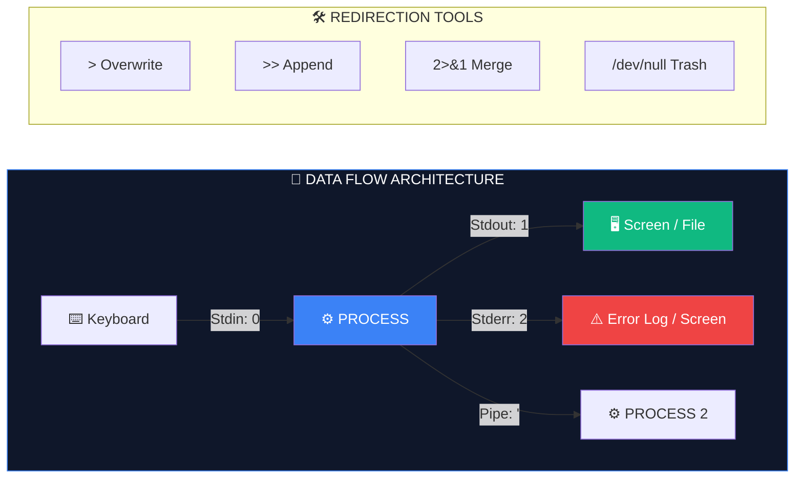

# 🔀 Input/Output (The Stream Plumbing)

> **"In Unix, everything is a file. If it isn't a file, it's a stream. If it isn't a stream, it's a pipe."**



## 📚 Overview

Every command in Linux is a "black box" that processes data. To coordinate these boxes, Linux uses standardized data channels called **Streams**. Mastering I/O (Input/Output) allows you to "plumb" these streams together—redirecting logs to files, silencing annoying warnings, and chaining dozens of tools into a single, complex pipeline.

---

## 🎓 Learning Objectives

By the end of this module, you will:

- ✅ Master the **Three Standard Streams**: 0 (Stdin), 1 (Stdout), and 2 (Stderr).
- ✅ Perform **Stream Redirection** using `>`, `>>`, and `<`.
- ✅ Handle Errors professionally using **Merging** (`2>&1`) and **Silencing** (`/dev/null`).
- ✅ Construct complex **Multi-stage Pipelines** (`|`).
- ✅ Implement **HereDocs** (`<<EOF`) for multi-line file generation.

---

## 🏗️ The Trio of Streams

Every process is born with three files already open:

1. **Stdin (0)**: Where the command gets data (Default: Keyboard).
2. **Stdout (1)**: Where the command sends success data (Default: Terminal).
3. **Stderr (2)**: Where the command sends errors (Default: Terminal).

### Redirection Dictionary:
| Syntax | Meaning | Description |
|--------|---------|-------------|
| `>` | Overwrite | Wipes file and saves Stdout. |
| `>>` | Append | Adds Stdout to the end of file. |
| `2>` | Error Redirection| Saves ONLY errors to a file. |
| `&>` | All-in-One | Saves BOTH Stdout and Stderr to a file. |
| `<` | Read-from | Feeds a file into a command's Stdin. |

---

## 🧪 Advanced Plumbing Techniques

### 1. Merging Streams (`2>&1`)
DevOps scripts often need to capture everything (success and error) into a single log file. 
```bash
# Redirect 2 (Stderr) to where 1 (Stdout) is going
./deploy.sh > system.log 2>&1
```

### 2. The HereDoc (`<<EOF`)
Used to create files containing multiple lines without using multiple `echo` commands.
```bash
cat <<EOF > config.json
{
  "env": "production",
  "port": 8080
}
EOF
```

### 3. The `tee` Command (The T-Junction)
Normally, redirection (`>`) hides output from the screen. `tee` allows you to see it AND save it.
```bash
# Save to log AND print to terminal
./build.sh | tee build.log
```

---

## 🏆 Real-World DevOps Case Study

### 🚨 **The Ghost Failure Pipeline**

**The Scenario**: A CI/CD pipeline was running a complex command:
`deploy_app | notify_success`
The `deploy_app` command failed with a `403 Forbidden` error, but the pipeline marked the step as **SUCCESS** and notified everyone.

**The Bug**:
Bash pipes only care about the exit code of the **last** command in the chain. Since `notify_success` finished correctly (Exit 0), the script thought the whole pipeline was fine.

**The Fix (The Pipefail Flag)**:
```bash
#!/bin/bash
set -o pipefail  # ⚡ The Secret Power

deploy_app | notify_success
```
**Outcome**: With `pipefail` enabled, if ANY command in the pipe fails, the whole pipeline reports an error code. 
**Lesson**: Never trust a pipeline without `pipefail`!

---

## 🎓 Interview Questions

#### Q1: How do you redirect standard error to standard output?
<details>
<summary>Click to reveal answer</summary>
Use `2>&1`. This tells the shell that File Descriptor 2 should point to wherever File Descriptor 1 is currently pointing.
</details>

#### Q2: What is `/dev/null`?
<details>
<summary>Click to reveal answer</summary>
It is a virtual "null device" or "black hole." Any data written to it is instantly discarded. It is commonly used to silence unwanted output or errors in automation scripts.
</details>

#### Q3: How do you feed the output of one command into the argument of another?
<details>
<summary>Click to reveal answer</summary>
Use **Command Substitution** `$()` or **Process Substitution** `<()`.
Example: `ls $(which terraform)` or `diff <(ls dir1) <(ls dir2)`.
</details>

---

## 📝 Knowledge Check

1. **Which File Descriptor represents Standard Error?**
   - [ ] a) 0
   - [ ] b) 1
   - [x] c) 2
   - [ ] d) 3

2. **Which operator appends output to a file without deleting contents?**
   - [ ] a) `>`
   - [x] b) `>>`
   - [ ] c) `2>`
   - [ ] d) `|`

3. **What does `set -o pipefail` do?**
   - [ ] a) Stops pipes from leaking memory
   - [x] b) Ensures a pipeline returns the exit code of the first failing command
   - [ ] c) Speeds up command execution
   - [ ] d) Changes the default terminal color

4. **Which command allows you to save output to a file AND see it on the screen?**
   - [ ] a) `cat`
   - [ ] b) `grep`
   - [x] c) `tee`
   - [ ] d) `pipe`

**Answers**: 1-c, 2-b, 3-b, 4-c

## 🔗 Additional Resources
- [Bash One-Liners: I/O Redirection](http://www.catonmat.net/blog/bash-one-liners-explained-part-three/)
- [Standard Streams Illustrated](https://en.wikipedia.org/wiki/Standard_streams)

---
**🎉 CONGRATULATIONS! You have completed the Beginner Shell Scripting Module!**

👉 Proceed to the **[Labs Directory](../Labs/README.md)** to put your skills to the test with real-world scenarios!
---
**📌 Pro Tip**: Use `&> file` as a modern Bash shortcut for `> file 2>&1` to capture everything in one go!
