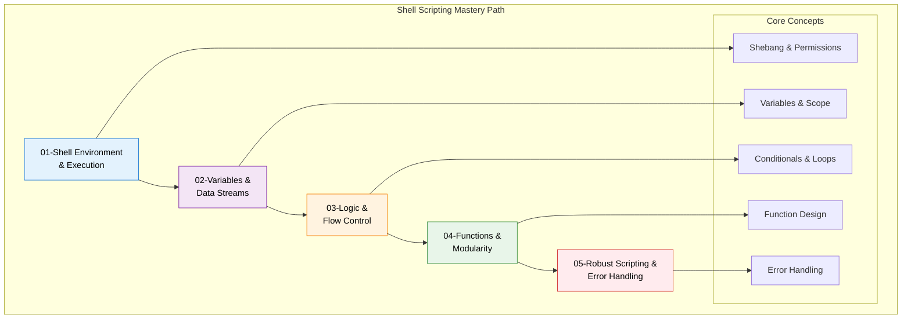
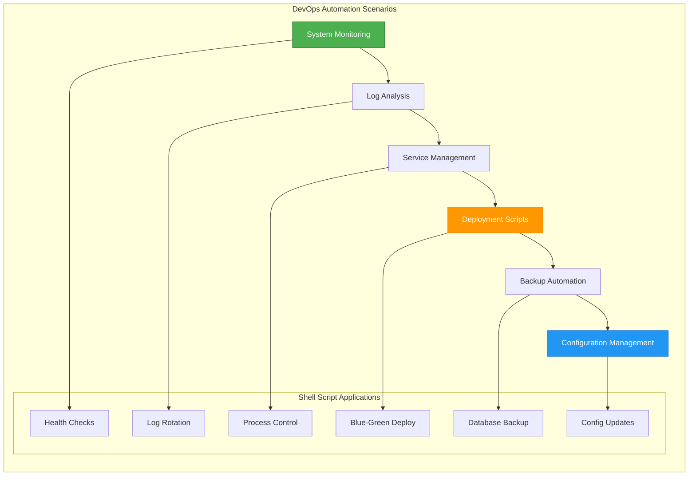
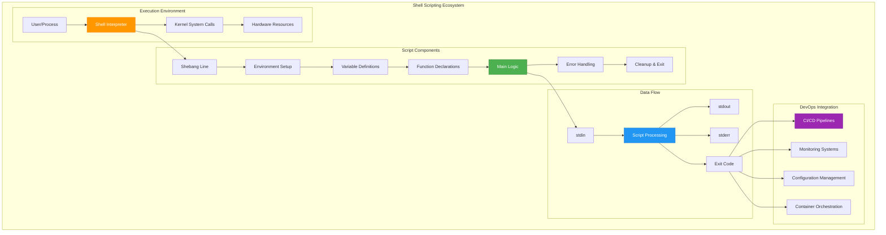

# 🐚 Shell Scripting for DevOps - Comprehensive Guide
*Master the Foundation of DevOps Automation*

---

## 📊 **Learning Overview**

Shell scripting is the **cornerstone of DevOps automation**. From simple system administration tasks to complex CI/CD pipelines, shell scripts power the infrastructure that runs the modern web.

### **Why Shell Scripting Matters in DevOps**
- **Universal Availability**: Present on every Unix/Linux system
- **System Integration**: Direct access to OS commands and utilities  
- **Automation Foundation**: Building blocks for larger automation frameworks
- **Troubleshooting**: Essential for debugging and system maintenance
- **CI/CD Integration**: Core component of deployment pipelines

---

## 🗺️ **Learning Path Architecture**



---

## 📚 **Module Structure & Content**

### **Module 1: [Shell Environment and Execution](./01-Shell-Environment-and-Execution/)**
**Duration**: 45 minutes | **Difficulty**: Beginner ⭐⭐⭐

**Core Topics**:
- OS hierarchy and shell interaction
- Shebang (`#!`) and interpreter selection
- File permissions and PATH management
- Environment vs. shell variables
- Sub-shell concepts and execution context

**Key Skills Acquired**:
- ✅ Configure proper script execution environment
- ✅ Understand shell vs. kernel interaction
- ✅ Manage script permissions and portability
- ✅ Debug execution environment issues

---

### **Module 2: [Variables and Data Streams](./02-Variables-and-Data-Streams/)**
**Duration**: 60 minutes | **Difficulty**: Beginner ⭐⭐⭐

**Core Topics**:
- Variable definition, scope, and expansion
- Standard streams (stdin, stdout, stderr)
- Redirection operators and techniques
- Pipes and command substitution
- Special variables and exit codes

**Key Skills Acquired**:
- ✅ Master variable manipulation and scope
- ✅ Control data flow with redirection
- ✅ Build command pipelines effectively
- ✅ Handle process communication

---

### **Module 3: [Logic and Flow Control](./03-Logic-and-Flow-Control/)**
**Duration**: 75 minutes | **Difficulty**: Intermediate ⭐⭐⭐⭐

**Core Topics**:
- Conditional statements (if/else/elif)
- Test operators and comparisons
- Loop constructs (for, while, until)
- Case statements and pattern matching
- Loop control (break, continue)

**Key Skills Acquired**:
- ✅ Implement decision-making logic
- ✅ Create efficient iteration patterns
- ✅ Handle complex conditional scenarios
- ✅ Design deployment automation flows

---

### **Module 4: [Shell Functions and Modularity](./04-Shell-Functions-and-Modularity/)**
**Duration**: 60 minutes | **Difficulty**: Intermediate ⭐⭐⭐⭐

**Core Topics**:
- Function definition and invocation
- Parameter passing and local variables
- Return values and exit codes
- Script argument processing
- Code organization and reusability

**Key Skills Acquired**:
- ✅ Design modular, reusable code
- ✅ Implement proper variable scoping
- ✅ Handle complex argument processing
- ✅ Create maintainable script libraries

---

### **Module 5: [Robust Scripting and Error Handling](./05-Robust-Scripting-and-Error-Handling/)**
**Duration**: 90 minutes | **Difficulty**: Advanced ⭐⭐⭐⭐⭐

**Core Topics**:
- Strict mode and fail-fast principles
- Signal handling and cleanup procedures
- Debugging techniques and tools
- Production-ready error handling
- Script reliability patterns

**Key Skills Acquired**:
- ✅ Write production-grade scripts
- ✅ Implement comprehensive error handling
- ✅ Design fail-safe automation
- ✅ Debug complex script issues

---

## 🎯 **DevOps Integration Patterns**

### **Common DevOps Use Cases**



### **Integration with DevOps Tools**

| Tool Category | Shell Script Role | Example Use Cases |
|---------------|-------------------|-------------------|
| **CI/CD** | Build & deployment automation | Jenkins pipelines, GitLab CI scripts |
| **Monitoring** | Data collection & alerting | Nagios plugins, custom metrics |
| **Configuration** | System setup & maintenance | Ansible modules, Puppet facts |
| **Containerization** | Image building & orchestration | Docker build scripts, K8s init containers |
| **Cloud Platforms** | Resource provisioning | AWS CLI automation, Terraform wrappers |

---

## 🛠️ **Practical Examples & Templates**

### **DevOps Script Templates**

#### **1. Service Health Check Script**
```bash
#!/bin/bash
set -euo pipefail

SERVICE_NAME="${1:-nginx}"
MAX_RETRIES=3
RETRY_DELAY=5

check_service_health() {
    local service="$1"
    local retries=0
    
    while [ $retries -lt $MAX_RETRIES ]; do
        if systemctl is-active --quiet "$service"; then
            echo "✅ $service is healthy"
            return 0
        fi
        
        echo "⚠️  $service not responding, retry $((retries + 1))/$MAX_RETRIES"
        sleep $RETRY_DELAY
        ((retries++))
    done
    
    echo "❌ $service health check failed"
    return 1
}

check_service_health "$SERVICE_NAME"
```

#### **2. Deployment Automation Script**
```bash
#!/bin/bash
set -euo pipefail

APP_NAME="${1:?Application name required}"
VERSION="${2:?Version required}"
ENVIRONMENT="${3:-staging}"

deploy_application() {
    local app="$1"
    local version="$2"
    local env="$3"
    
    echo "🚀 Deploying $app v$version to $env"
    
    # Pre-deployment checks
    if ! check_prerequisites; then
        echo "❌ Prerequisites not met"
        exit 1
    fi
    
    # Backup current version
    backup_current_version "$app" "$env"
    
    # Deploy new version
    if deploy_new_version "$app" "$version" "$env"; then
        echo "✅ Deployment successful"
        cleanup_old_backups "$app" "$env"
    else
        echo "❌ Deployment failed, rolling back"
        rollback_deployment "$app" "$env"
        exit 1
    fi
}

deploy_application "$APP_NAME" "$VERSION" "$ENVIRONMENT"
```

---

## 📊 **Shell Scripting Architecture Diagram**



---

## 🎓 **Assessment & Validation**

### **Learning Objectives Checklist**
- [ ] **Environment Mastery**: Configure and troubleshoot script execution environments
- [ ] **Data Manipulation**: Handle variables, streams, and command substitution effectively
- [ ] **Logic Implementation**: Create complex conditional and iterative structures
- [ ] **Modular Design**: Write maintainable, reusable functions and libraries
- [ ] **Production Readiness**: Implement robust error handling and debugging

### **Practical Skills Validation**
- [ ] Write a multi-server deployment script with rollback capability
- [ ] Create a monitoring script that handles various failure scenarios
- [ ] Implement a log analysis tool with configurable alerting
- [ ] Design a backup automation system with retention policies
- [ ] Build a system health dashboard using shell scripts

---

## 🚀 **Next Steps & Advanced Topics**

### **Intermediate Progression**
After mastering these fundamentals, advance to:
- **[Advanced Bash Automation](../../../2-Intermediate/02-Automation/)** - Complex automation patterns
- **[Python for DevOps](../../../2-Intermediate/02-Automation/03-Python-for-DevOps/)** - Higher-level automation
- **[Configuration Management](../../../2-Intermediate/03-Configuration-Tools/)** - Infrastructure as Code

### **Integration Opportunities**
- **CI/CD Pipelines**: Jenkins, GitLab CI, GitHub Actions
- **Container Orchestration**: Kubernetes init containers and jobs
- **Infrastructure Automation**: Terraform provisioners and Ansible modules
- **Monitoring Integration**: Custom Nagios plugins and Prometheus exporters

---

## 📚 **Additional Resources**

### **Reference Materials**
- **[Advanced Bash-Scripting Guide](../../../00-Resources/04-Books-Guides/Advanced%20Bash-Scripting%20Guide.pdf)** - Comprehensive reference
- **[Shell Scripting Cheat Sheets](../../../00-Resources/04-Books-Guides/CheatSheets/)** - Quick reference guides
- **[Real-World Examples](../../../00-Resources/05-Projects-Showcase/)** - Production script examples

### **Practice Environments**
- **Local Linux/macOS**: Native shell environment
- **Windows WSL**: Windows Subsystem for Linux
- **Cloud Shells**: AWS CloudShell, Azure Cloud Shell, GCP Cloud Shell
- **Container Environments**: Docker containers with bash

---

**Ready to master shell scripting?** Start with **[Module 1: Shell Environment and Execution](./01-Shell-Environment-and-Execution/)** and build your DevOps automation foundation! 🚀