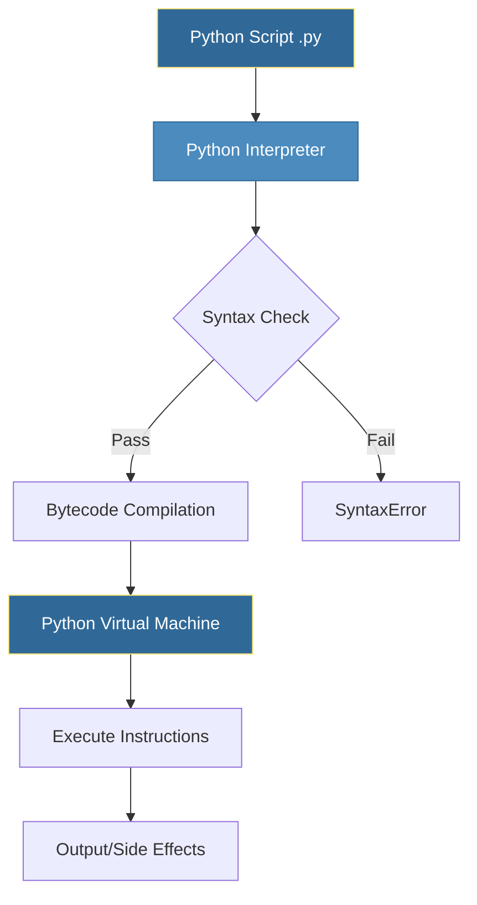
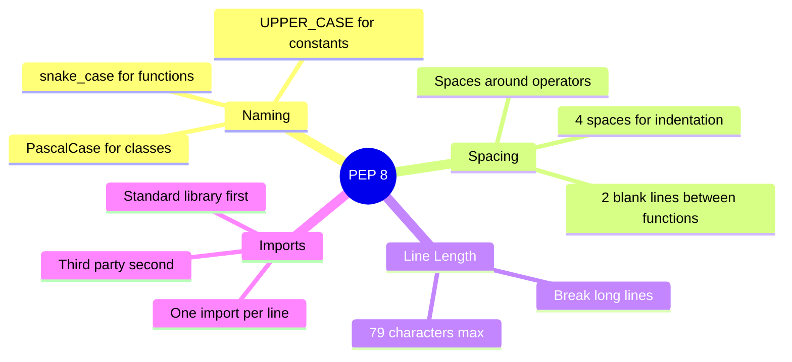

# Python Fundamentals
*The Foundation of DevOps Automation*

Python's clean syntax and readability make it the #1 language for automation. This module covers the essential building blocks every DevOps engineer needs.

---

## 🐍 Python at a Glance


---

## 🎯 Learning Objectives

After completing this module, you will be able to:
- Write syntactically correct Python code
- Work with variables and data types
- Implement control flow (conditionals and loops)
- Follow PEP 8 style conventions
- Execute Python scripts from the command line

---

## 📊 Python Execution Flow



---

## 📚 Core Concepts

### 1. Variables and Data Types

Python is dynamically typed - you don't declare types explicitly.

```python
# Numeric Types
instance_count = 5          # int
cpu_usage = 78.5            # float
complex_num = 3 + 4j        # complex

# Text Type
server_name = "web-prod-01"  # str

# Boolean Type
is_healthy = True            # bool

# None Type
connection = None            # NoneType
```

### 2. String Operations for DevOps

```python
# String formatting (f-strings - Python 3.6+)
hostname = "web-server"
port = 8080
url = f"http://{hostname}:{port}/health"

# Common string methods
log_line = "  ERROR: Connection timeout  "
log_line.strip()          # Remove whitespace
log_line.lower()          # Lowercase
log_line.split(":")       # Split into list

# Multi-line strings for configs
nginx_config = """
server {
    listen 80;
    server_name example.com;
}
"""
```

### 3. Control Flow

```python
# Conditional statements
status_code = 503

if status_code == 200:
    print("Service healthy")
elif status_code >= 500:
    print("Server error - triggering alert")
else:
    print(f"Unexpected status: {status_code}")

# For loops - iterating collections
servers = ["web-01", "web-02", "web-03"]
for server in servers:
    print(f"Checking {server}...")

# While loops - condition-based
retry_count = 0
max_retries = 3
while retry_count < max_retries:
    print(f"Attempt {retry_count + 1}")
    retry_count += 1
```

### 4. Operators

| Category | Operators | Example |
|----------|-----------|---------|
| Arithmetic | `+`, `-`, `*`, `/`, `//`, `%`, `**` | `5 // 2 = 2` |
| Comparison | `==`, `!=`, `<`, `>`, `<=`, `>=` | `5 > 3 = True` |
| Logical | `and`, `or`, `not` | `True and False = False` |
| Membership | `in`, `not in` | `"a" in "abc" = True` |
| Identity | `is`, `is not` | `x is None` |

---

## 🎨 PEP 8 Style Guide



### Quick PEP 8 Reference

```python
# ✅ Good
def calculate_cpu_usage(process_id):
    MAX_CPU_PERCENT = 100
    return get_usage(process_id) / MAX_CPU_PERCENT

# ❌ Bad  
def CalculateCPUUsage( processId ):
    maxCpuPercent=100
    return getUsage(processId)/maxCpuPercent
```

---

## 🛠️ Hands-On Exercises

### Exercise 1: Variable Basics
Create variables to store information about a server:
```python
# TODO: Create variables for:
# - server_name (string)
# - ip_address (string)  
# - port (integer)
# - is_production (boolean)
# - cpu_cores (integer)

# Print a formatted status message using f-strings
```

<details>
<summary>💡 Solution</summary>

```python
server_name = "api-gateway-01"
ip_address = "10.0.1.50"
port = 443
is_production = True
cpu_cores = 8

print(f"Server: {server_name}")
print(f"Address: {ip_address}:{port}")
print(f"Production: {'Yes' if is_production else 'No'}")
print(f"CPU Cores: {cpu_cores}")
```
</details>

### Exercise 2: Health Check Logic
Write a script that determines server health based on metrics:
```python
# Given these metrics
cpu_usage = 85
memory_usage = 70
disk_usage = 45

# TODO: Implement health check logic
# - If any metric > 90: status = "CRITICAL"
# - If any metric > 75: status = "WARNING"  
# - Otherwise: status = "HEALTHY"
```

<details>
<summary>💡 Solution</summary>

```python
cpu_usage = 85
memory_usage = 70
disk_usage = 45

if cpu_usage > 90 or memory_usage > 90 or disk_usage > 90:
    status = "CRITICAL"
elif cpu_usage > 75 or memory_usage > 75 or disk_usage > 75:
    status = "WARNING"
else:
    status = "HEALTHY"

print(f"Server Status: {status}")
print(f"  CPU: {cpu_usage}% | Memory: {memory_usage}% | Disk: {disk_usage}%")
```
</details>

### Exercise 3: Server Iteration
Process a list of servers and identify production ones:
```python
servers = [
    {"name": "web-prod-01", "env": "production"},
    {"name": "web-dev-01", "env": "development"},
    {"name": "api-prod-01", "env": "production"},
    {"name": "db-stage-01", "env": "staging"},
]

# TODO: Print only production servers
# TODO: Count total production servers
```

<details>
<summary>💡 Solution</summary>

```python
servers = [
    {"name": "web-prod-01", "env": "production"},
    {"name": "web-dev-01", "env": "development"},
    {"name": "api-prod-01", "env": "production"},
    {"name": "db-stage-01", "env": "staging"},
]

production_count = 0

print("Production Servers:")
for server in servers:
    if server["env"] == "production":
        print(f"  - {server['name']}")
        production_count += 1

print(f"\nTotal: {production_count} production servers")
```
</details>

---

## 📖 Real-World Story: The Config Parser

**Scenario**: A team had 50+ servers with configuration scattered across bash scripts using different variable naming conventions (`serverName`, `SERVER_NAME`, `server-name`).

**Solution**: A Python script was created to:
1. Read all config files
2. Normalize variable names to `snake_case`
3. Output standardized JSON configs

**Outcome**: Configuration drift eliminated, making Ansible automation possible.

---

## ❓ Interview Questions

1. **What is the difference between `==` and `is` in Python?**
   > `==` compares values, while `is` compares object identity (memory location). Use `==` for value comparison and `is` for checking `None`.

2. **Explain Python's dynamic typing. Is it an advantage for DevOps?**
   > Variables don't have fixed types. Advantage: faster scripting. Disadvantage: runtime errors instead of compile-time.

3. **What is PEP 8 and why does it matter?**
   > Python Enhancement Proposal 8 is the style guide. Consistent style improves readability and maintainability.

4. **How do you check if a variable is None in Python?**
   > Use `if variable is None:` (not `== None`).

5. **What's the difference between `for` and `while` loops?**
   > `for` iterates over sequences, `while` continues based on a condition.

---

## 🧠 Quiz

1. What is the output of `type(5.0)`?
   - a) `<class 'int'>`
   - b) `<class 'float'>` ✅
   - c) `<class 'number'>`

2. Which is the correct way to create a multi-line string?
   - a) `"line1" + "line2"`
   - b) `"""line1\nline2"""` ✅
   - c) `'line1', 'line2'`

3. What does `5 // 2` return?
   - a) `2.5`
   - b) `2` ✅
   - c) `3`

4. Which naming convention is PEP 8 compliant for functions?
   - a) `calculateSum`
   - b) `CalculateSum`
   - c) `calculate_sum` ✅

5. What is the output of `"hello" * 3`?
   - a) `"hello hello hello"`
   - b) `"hellohellohello"` ✅
   - c) `Error`

---

**Next Step**: [Data Structures →](../02-Data-Structures/README.md)
