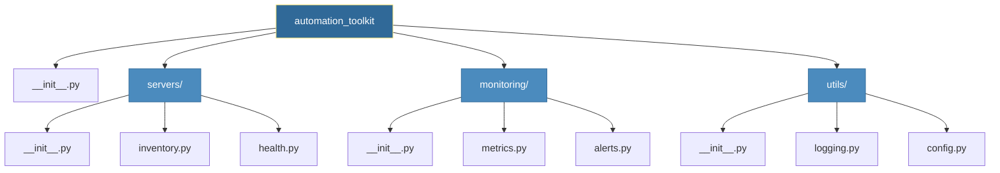
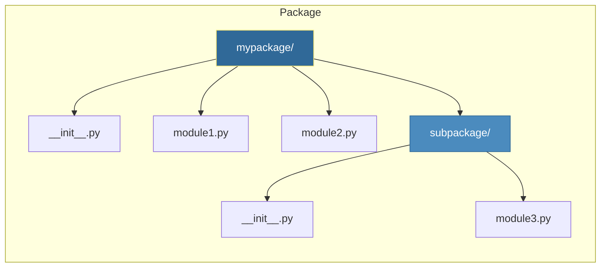

# Functions and Modules
*Building Reusable, Organized Automation Code*

Functions and modules transform scripts into maintainable automation tools. They enable code reuse, testing, and collaboration across teams.

---

## 🎯 Learning Objectives

- Define and call functions with various argument types
- Create and import custom modules
- Organize code into packages
- Apply best practices for reusable automation code

---

## 📊 Module Organization Architecture



---

## 📚 Core Concepts

### 1. Function Basics

```python
# Basic function definition
def check_server_health(hostname):
    """Check if a server is responding."""
    response = ping(hostname)
    return response.status == "OK"

# Function with multiple parameters
def deploy_application(app_name, environment, version="latest"):
    """Deploy an application to specified environment."""
    print(f"Deploying {app_name} v{version} to {environment}")
    # deployment logic here
    return True

# Calling functions
is_healthy = check_server_health("web-01")
deploy_application("api-service", "production", version="2.3.1")
deploy_application("api-service", "staging")  # Uses default version
```

### 2. Argument Types

```python
# Positional arguments
def create_user(username, role, team):
    return {"user": username, "role": role, "team": team}

# Keyword arguments
user = create_user(role="admin", team="platform", username="john")

# *args - Variable positional arguments
def run_commands(*commands):
    """Run multiple shell commands."""
    results = []
    for cmd in commands:
        results.append(execute(cmd))
    return results

run_commands("ls -la", "df -h", "whoami")

# **kwargs - Variable keyword arguments
def configure_server(**settings):
    """Apply configuration settings."""
    for key, value in settings.items():
        print(f"Setting {key} = {value}")

configure_server(timeout=30, retries=3, ssl=True)

# Combined
def deploy(app, *servers, **options):
    print(f"Deploying {app} to {servers} with {options}")

deploy("api", "web-01", "web-02", port=443, ssl=True)
```

### 3. Return Values

```python
# Single return
def get_cpu_usage(server):
    return 85.5

# Multiple returns (tuple unpacking)
def get_server_stats(server):
    cpu = 75.2
    memory = 68.4
    disk = 45.0
    return cpu, memory, disk

cpu, mem, disk = get_server_stats("web-01")

# Return dictionary for named results
def analyze_logs(log_file):
    return {
        "total_lines": 10000,
        "errors": 45,
        "warnings": 123,
        "error_rate": 0.45
    }

stats = analyze_logs("/var/log/app.log")
print(f"Error rate: {stats['error_rate']}%")
```

### 4. Lambda Functions

```python
# Quick, single-expression functions
servers = [
    {"name": "web-01", "cpu": 75},
    {"name": "api-01", "cpu": 90},
    {"name": "db-01", "cpu": 45}
]

# Sort by CPU usage
sorted_servers = sorted(servers, key=lambda s: s["cpu"])

# Filter high CPU servers
high_cpu = list(filter(lambda s: s["cpu"] > 80, servers))

# Transform data
names = list(map(lambda s: s["name"].upper(), servers))
```

---

## 📦 Modules and Imports

### Creating Modules

```python
# server_utils.py
"""Utilities for server management."""

DEFAULT_PORT = 22
DEFAULT_TIMEOUT = 30

def connect(hostname, port=DEFAULT_PORT):
    """Establish connection to server."""
    print(f"Connecting to {hostname}:{port}")
    return {"connected": True, "host": hostname}

def disconnect(connection):
    """Close server connection."""
    print(f"Disconnecting from {connection['host']}")

class ServerConnection:
    def __init__(self, hostname):
        self.hostname = hostname
        self.connected = False
    
    def connect(self):
        self.connected = True
```

### Importing Modules

```python
# Method 1: Import entire module
import server_utils
conn = server_utils.connect("web-01")

# Method 2: Import specific items
from server_utils import connect, DEFAULT_PORT
conn = connect("web-01", DEFAULT_PORT)

# Method 3: Import with alias
import server_utils as su
conn = su.connect("web-01")

# Method 4: Import all (avoid in production!)
from server_utils import *
```

---

## 📁 Package Structure



```python
# mypackage/__init__.py
"""Main package initialization."""
from .module1 import important_function
from .module2 import AnotherClass

__version__ = "1.0.0"
__all__ = ["important_function", "AnotherClass"]

# Usage
from mypackage import important_function
```

---

## 🛠️ Hands-On Exercises

### Exercise 1: Health Check Function
```python
# Create a function that checks multiple aspects of server health
# TODO: Implement check_health function
# - Takes: hostname, checks (list of check types)
# - Returns: dictionary with results for each check
# - Available checks: "cpu", "memory", "disk", "network"

def check_health(hostname, checks):
    pass

# Test
result = check_health("web-01", ["cpu", "memory"])
# Expected: {"cpu": {"status": "ok", "value": 45}, "memory": {...}}
```

<details>
<summary>💡 Solution</summary>

```python
import random

def check_health(hostname, checks):
    """Perform specified health checks on a server."""
    results = {}
    
    check_functions = {
        "cpu": lambda: random.randint(20, 95),
        "memory": lambda: random.randint(30, 90),
        "disk": lambda: random.randint(10, 85),
        "network": lambda: random.choice([True, False])
    }
    
    for check in checks:
        if check in check_functions:
            value = check_functions[check]()
            if check == "network":
                status = "ok" if value else "error"
            else:
                status = "ok" if value < 80 else "warning" if value < 90 else "critical"
            results[check] = {"status": status, "value": value}
        else:
            results[check] = {"status": "unknown", "value": None}
    
    return results

# Test
result = check_health("web-01", ["cpu", "memory", "network"])
print(result)
```
</details>

### Exercise 2: Decorator for Retry Logic
```python
# Create a retry decorator for flaky operations
# TODO: Implement retry decorator
# - Takes max_attempts and delay parameters
# - Retries function if it raises an exception
# - Returns result on success, re-raises on final failure

def retry(max_attempts=3, delay=1):
    pass

# Usage
@retry(max_attempts=3, delay=2)
def call_flaky_api():
    # Simulated API call that sometimes fails
    pass
```

<details>
<summary>💡 Solution</summary>

```python
import time
import functools

def retry(max_attempts=3, delay=1):
    """Retry decorator for handling transient failures."""
    def decorator(func):
        @functools.wraps(func)
        def wrapper(*args, **kwargs):
            last_exception = None
            for attempt in range(1, max_attempts + 1):
                try:
                    return func(*args, **kwargs)
                except Exception as e:
                    last_exception = e
                    print(f"Attempt {attempt}/{max_attempts} failed: {e}")
                    if attempt < max_attempts:
                        time.sleep(delay)
            raise last_exception
        return wrapper
    return decorator

# Test
import random

@retry(max_attempts=3, delay=1)
def call_flaky_api():
    if random.random() < 0.7:  # 70% chance of failure
        raise ConnectionError("API temporarily unavailable")
    return {"status": "success", "data": [1, 2, 3]}

try:
    result = call_flaky_api()
    print(f"Success: {result}")
except ConnectionError:
    print("All retries exhausted")
```
</details>

### Exercise 3: Config Module
```python
# Create a configuration module structure
# TODO: Create these files:
# - config/__init__.py
# - config/settings.py
# - config/loader.py

# The module should:
# 1. Load configuration from environment or file
# 2. Provide default values
# 3. Validate required settings
```

<details>
<summary>💡 Solution</summary>

```python
# config/__init__.py
from .settings import Settings
from .loader import load_config

__all__ = ["Settings", "load_config"]

# config/settings.py
class Settings:
    REQUIRED_KEYS = ["DATABASE_URL", "API_KEY"]
    
    DEFAULTS = {
        "LOG_LEVEL": "INFO",
        "TIMEOUT": 30,
        "RETRIES": 3
    }
    
    def __init__(self, **kwargs):
        # Apply defaults
        for key, value in self.DEFAULTS.items():
            setattr(self, key.lower(), kwargs.get(key, value))
        
        # Apply provided settings
        for key, value in kwargs.items():
            setattr(self, key.lower(), value)
    
    def validate(self):
        missing = []
        for key in self.REQUIRED_KEYS:
            if not hasattr(self, key.lower()) or getattr(self, key.lower()) is None:
                missing.append(key)
        if missing:
            raise ValueError(f"Missing required config: {missing}")

# config/loader.py
import os

def load_config(env_prefix="APP"):
    """Load configuration from environment variables."""
    config = {}
    for key, value in os.environ.items():
        if key.startswith(f"{env_prefix}_"):
            config_key = key[len(env_prefix) + 1:]
            config[config_key] = value
    return config
```
</details>

---

## 📖 Real-World Story: The Utility Library

**Scenario**: Five teams were each writing their own server connection code, leading to inconsistent error handling and duplicated bugs.

**Solution**: Created a shared `infra-utils` Python package with:
- Standardized connection functions
- Built-in retry logic
- Consistent logging

**Outcome**: Bug fixes in one place benefited all teams. New team members onboarded faster with clean, documented functions.

---

## ❓ Interview Questions

1. **What's the difference between `*args` and `**kwargs`?**
   > `*args` captures extra positional arguments as tuple. `**kwargs` captures extra keyword arguments as dict.

2. **Explain the purpose of `__init__.py`.**
   > Marks a directory as a Python package. Can initialize package-level imports and define `__all__`.

3. **When would you use a lambda vs a regular function?**
   > Lambda for simple, one-line expressions (often with map/filter). Regular functions for complex logic requiring multiple statements.

4. **What is a decorator and how does it work?**
   > A function that wraps another function to extend behavior. Uses `@decorator` syntax and `functools.wraps`.

5. **How do you handle circular imports?**
   > Move import inside function, restructure modules, or use TYPE_CHECKING for type hints.

---

## 🧠 Quiz

1. What does `*args` create inside a function?
   - a) List
   - b) Tuple ✅
   - c) Dictionary

2. Which import style is considered best practice?
   - a) `from module import *`
   - b) `import module` ✅
   - c) `from module import func` (also acceptable)

3. What's the purpose of `@functools.wraps`?
   - a) Speed up function calls
   - b) Preserve function metadata ✅
   - c) Enable recursion

4. Default arguments are evaluated:
   - a) At function call time
   - b) At function definition time ✅
   - c) At module import time

5. What happens if you modify a mutable default argument?
   - a) Creates new object each call
   - b) Persists changes across calls ✅
   - c) Raises error

---

**Next Step**: [File Operations →](../04-File-Operations/README.md)
