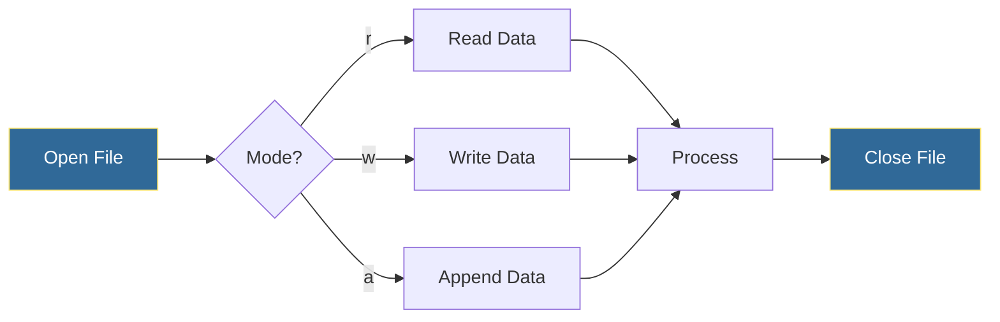
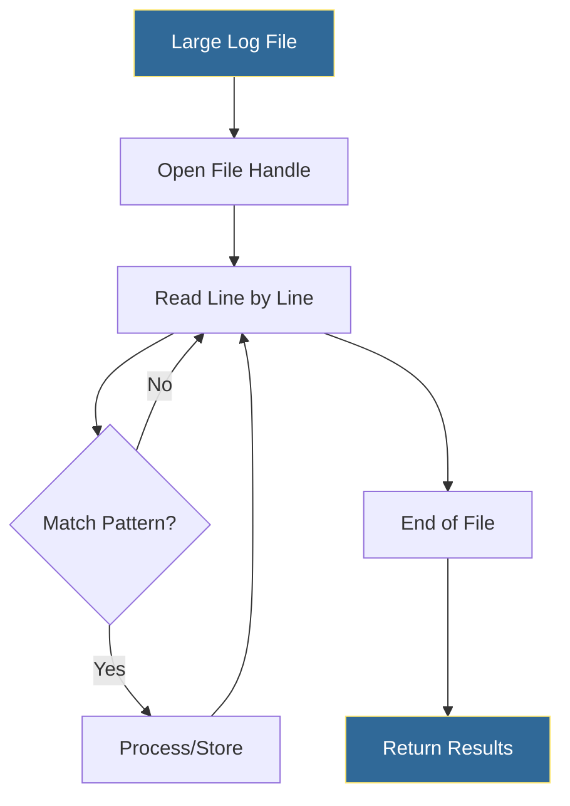

# File Operations
*Reading, Writing, and Managing Files for Automation*

File operations are fundamental to DevOps automation—from reading configs to writing logs to managing deployment artifacts. Python provides powerful, safe abstractions for file handling.

---

## 🎯 Learning Objectives

- Read and write files safely using context managers
- Handle different file formats (text, binary)
- Navigate file systems programmatically
- Process large files efficiently

---

## 📊 File I/O Workflow



---

## 📚 Core Concepts

### 1. Basic File Operations

```python
# Reading a file (bad - doesn't auto-close!)
f = open("config.txt", "r")
content = f.read()
f.close()

# Reading a file (good - context manager)
with open("config.txt", "r") as f:
    content = f.read()
# File automatically closed here

# Reading lines
with open("/var/log/app.log", "r") as f:
    lines = f.readlines()  # List of all lines
    
# Reading line by line (memory efficient)
with open("/var/log/app.log", "r") as f:
    for line in f:
        process(line.strip())
```

### 2. File Modes

| Mode | Description | Creates File? |
|------|-------------|---------------|
| `r` | Read (default) | No |
| `w` | Write (truncates) | Yes |
| `a` | Append | Yes |
| `r+` | Read and write | No |
| `w+` | Write and read | Yes |
| `rb` | Read binary | No |
| `wb` | Write binary | Yes |

### 3. Writing Files

```python
# Write entire content
with open("output.txt", "w") as f:
    f.write("Server Status Report\n")
    f.write("=" * 20 + "\n")

# Write multiple lines
lines = ["web-01: healthy", "web-02: healthy", "db-01: warning"]
with open("status.txt", "w") as f:
    f.writelines(line + "\n" for line in lines)

# Append to existing file
with open("audit.log", "a") as f:
    f.write(f"[{timestamp}] User logged in\n")

# Write with print (useful for formatted output)
with open("report.txt", "w") as f:
    print("Section 1", file=f)
    print("=" * 40, file=f)
```

### 4. Working with Binary Files

```python
# Copy binary file (e.g., images, archives)
with open("app.tar.gz", "rb") as src:
    with open("backup.tar.gz", "wb") as dst:
        dst.write(src.read())

# Read chunks for large files
def copy_large_file(source, destination, chunk_size=8192):
    with open(source, "rb") as src:
        with open(destination, "wb") as dst:
            while chunk := src.read(chunk_size):
                dst.write(chunk)
```

---

## 🔧 Advanced Patterns

### Atomic File Writes

```python
import tempfile
import os
import shutil

def atomic_write(filepath, content):
    """Write file atomically to prevent corruption."""
    dir_name = os.path.dirname(filepath)
    
    # Write to temp file first
    with tempfile.NamedTemporaryFile(
        mode='w', 
        dir=dir_name, 
        delete=False
    ) as tmp:
        tmp.write(content)
        tmp_path = tmp.name
    
    # Atomic rename
    shutil.move(tmp_path, filepath)

# Usage - config won't be corrupted if write fails
atomic_write("/etc/myapp/config.json", '{"debug": true}')
```

### File Locking

```python
import fcntl
import time

def write_with_lock(filepath, content):
    """Write to file with exclusive lock."""
    with open(filepath, 'w') as f:
        try:
            fcntl.flock(f.fileno(), fcntl.LOCK_EX)
            f.write(content)
        finally:
            fcntl.flock(f.fileno(), fcntl.LOCK_UN)
```

### Processing Large Log Files



```python
def find_errors_in_log(log_file, pattern="ERROR"):
    """Stream through large log file finding errors."""
    errors = []
    with open(log_file, "r") as f:
        for line_num, line in enumerate(f, 1):
            if pattern in line:
                errors.append({
                    "line_num": line_num,
                    "content": line.strip()
                })
    return errors

# Memory efficient for multi-GB log files
errors = find_errors_in_log("/var/log/large-app.log")
```

---

## 🛠️ Hands-On Exercises

### Exercise 1: Config File Reader
```python
# Create a function to read key=value config files
# TODO: Implement parse_config function
# - Handle comments (lines starting with #)
# - Handle empty lines
# - Return dictionary of settings

sample_config = """
# Database settings
DB_HOST=localhost
DB_PORT=5432
DB_NAME=myapp

# App settings
DEBUG=true
LOG_LEVEL=INFO
"""

def parse_config(filepath):
    pass
```

<details>
<summary>💡 Solution</summary>

```python
def parse_config(filepath):
    """Parse key=value config file into dictionary."""
    config = {}
    
    with open(filepath, "r") as f:
        for line in f:
            line = line.strip()
            
            # Skip empty lines and comments
            if not line or line.startswith("#"):
                continue
            
            # Parse key=value
            if "=" in line:
                key, value = line.split("=", 1)  # Split on first = only
                key = key.strip()
                value = value.strip()
                
                # Type conversion
                if value.lower() == "true":
                    value = True
                elif value.lower() == "false":
                    value = False
                elif value.isdigit():
                    value = int(value)
                
                config[key] = value
    
    return config

# Test
config = parse_config("app.conf")
print(config)
# {'DB_HOST': 'localhost', 'DB_PORT': 5432, 'DB_NAME': 'myapp', 
#  'DEBUG': True, 'LOG_LEVEL': 'INFO'}
```
</details>

### Exercise 2: Log Rotation Script
```python
# Create a log rotation function
# TODO: Implement rotate_logs function
# - Rename current.log to current.log.1
# - Rename current.log.1 to current.log.2
# - Keep only last N rotations
# - Create empty current.log

def rotate_logs(log_file, keep_count=5):
    pass
```

<details>
<summary>💡 Solution</summary>

```python
import os

def rotate_logs(log_file, keep_count=5):
    """Rotate log files, keeping last N versions."""
    
    # Remove oldest if it exists
    oldest = f"{log_file}.{keep_count}"
    if os.path.exists(oldest):
        os.remove(oldest)
    
    # Rotate existing backups
    for i in range(keep_count - 1, 0, -1):
        old_name = f"{log_file}.{i}"
        new_name = f"{log_file}.{i + 1}"
        if os.path.exists(old_name):
            os.rename(old_name, new_name)
    
    # Rotate current to .1
    if os.path.exists(log_file):
        os.rename(log_file, f"{log_file}.1")
    
    # Create new empty log file
    with open(log_file, "w") as f:
        pass  # Create empty file
    
    print(f"Rotated {log_file}, keeping {keep_count} backups")

# Test
rotate_logs("/var/log/myapp.log", keep_count=3)
```
</details>

### Exercise 3: Safe File Updater
```python
# Create a function to safely update JSON config files
# TODO: Implement update_json_config function
# - Read existing JSON
# - Update with new values
# - Write atomically
# - Handle file not existing

import json

def update_json_config(filepath, updates):
    pass
```

<details>
<summary>💡 Solution</summary>

```python
import json
import tempfile
import os
import shutil

def update_json_config(filepath, updates):
    """Safely update JSON config file."""
    
    # Read existing config or start empty
    try:
        with open(filepath, "r") as f:
            config = json.load(f)
    except FileNotFoundError:
        config = {}
    except json.JSONDecodeError:
        print(f"Warning: Invalid JSON in {filepath}, starting fresh")
        config = {}
    
    # Apply updates (deep merge would be better for nested)
    config.update(updates)
    
    # Write atomically
    dir_name = os.path.dirname(filepath) or "."
    with tempfile.NamedTemporaryFile(
        mode="w",
        dir=dir_name,
        suffix=".tmp",
        delete=False
    ) as tmp:
        json.dump(config, tmp, indent=2)
        tmp_path = tmp.name
    
    # Atomic rename
    shutil.move(tmp_path, filepath)
    print(f"Updated {filepath}")
    return config

# Test
update_json_config("settings.json", {"debug": True, "port": 8080})
update_json_config("settings.json", {"timeout": 30})  # Adds to existing
```
</details>

---

## 📖 Real-World Story: The Corrupted Config

**Scenario**: A deployment script was interrupted mid-write, leaving a config file half-written. The service crashed on restart.

**Problem**: Direct file writes using `open('config.json', 'w')` are not atomic.

**Solution**: Implemented atomic writes using temp file + rename pattern.

**Outcome**: Even when deployments fail, config files are never left in corrupted state.

---

## ❓ Interview Questions

1. **Why should you use context managers (`with`) for file operations?**
   > Ensures files are properly closed even if exceptions occur. Prevents resource leaks.

2. **How do you handle very large files that don't fit in memory?**
   > Read line by line using iteration, or use chunked reading for binary files.

3. **What's the difference between `r+` and `w+` modes?**
   > `r+` requires file to exist and preserves content. `w+` creates/truncates file.

4. **How do you ensure file writes are atomic?**
   > Write to temp file, then rename. Rename is atomic on most filesystems.

5. **What's the difference between `read()`, `readline()`, and `readlines()`?**
   > `read()` returns entire content, `readline()` one line, `readlines()` list of all lines.

---

## 🧠 Quiz

1. Which mode creates a file if it doesn't exist but doesn't truncate?
   - a) `w`
   - b) `a` ✅
   - c) `r+`

2. What does `with open(...) as f:` guarantee?
   - a) Fast reads
   - b) Automatic file closing ✅
   - c) Read-only access

3. For a 10GB log file, which approach is memory efficient?
   - a) `f.read()`
   - b) `f.readlines()`
   - c) `for line in f:` ✅

4. How do you write binary data?
   - a) `open(f, "w")`
   - b) `open(f, "wb")` ✅
   - c) `open(f, "binary")`

5. What happens with `open("new.txt", "w")` if file exists?
   - a) Appends
   - b) Error
   - c) Truncates (overwrites) ✅

---

**Next Step**: [Error Handling →](../05-Error-Handling/README.md)
