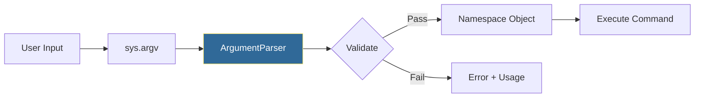

# Command Line Arguments
*Building Professional CLI Tools for DevOps*

CLI tools are the backbone of DevOps automation. Python's `argparse` module enables you to build professional command-line interfaces with help text, validation, and subcommands.

---

## 🎯 Learning Objectives

- Parse command-line arguments with argparse
- Implement subcommands for complex tools
- Add validation and help text
- Build user-friendly CLI experiences

---

## 📊 CLI Argument Parsing Flow



---

## 📚 Core Concepts

### 1. Basic Argparse

```python
import argparse

parser = argparse.ArgumentParser(
    description="Deploy application to servers"
)

# Positional argument
parser.add_argument("app_name", help="Name of application")

# Optional arguments
parser.add_argument("-e", "--environment", 
    default="staging", 
    choices=["staging", "production"],
    help="Target environment")
parser.add_argument("-v", "--verbose", 
    action="store_true",
    help="Enable verbose output")
parser.add_argument("-r", "--replicas", 
    type=int, 
    default=1,
    help="Number of replicas")

args = parser.parse_args()
print(f"Deploying {args.app_name} to {args.environment}")
```

### 2. Argument Types

```python
# Boolean flags
parser.add_argument("--debug", action="store_true")
parser.add_argument("--no-cache", action="store_false", dest="cache")

# Multiple values
parser.add_argument("-s", "--servers", nargs="+", help="Server list")
parser.add_argument("-t", "--tags", nargs="*", default=[])

# Required optional
parser.add_argument("--api-key", required=True)

# Choices
parser.add_argument("--level", choices=["debug", "info", "warn", "error"])
```

### 3. Subcommands

```python
parser = argparse.ArgumentParser(prog="devops-tool")
subparsers = parser.add_subparsers(dest="command", required=True)

# Deploy subcommand
deploy = subparsers.add_parser("deploy", help="Deploy application")
deploy.add_argument("app", help="Application name")
deploy.add_argument("-e", "--env", default="staging")

# Status subcommand  
status = subparsers.add_parser("status", help="Check status")
status.add_argument("-a", "--all", action="store_true")

args = parser.parse_args()

if args.command == "deploy":
    print(f"Deploying {args.app} to {args.env}")
elif args.command == "status":
    print(f"Checking status (all={args.all})")
```

---

## 🛠️ Hands-On Exercise

### Server Management CLI
```python
import argparse

def main():
    parser = argparse.ArgumentParser(description="Server Manager")
    subparsers = parser.add_subparsers(dest="action")
    
    # List command
    list_p = subparsers.add_parser("list")
    list_p.add_argument("--env", choices=["dev", "prod"])
    
    # Deploy command
    deploy_p = subparsers.add_parser("deploy")
    deploy_p.add_argument("app")
    deploy_p.add_argument("--version", default="latest")
    
    args = parser.parse_args()
    
    if args.action == "list":
        print(f"Listing servers (env={args.env})")
    elif args.action == "deploy":
        print(f"Deploying {args.app}:{args.version}")

if __name__ == "__main__":
    main()
```

---

## ❓ Interview Questions

1. **What's the difference between positional and optional arguments?**
   > Positional are required by order; optional use `-` or `--` prefix.

2. **How do you create mutually exclusive arguments?**
   > Use `parser.add_mutually_exclusive_group()`.

---

## 🧠 Quiz

1. What does `action="store_true"` do?
   - a) Stores the string "true"
   - b) Sets True if flag present ✅
   - c) Required boolean

2. How do you make an optional argument required?
   - a) `required=True` ✅
   - b) Remove the dashes
   - c) `mandatory=True`

---

**Next Step**: [Subprocess Module →](../10-Subprocess-Module/README.md)
