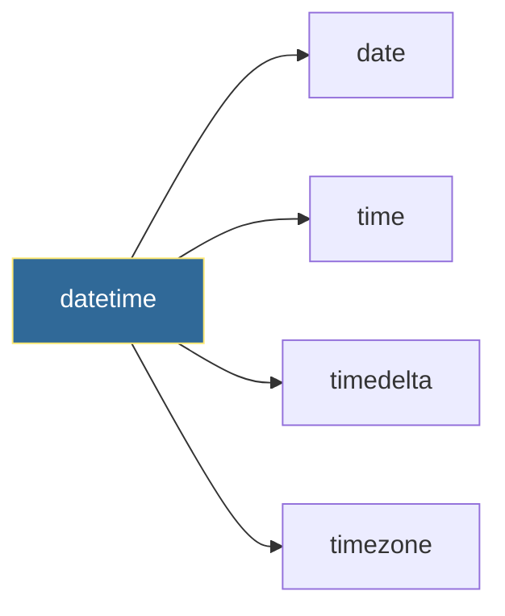

# Datetime Operations
*Handling Time in Automation Scripts*

Time handling is critical for DevOps—scheduling tasks, parsing logs, calculating durations, and working across time zones.

---

## 🎯 Learning Objectives

- Work with dates, times, and timestamps
- Parse and format datetime strings
- Handle time zones correctly

---

## 📊 Datetime Components



---

## 📚 Core Concepts

### 1. Creating Datetimes

```python
from datetime import datetime, date, time, timedelta

# Current time
now = datetime.now()
utc_now = datetime.utcnow()
today = date.today()

# Specific datetime
meeting = datetime(2026, 1, 15, 10, 30, 0)

# From timestamp
ts = datetime.fromtimestamp(1704067200)
```

### 2. Formatting and Parsing

```python
# Format to string
now = datetime.now()
formatted = now.strftime("%Y-%m-%d %H:%M:%S")  # 2026-01-11 22:30:00
iso = now.isoformat()  # 2026-01-11T22:30:00.123456

# Parse from string
dt = datetime.strptime("2026-01-11 10:30:00", "%Y-%m-%d %H:%M:%S")

# Common formats
# %Y - 4-digit year    %m - month (01-12)
# %d - day (01-31)     %H - hour (00-23)
# %M - minute          %S - second
```

### 3. Time Calculations

```python
from datetime import timedelta

now = datetime.now()

# Add/subtract time
tomorrow = now + timedelta(days=1)
next_week = now + timedelta(weeks=1)
an_hour_ago = now - timedelta(hours=1)

# Calculate duration
start = datetime(2026, 1, 1)
end = datetime(2026, 1, 15)
duration = end - start
print(f"Duration: {duration.days} days")
```

---

## 🛠️ Hands-On Exercise

```python
from datetime import datetime, timedelta

def cleanup_old_backups(backups, max_age_days=30):
    """Remove backups older than max_age_days."""
    cutoff = datetime.now() - timedelta(days=max_age_days)
    
    for backup in backups:
        backup_date = datetime.strptime(backup['date'], '%Y-%m-%d')
        if backup_date < cutoff:
            print(f"Deleting old backup: {backup['name']}")
```

---

## 🧠 Quiz

1. What method formats datetime to string?
   - a) `format()`
   - b) `strftime()` ✅
   - c) `to_string()`

2. What represents duration between datetimes?
   - a) `duration`
   - b) `timedelta` ✅
   - c) `span`

---

**Next Step**: [Regular Expressions →](../13-Regular-Expressions/README.md)
