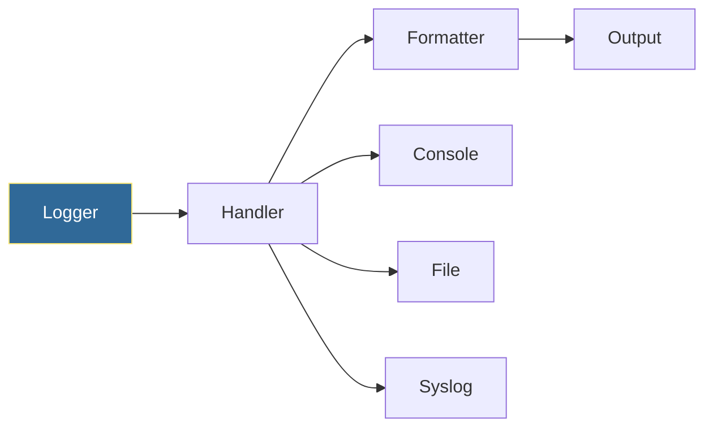

# Logging Basics
*Professional Logging for Production Scripts*

Proper logging separates amateur scripts from production-ready automation. The logging module provides flexible, configurable output for debugging and monitoring.

---

## 🎯 Learning Objectives

- Configure logging with handlers and formatters
- Use appropriate log levels
- Implement structured logging

---

## 📊 Logging Architecture



---

## 📚 Core Concepts

### 1. Basic Logging

```python
import logging

# Configure logging
logging.basicConfig(
    level=logging.INFO,
    format="%(asctime)s - %(name)s - %(levelname)s - %(message)s"
)

logger = logging.getLogger(__name__)

# Log at different levels
logger.debug("Detailed debugging info")
logger.info("General information")
logger.warning("Warning message")
logger.error("Error occurred")
logger.critical("Critical failure!")
```

### 2. Log Levels

| Level | Value | Usage |
|-------|-------|-------|
| DEBUG | 10 | Detailed diagnostic info |
| INFO | 20 | General operational events |
| WARNING | 30 | Something unexpected |
| ERROR | 40 | Serious problem |
| CRITICAL | 50 | System failure |

### 3. File and Console Logging

```python
import logging

logger = logging.getLogger("myapp")
logger.setLevel(logging.DEBUG)

# Console handler
console = logging.StreamHandler()
console.setLevel(logging.INFO)
console.setFormatter(logging.Formatter("%(levelname)s - %(message)s"))

# File handler
file_handler = logging.FileHandler("app.log")
file_handler.setLevel(logging.DEBUG)
file_handler.setFormatter(
    logging.Formatter("%(asctime)s - %(levelname)s - %(message)s")
)

logger.addHandler(console)
logger.addHandler(file_handler)
```

---

## 🛠️ Hands-On Exercise

```python
import logging

def setup_logger(name, log_file, level=logging.INFO):
    """Create a configured logger."""
    logger = logging.getLogger(name)
    logger.setLevel(level)
    
    formatter = logging.Formatter(
        "%(asctime)s | %(name)s | %(levelname)s | %(message)s"
    )
    
    handler = logging.FileHandler(log_file)
    handler.setFormatter(formatter)
    logger.addHandler(handler)
    
    return logger

# Usage
app_logger = setup_logger("deploy", "deploy.log")
app_logger.info("Starting deployment")
```

---

## 🧠 Quiz

1. Which log level is highest severity?
   - a) ERROR
   - b) CRITICAL ✅
   - c) WARNING

2. Default logging level when not set?
   - a) DEBUG
   - b) INFO
   - c) WARNING ✅

---

**Next Step**: [Virtual Environments →](../15-Virtual-Environments/README.md)
