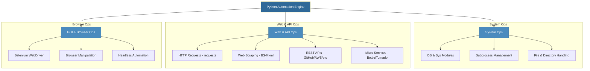

# Module 2: Python for DevOps Automation
*Mastering System Orchestration and Web Interaction with Python*

Python is the "glue" of the DevOps world. Its readability, vast ecosystem of libraries, and cross-platform compatibility make it the primary choice for complex automation that exceeds the capabilities of Shell scripting.

---

## 🎯 Learning Objectives
- Master Python environments and package management (`pip`, `venv`).
- Automate web interactions: HTTP Requests, Scraping, and REST API integration.
- Build micro-web services for automation status and internal tools.
- Implement browser-based automation for legacy systems and testing.
- Leverage asynchronous patterns for high-performance automation.

---

## 🏛️ Python Automation Architecture

---

## 📂 Curriculum Topics

### 1. **[Working with the Web](./01-Working-with-the-Web.md)**
- **HTTP Requests**: Mastering GET/POST with the `requests` library.
- **Data Extraction**: Parsing HTML with `BeautifulSoup` and `lxml`.
- **API Integration**: Complete CRUD operations with GitHub REST API (Gists).

### 2. **[Web Automation & Selenium](./02-Web-Automation.md)**
- **Browser Control**: Spawning and controlling Firefox/Chrome/Safari.
- **Element Interaction**: Locating elements by ID, Name, and XPath.
- **Form Automation**: Handling logins and automated data entry.

### 3. **[Micro-Frameworks & Async Operations](./03-Micro-Frameworks-and-Async.md)**
- **Bottle**: Building single-file micro-services for automation dashboards.
- **Tornado**: High-performance, asynchronous web servers for concurrent tasks.
- **CRUD Workflows**: Implementing Create, Read, Update, Delete for internal tools.

---

## 🛠️ Essential DevOps Libraries Reference

| Library | Category | Use Case |
|---------|----------|----------|
| `os` / `sys` | System | Path manipulation, script arguments, env vars |
| `subprocess` | System | Running shell commands and capturing output |
| `requests` | Web | Making API calls and fetching web content |
| `beautifulsoup4` | Parsing | Extracting data from complex HTML structures |
| `selenium` | Automation | Browser-based task automation and testing |
| `bottle` | Web Apps | Lightweight internal status pages or web hooks |
| `tornado` | Async | Handling thousands of concurrent connections |

---

## 📖 Stories from the Field: The API Pivot
**Scenario**: A team was manually taking screenshots of 50 different monitoring dashboards every morning.
**Solution**: A Python script using `selenium` was written to log in, navigate through the dashboards, and save the screenshots automatically into a daily Slack channel.
**Outcome**: Saved 2 hours of engineering time daily and ensured consistency in reporting.

---

## ❓ Interview Questions
1. **Explain the difference between `os.system()` and `subprocess.run()`.**
2. **Why is `requests` preferred over `urllib2` for DevOps tasks?**
3. **What is an "Asynchronous" HTTP server and when should you use it?**

---

## 🧠 Quiz
1. Which module is used to parse HTML content? `(BeautifulSoup / lxml)`
2. What HTTP method is used to update a resource? `(PATCH / PUT)`
3. Which tool allows Python to interact with a physical browser? `(Selenium)`

---
**Next Step**: Start with **[Working with the Web](./01-Working-with-the-Web.md)**.
