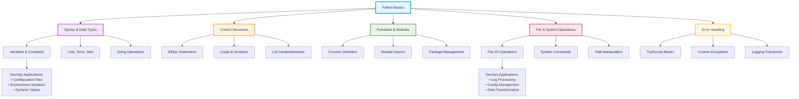

# Python for DevOps Learning Path

```mermaid
graph TD
    A[Python Basics] --> B[Syntax & Data Types]
    A --> C[Control Structures]
    A --> D[Functions & Modules]
    A --> E[File & System Operations]
    A --> F[Error Handling]
    
    B --> G[Variables & Constants]
    B --> H[Lists, Dicts, Sets]
    B --> I[String Operations]
    
    C --> J[If/Else Statements]
    C --> K[Loops & Iterations]
    C --> L[List Comprehensions]
    
    D --> M[Function Definition]
    D --> N[Module Imports]
    D --> O[Package Management]
    
    E --> P[File I/O Operations]
    E --> Q[System Commands]
    E --> R[Path Manipulation]
    
    F --> S[Try/Except Blocks]
    F --> T[Custom Exceptions]
    F --> U[Logging Framework]
    
    G --> V[DevOps Applications:<br/>• Configuration Files<br/>• Environment Variables<br/>• Dynamic Values]
    
    P --> W[DevOps Applications:<br/>• Log Processing<br/>• Config Management<br/>• Data Transformation]
    
    style A fill:#e1f5fe,stroke:#1e88e5,stroke-width:3px
    style B fill:#f3e5f5,stroke:#8e24aa,stroke-width:2px
    style C fill:#fff3e0,stroke:#f57c00,stroke-width:2px
    style D fill:#e8f5e8,stroke:#2e7d32,stroke-width:2px
    style E fill:#fce4ec,stroke:#c2185b,stroke-width:2px
    style F fill:#fff8e1,stroke:#f9a825,stroke-width:2px
```

This learning path shows Python fundamentals with specific focus on DevOps applications and use cases.