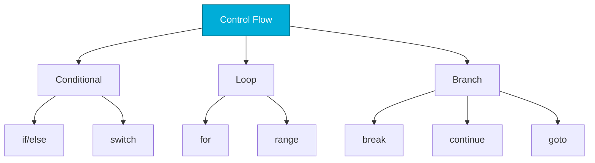

# Control Flow
*Directing Program Execution in Go*

Go's control flow is simple but powerful. No parentheses required, and some unique constructs like `switch` with no expression make code more readable.

---

## 🎯 Learning Objectives

- Write conditional statements (if/else)
- Use switch statements effectively
- Master Go's loop constructs (for only!)
- Apply break, continue, and range

---

## 📊 Control Flow Patterns



---

## 📚 Core Concepts

### 1. If/Else Statements

```go
// Basic if
if status == "healthy" {
    fmt.Println("Server OK")
}

// If with initialization (idiomatic Go!)
if cpu := getCPUUsage(); cpu > 90 {
    alert("High CPU", cpu)
} else if cpu > 75 {
    warn("CPU elevated", cpu)
} else {
    log("CPU normal", cpu)
}
// Note: cpu is scoped to the if block
```

### 2. Switch Statements

```go
// Basic switch
switch status {
case "healthy":
    fmt.Println("✓ Healthy")
case "degraded":
    fmt.Println("⚠ Degraded")
case "unhealthy":
    fmt.Println("✗ Unhealthy")
default:
    fmt.Println("? Unknown")
}

// Switch with no expression (cleaner than if/else chains)
cpu := 85
switch {
case cpu > 90:
    fmt.Println("CRITICAL")
case cpu > 75:
    fmt.Println("WARNING")
default:
    fmt.Println("OK")
}

// Multiple cases
switch day {
case "Saturday", "Sunday":
    fmt.Println("Weekend")
default:
    fmt.Println("Weekday")
}
```

### 3. For Loops (The Only Loop in Go!)

```go
// Traditional for
for i := 0; i < 10; i++ {
    fmt.Println(i)
}

// While-style
retries := 0
for retries < 3 {
    if tryConnect() {
        break
    }
    retries++
}

// Infinite loop
for {
    if shouldStop() {
        break
    }
    processWork()
}

// Range over slice
servers := []string{"web-01", "web-02", "api-01"}
for i, server := range servers {
    fmt.Printf("%d: %s\n", i, server)
}

// Range, ignore index
for _, server := range servers {
    checkHealth(server)
}
```

---

## 🛠️ Hands-On Exercises

### Exercise 1: Server Health Checker
```go
// Implement health status logic
func getHealthStatus(cpu, memory, disk float64) string {
    // TODO: Return "critical" if any > 90
    // Return "warning" if any > 75
    // Return "healthy" otherwise
}
```

<details>
<summary>💡 Solution</summary>

```go
func getHealthStatus(cpu, memory, disk float64) string {
    switch {
    case cpu > 90 || memory > 90 || disk > 90:
        return "critical"
    case cpu > 75 || memory > 75 || disk > 75:
        return "warning"
    default:
        return "healthy"
    }
}
```
</details>

### Exercise 2: Retry Loop
```go
// Implement retry logic with backoff
func connectWithRetry(maxRetries int) bool {
    // TODO: Try to connect up to maxRetries times
    // Print attempt number
    // Return true on success, false if all fail
}
```

<details>
<summary>💡 Solution</summary>

```go
import "time"

func connectWithRetry(maxRetries int) bool {
    for attempt := 1; attempt <= maxRetries; attempt++ {
        fmt.Printf("Attempt %d/%d...\n", attempt, maxRetries)
        
        if tryConnect() {
            fmt.Println("Connected!")
            return true
        }
        
        if attempt < maxRetries {
            time.Sleep(time.Second * time.Duration(attempt))
        }
    }
    return false
}
```
</details>

---

## ❓ Interview Questions

1. **Does Go have a while loop?**
   > No. Use `for` without init/post: `for condition { }`.

2. **What's unique about Go's switch?**
   > No fallthrough by default, can switch without expression, cases can be expressions.

3. **How do you iterate over a map?**
   > `for key, value := range myMap { }`.

---

## 🧠 Quiz

1. How many loop constructs does Go have?
   - a) 3 (for, while, do-while)
   - b) 1 (for only) ✅

2. Does switch require break?
   - a) Yes
   - b) No (no fallthrough by default) ✅

3. What does `range` return for a slice?
   - a) Just values
   - b) Index and value ✅

---

**Next Step**: [Functions →](../04-Functions/README.md)
