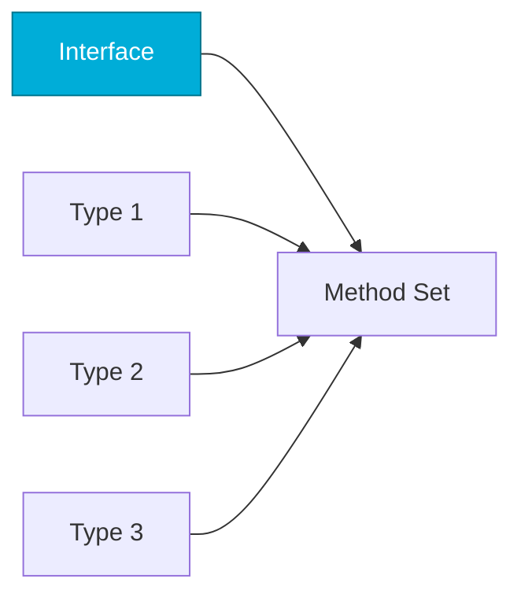

# Interfaces
*Go's Powerful Abstraction Mechanism*

Interfaces in Go are implicit—types satisfy interfaces by implementing methods, not by declaring. This enables loose coupling and testability.

---

## 🎯 Learning Objectives

- Define and implement interfaces
- Use the empty interface and type assertions
- Apply interfaces for dependency injection
- Understand common interface patterns

---

## 📊 Interface Satisfaction



---

## 📚 Core Concepts

### 1. Defining Interfaces

```go
// Simple interface
type HealthChecker interface {
    CheckHealth() bool
}

// Multiple methods
type Server interface {
    Start() error
    Stop() error
    Status() string
}

// Any type with these methods satisfies the interface
type WebServer struct{ port int }
func (w *WebServer) Start() error { return nil }
func (w *WebServer) Stop() error { return nil }
func (w *WebServer) Status() string { return "running" }
```

### 2. Using Interfaces

```go
func monitorHealth(checker HealthChecker) {
    if checker.CheckHealth() {
        fmt.Println("Healthy")
    } else {
        fmt.Println("Unhealthy")
    }
}

// Any type with CheckHealth() bool works
type APIServer struct{}
func (a APIServer) CheckHealth() bool { return true }

type Database struct{}
func (d Database) CheckHealth() bool { return true }

monitorHealth(APIServer{})
monitorHealth(Database{})
```

### 3. Empty Interface and Type Assertions

```go
// Empty interface accepts any type
func printAnything(v interface{}) {
    fmt.Printf("Value: %v, Type: %T\n", v, v)
}

// Type assertion
func process(v interface{}) {
    if str, ok := v.(string); ok {
        fmt.Println("String:", str)
    }
}

// Type switch
func describe(v interface{}) {
    switch t := v.(type) {
    case string:
        fmt.Println("String:", t)
    case int:
        fmt.Println("Int:", t)
    default:
        fmt.Println("Unknown type")
    }
}
```

### 4. Common Interfaces

```go
// io.Reader / io.Writer
type Reader interface {
    Read(p []byte) (n int, err error)
}

// Stringer (like toString)
type Stringer interface {
    String() string
}

// error interface
type error interface {
    Error() string
}
```

---

## 🛠️ Hands-On Exercise

```go
// Create a Deployer interface and implementations
type Deployer interface {
    Deploy(name, image string) error
}

// TODO: Implement for KubernetesDeployer and DockerDeployer
```

<details>
<summary>💡 Solution</summary>

```go
type Deployer interface {
    Deploy(name, image string) error
}

type KubernetesDeployer struct {
    Namespace string
}

func (k KubernetesDeployer) Deploy(name, image string) error {
    fmt.Printf("kubectl -n %s apply deployment/%s image=%s\n", k.Namespace, name, image)
    return nil
}

type DockerDeployer struct{}

func (d DockerDeployer) Deploy(name, image string) error {
    fmt.Printf("docker run -d --name %s %s\n", name, image)
    return nil
}

func runDeployment(d Deployer, name, image string) {
    d.Deploy(name, image)
}
```
</details>

---

## ❓ Interview Questions

1. **How are Go interfaces different from Java/C# interfaces?**
   > Implicit satisfaction—no `implements` keyword needed.

2. **What is the empty interface `interface{}`?**
   > Satisfied by any type. Used for generic containers before generics.

---

## 🧠 Quiz

1. Interface satisfaction is:
   - a) Explicit with keyword
   - b) Implicit by implementing methods ✅

2. The empty interface accepts:
   - a) Nothing
   - b) Any type ✅

---

**Next Step**: [Error Handling →](../07-Error-Handling/README.md)
