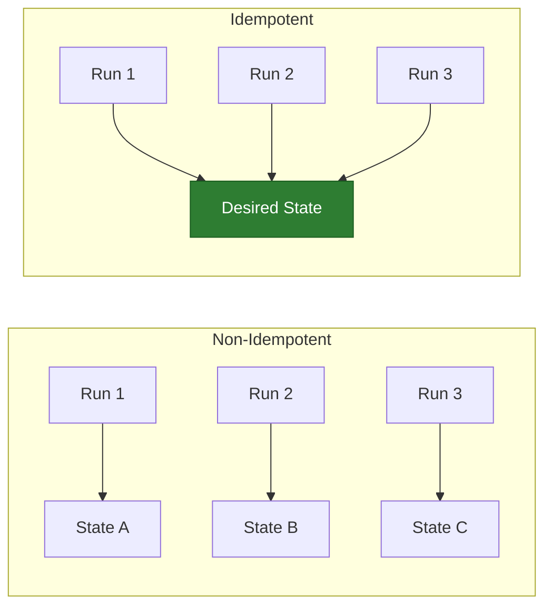
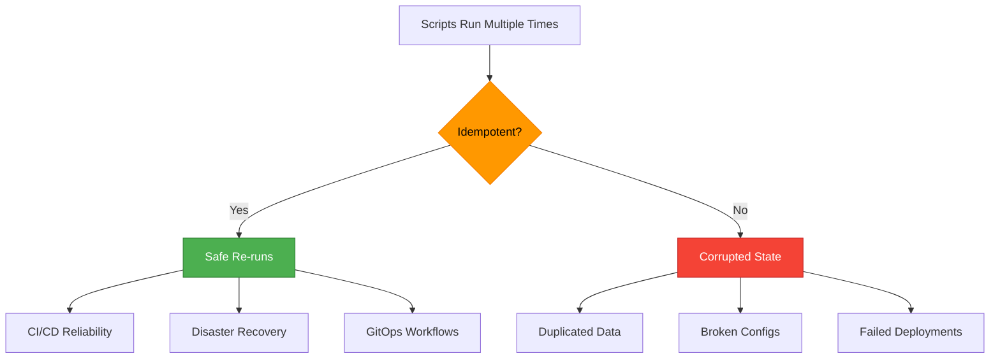

# Idempotency in Automation
*Writing Scripts That Are Safe to Run Multiple Times*

Idempotency is one of the most critical concepts in DevOps automation. An idempotent operation produces the same result whether executed once or many times—essential for reliable infrastructure and deployable automation.

---

## 🎯 Learning Objectives

- Understand what makes an operation idempotent
- Identify safe vs. unsafe operations
- Implement idempotent patterns in Shell, Python, and Go
- Apply idempotency in Ansible, Terraform, and Kubernetes

---

## 📊 The Idempotency Principle



> **Definition**: An operation is idempotent if `f(x) = f(f(x))` — applying it multiple times has the same effect as applying it once.

---

## 📂 Topics

| Topic | Description |
|-------|-------------|
| [What is Idempotency?](#what-is-idempotency) | Core concept and importance |
| [Safe vs. Unsafe Operations](#safe-vs-unsafe-operations) | Categorizing operations |
| [Idempotency in Shell Scripts](#shell-script-patterns) | Bash patterns |
| [Idempotency in Python/Go](#programming-patterns) | Code patterns |
| [Configuration Management](#configuration-management) | Ansible, Terraform, K8s |

---

## 📚 What is Idempotency?

### The Problem Without Idempotency

```bash
# NON-IDEMPOTENT: Appends on every run!
echo "export PATH=/custom/bin:$PATH" >> ~/.bashrc

# After 5 runs: PATH is corrupted with duplicates
```

### The Idempotent Solution

```bash
# IDEMPOTENT: Only adds if not present
grep -q "/custom/bin" ~/.bashrc || echo "export PATH=/custom/bin:$PATH" >> ~/.bashrc
```

### Why It Matters in DevOps



---

## 🔴🟢 Safe vs. Unsafe Operations

### Classification Table

| Operation Type | Example | Idempotent? | How to Make Safe |
|---------------|---------|-------------|------------------|
| **Create** | `mkdir dir` | ❌ Fails if exists | `mkdir -p dir` |
| **Create/Update** | `echo > file` | ✅ Overwrites | Already safe |
| **Append** | `echo >> file` | ❌ Duplicates | Check before append |
| **Delete** | `rm file` | ❌ Fails if missing | `rm -f file` |
| **Copy** | `cp src dest` | ✅ Overwrites | Already safe |
| **Link** | `ln -s src dest` | ❌ Fails if exists | `ln -sf src dest` |
| **Service Start** | `systemctl start x` | ✅ Ignores if running | Already safe |
| **Install Package** | `apt install x` | ✅ Skips if present | Already safe |

### Making Commands Idempotent

```bash
# ❌ NON-IDEMPOTENT
mkdir /app/logs              # Fails if exists
useradd deploy               # Fails if exists
iptables -A INPUT -p tcp ... # Adds duplicate rules

# ✅ IDEMPOTENT
mkdir -p /app/logs                        # -p = no error if exists
id deploy &>/dev/null || useradd deploy   # Check first
iptables -C INPUT -p tcp ... 2>/dev/null || iptables -A INPUT -p tcp ...
```

---

## 💻 Shell Script Patterns

### Pattern 1: Check Before Create

```bash
#!/bin/bash
# Idempotent user creation

create_user() {
    local username=$1
    
    if id "$username" &>/dev/null; then
        echo "User $username already exists"
    else
        useradd -m -s /bin/bash "$username"
        echo "Created user $username"
    fi
}

create_user "deploy"
```

### Pattern 2: Check Before Append

```bash
#!/bin/bash
# Idempotent config line addition

add_config_line() {
    local file=$1
    local line=$2
    
    if grep -qF "$line" "$file" 2>/dev/null; then
        echo "Config already present in $file"
    else
        echo "$line" >> "$file"
        echo "Added config to $file"
    fi
}

add_config_line "/etc/hosts" "10.0.0.5 api.internal"
```

### Pattern 3: Desired State Enforcement

```bash
#!/bin/bash
# Idempotent service configuration

ensure_service() {
    local service=$1
    local state=$2  # "running" or "stopped"
    
    case $state in
        running)
            systemctl is-active --quiet "$service" || systemctl start "$service"
            systemctl is-enabled --quiet "$service" || systemctl enable "$service"
            ;;
        stopped)
            systemctl is-active --quiet "$service" && systemctl stop "$service"
            systemctl is-enabled --quiet "$service" && systemctl disable "$service"
            ;;
    esac
}

ensure_service "nginx" "running"
```

---

## 🐍 Programming Patterns

### Python Idempotent Patterns

```python
import os
from pathlib import Path

def ensure_directory(path):
    """Idempotent directory creation."""
    Path(path).mkdir(parents=True, exist_ok=True)

def ensure_file_content(path, content):
    """Idempotent file with specific content."""
    path = Path(path)
    if path.exists() and path.read_text() == content:
        return False  # No change needed
    path.write_text(content)
    return True  # Changed

def ensure_line_in_file(path, line):
    """Idempotent line addition."""
    path = Path(path)
    if path.exists():
        content = path.read_text()
        if line in content:
            return False
    with open(path, 'a') as f:
        f.write(line + '\n')
    return True
```

### Go Idempotent Patterns

```go
package main

import (
    "os"
    "strings"
)

// EnsureDirectory creates dir if not exists
func EnsureDirectory(path string) error {
    return os.MkdirAll(path, 0755)  // Already idempotent
}

// EnsureFileContent writes only if content differs
func EnsureFileContent(path, content string) (bool, error) {
    existing, err := os.ReadFile(path)
    if err == nil && string(existing) == content {
        return false, nil  // No change
    }
    return true, os.WriteFile(path, []byte(content), 0644)
}

// EnsureLineInFile adds line only if missing
func EnsureLineInFile(path, line string) (bool, error) {
    content, _ := os.ReadFile(path)
    if strings.Contains(string(content), line) {
        return false, nil
    }
    f, err := os.OpenFile(path, os.O_APPEND|os.O_CREATE|os.O_WRONLY, 0644)
    if err != nil {
        return false, err
    }
    defer f.Close()
    _, err = f.WriteString(line + "\n")
    return true, err
}
```

---

## ⚙️ Configuration Management

### Ansible (Declarative = Idempotent by Design)

```yaml
# Ansible modules are idempotent by default
- name: Ensure nginx is installed
  apt:
    name: nginx
    state: present  # Only installs if missing

- name: Ensure nginx is running
  service:
    name: nginx
    state: started  # Only starts if stopped
    enabled: yes    # Only enables if disabled

- name: Ensure config file content
  copy:
    dest: /etc/nginx/nginx.conf
    content: |
      server {
        listen 80;
      }
  notify: Reload nginx  # Only triggers if changed
```

### Terraform (State-Based Idempotency)

```hcl
# Terraform compares desired state to actual state
resource "aws_instance" "web" {
  ami           = "ami-12345678"
  instance_type = "t3.micro"
  
  tags = {
    Name = "web-server"
  }
}

# Running `terraform apply` multiple times:
# - First run: Creates instance
# - Subsequent runs: "No changes. Infrastructure is up-to-date."
```

### Kubernetes (Declarative Manifests)

```yaml
# kubectl apply is idempotent
apiVersion: apps/v1
kind: Deployment
metadata:
  name: web
spec:
  replicas: 3
  selector:
    matchLabels:
      app: web
  template:
    metadata:
      labels:
        app: web
    spec:
      containers:
      - name: web
        image: nginx:1.21
```

```bash
# Run multiple times - same result
kubectl apply -f deployment.yaml
kubectl apply -f deployment.yaml  # No changes
kubectl apply -f deployment.yaml  # No changes
```

---

## 🛠️ Hands-On Exercises

### Exercise 1: Make This Script Idempotent

```bash
#!/bin/bash
# FIX THIS SCRIPT
mkdir /app
cp config.yaml /app/config.yaml
echo "APP_ENV=production" >> /app/.env
systemctl restart myapp
```

<details>
<summary>💡 Solution</summary>

```bash
#!/bin/bash
set -e

# Idempotent directory
mkdir -p /app

# Idempotent copy (already safe, but add check for changes)
if ! cmp -s config.yaml /app/config.yaml 2>/dev/null; then
    cp config.yaml /app/config.yaml
    CONFIG_CHANGED=true
fi

# Idempotent env var
grep -q "APP_ENV=production" /app/.env 2>/dev/null || \
    echo "APP_ENV=production" >> /app/.env

# Only restart if config changed
if [ "$CONFIG_CHANGED" = true ]; then
    systemctl restart myapp
fi
```
</details>

### Exercise 2: Python Idempotent Installer

```python
# Create an idempotent Python script that:
# 1. Creates /opt/myapp directory
# 2. Downloads app binary only if missing or outdated
# 3. Creates systemd service file
# 4. Enables and starts service
```

<details>
<summary>💡 Solution</summary>

```python
import os
import subprocess
from pathlib import Path
import hashlib
import urllib.request

def ensure_app_installed():
    app_dir = Path("/opt/myapp")
    app_dir.mkdir(parents=True, exist_ok=True)
    
    binary = app_dir / "myapp"
    expected_hash = "abc123..."  # Known good hash
    
    # Download if missing or hash mismatch
    if not binary.exists() or get_hash(binary) != expected_hash:
        urllib.request.urlretrieve("https://example.com/myapp", binary)
        binary.chmod(0o755)
        return True
    return False

def ensure_service():
    service_file = Path("/etc/systemd/system/myapp.service")
    service_content = """[Unit]
Description=My App
[Service]
ExecStart=/opt/myapp/myapp
[Install]
WantedBy=multi-user.target
"""
    
    changed = False
    if not service_file.exists() or service_file.read_text() != service_content:
        service_file.write_text(service_content)
        subprocess.run(["systemctl", "daemon-reload"])
        changed = True
    
    subprocess.run(["systemctl", "enable", "myapp"], check=True)
    subprocess.run(["systemctl", "start", "myapp"], check=True)
    return changed
```
</details>

---

## 📖 Real-World Story: The Duplicate Cron Job

**Scenario**: A deployment script added a cron job on every run:
```bash
echo "0 * * * * /scripts/backup.sh" >> /etc/crontab
```

**Problem**: After 30 deployments, 30 duplicate cron entries were running backups simultaneously, overloading the database.

**Solution**:
```bash
grep -q "backup.sh" /etc/crontab || echo "0 * * * * /scripts/backup.sh" >> /etc/crontab
```

**Lesson**: Always check before appending. Better yet, use dedicated files like `/etc/cron.d/myapp-backup`.

---

## ❓ Interview Questions

1. **What is idempotency and why is it important in DevOps?**
   > An operation is idempotent if running it multiple times produces the same result as running it once. It's critical for CI/CD pipelines, disaster recovery, and GitOps.

2. **How do you make `mkdir` idempotent?**
   > Use `mkdir -p` which doesn't error if directory exists.

3. **Why is appending to files problematic in automation?**
   > Each run adds duplicate content. Check if content exists before appending.

4. **Is `terraform apply` idempotent?**
   > Yes. Terraform compares desired state to actual state and only makes necessary changes.

5. **How does Ansible achieve idempotency?**
   > Modules check current state before making changes. Most modules skip actions if already in desired state.

---

## 🧠 Quiz

1. Which command is idempotent?
   - a) `echo "text" >> file`
   - b) `echo "text" > file` ✅
   - c) `cat file >> another`

2. What makes an operation idempotent?
   - a) It runs faster each time
   - b) Same result regardless of run count ✅
   - c) It requires elevated permissions

3. Which is idempotent?
   - a) `mkdir /app`
   - b) `mkdir -p /app` ✅
   - c) Both are idempotent

4. Terraform achieves idempotency through:
   - a) Retry logic
   - b) State comparison ✅
   - c) Caching

5. In Ansible, `state: present` means:
   - a) Force reinstall
   - b) Ensure exists, skip if already present ✅
   - c) Check but don't modify

---

## 🔗 Resources

- [Automation Best Practices](../04-Automation-Best-Practices/)
- [Ansible Idempotency](https://docs.ansible.com/ansible/latest/reference_appendices/glossary.html#term-Idempotency)
- [Terraform State](https://developer.hashicorp.com/terraform/language/state)

---

**Key Takeaway**: Always ask yourself: *"What happens if this runs twice?"* If the answer isn't "nothing bad," your script needs idempotency guards.
