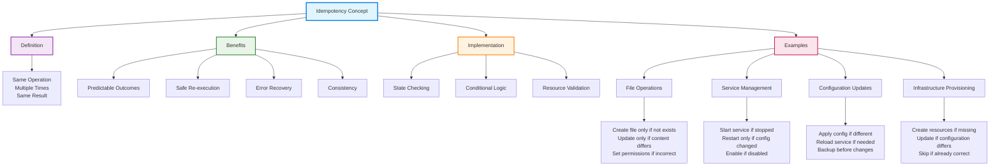

# Idempotency in DevOps Automation

```mermaid
graph TD
    A[Idempotency Concept] --> B[Definition]
    A --> C[Benefits]
    A --> D[Implementation]
    A --> E[Examples]
    
    B --> F[Same Operation<br/>Multiple Times<br/>Same Result]
    
    C --> G[Predictable Outcomes]
    C --> H[Safe Re-execution]
    C --> I[Error Recovery]
    C --> J[Consistency]
    
    D --> K[State Checking]
    D --> L[Conditional Logic]
    D --> M[Resource Validation]
    
    E --> N[File Operations]
    E --> O[Service Management]
    E --> P[Configuration Updates]
    E --> Q[Infrastructure Provisioning]
    
    N --> R[Create file only if not exists<br/>Update only if content differs<br/>Set permissions if incorrect]
    
    O --> S[Start service if stopped<br/>Restart only if config changed<br/>Enable if disabled]
    
    P --> T[Apply config if different<br/>Reload service if needed<br/>Backup before changes]
    
    Q --> U[Create resources if missing<br/>Update if configuration differs<br/>Skip if already correct]
    
    style A fill:#e1f5fe,stroke:#1e88e5,stroke-width:3px
    style B fill:#f3e5f5,stroke:#8e24aa,stroke-width:2px
    style C fill:#e8f5e8,stroke:#2e7d32,stroke-width:2px
    style D fill:#fff3e0,stroke:#f57c00,stroke-width:2px
    style E fill:#fce4ec,stroke:#c2185b,stroke-width:2px
```

This diagram illustrates the concept of idempotency and its critical importance in DevOps automation for reliable and predictable operations.