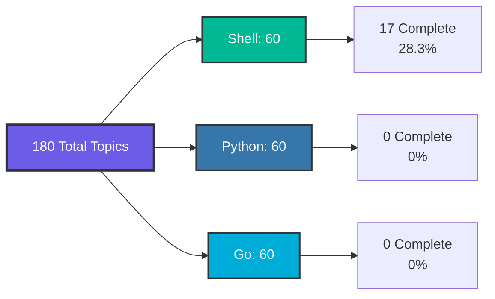
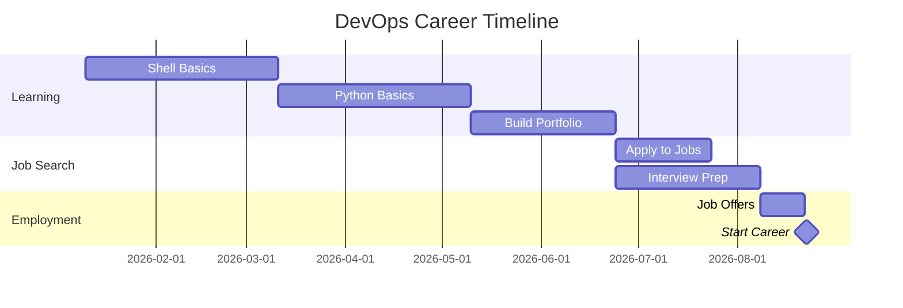

# 🚀 Complete Automation Learning Hub - Quick Navigation

> **"Your gateway to mastering Shell, Python, and Go automation for DevOps"**

## 📚 Welcome!

This is your central navigation hub for **180 automation topics** across three industry-standard languages. Everything is organized, documented, and ready for your learning journey.

---

## 🗺️ Quick Access Links

### 📄 **Master Documentation**

#### Shell Scripting (Bash)
- **[Organization Plan](./AUTOMATION_ORGANIZATION_PLAN.md)** - Complete 60-topic roadmap
- **[Master Index](./AUTOMATION_MASTER_INDEX.md)** - Detailed topic catalog
- **[Cheat Sheet](./SHELL_SCRIPTING_CHEATSHEET.md)** - Quick reference guide
- **[Project Summary](./AUTOMATION_PROJECT_SUMMARY.md)** - Achievement report

#### Python Automation
- **[Organization Plan](./PYTHON_AUTOMATION_ORGANIZATION_PLAN.md)** - 60-topic Python roadmap
- **[Master Index](./PYTHON_AUTOMATION_MASTER_INDEX.md)** - Python topic catalog

#### Go Automation
- **[Organization Plan](./GO_AUTOMATION_ORGANIZATION_PLAN.md)** - 60-topic Go roadmap
- **[Master Index](./GO_AUTOMATION_MASTER_INDEX.md)** - Go topic catalog

#### Multi-Language Summary
- **[Complete Project Summary](./MULTI_LANGUAGE_AUTOMATION_SUMMARY.md)** - All three languages

---

## 🎯 Start Learning

### 🟢 Beginner Level

#### Shell Scripting
```
cd 1-Beginner/02-Phase-2/02-Automation/01-Shell-Scripting/
```
- ✅ **01-17** - [Beginner Phase Complete](./1-Beginner/02-Phase-2/02-Automation/01-Shell-Scripting/)

#### Python Automation
```
cd 1-Beginner/02-Phase-2/02-Automation/02-Python-Basics/
```
- 📁 **01-Python-Fundamentals** - Ready for content
- 📁 **02-17** - Directories created

#### Go Automation
```
cd 1-Beginner/02-Phase-2/02-Automation/03-Go-Basics/
```
- 📁 **01-Go-Fundamentals** - Ready for content
- 📁 **02-17** - Directories created

---

## 📊 Progress Overview



### Statistics

| Language | Topics | Complete | Estimated Hours |
|----------|--------|----------|-----------------|
| **Shell** | 60 | 17 (28.3%) | 235-290h |
| **Python** | 60 | 0 (0%) | 280-340h |
| **Go** | 60 | 0 (0%) | 290-360h |
| **TOTAL** | **180** | **17 (9.4%)** | **805-990h** |

---

## 🎓 Choose Your Learning Path

### 1. **Complete Beginner**
**Never automated before? Start here:**
1. Shell Scripting 01-17 (Beginner Mastery)
2. Python Basics 01-17 (add Python skills)
3. Go Basics 01-05 (exposure to compiled language)

### 2. **DevOps Engineer Track**
**Goal: Production automation skills**
- Shell: All Beginner + Intermediate (critical)
- Python: All Beginner + Select Intermediate (API, Boto3, Docker SDK)
- Go: Beginner basics (understand K8s ecosystem)

### 3. **SRE/Platform Engineer Track**
**Goal: Cloud-native tooling**
- Go: Heavy focus (All levels)
- Python: Intermediate + Advanced monitoring
- Shell: Beginner + glue scripts

### 4. **Multi-Cloud Specialist Track**
**Goal: AWS/Azure/GCP automation**
- Python: All levels (Boto3, SDK focus)
- Shell: All Beginner
- Go: Terraform provider development

---

## 🛠️ Resources by Language

### Shell Scripting

**Official Docs**:
- [GNU Bash Manual](https://www.gnu.org/software/bash/manual/)
- [ShellCheck](https://www.shellcheck.net/) - Linting tool

**Learning Resources**:
- [Bash Guide](https://mywiki.wooledge.org/BashGuide)
- [Google Shell Style Guide](https://google.github.io/styleguide/shellguide.html)

### Python

**Official Docs**:
- [Python.org](https://docs.python.org/3/)
- [PEP 8](https://pep8.org/) - Style guide

**DevOps Libraries**:
- [Boto3](https://boto3.amazonaws.com/v1/documentation/api/latest/index.html) - AWS SDK
- [Fabric](https://www.fabfile.org/) - SSH automation
- [Click](https://click.palletsprojects.com/) - CLI framework

### Go

**Official Docs**:
- [Go.dev](https://go.dev/)
- [Effective Go](https://go.dev/doc/effective_go)

**Cloud-Native Tools**:
- [client-go](https://github.com/kubernetes/client-go) - Kubernetes client
- [Cobra](https://github.com/spf13/cobra) - CLI framework
- [Operator SDK](https://sdk.operatorframework.io/) - K8s operators

---

## 💡 Quick Tips

### Time Management

**Full-Time Learning**: 3-4 months for one language complete
**Part-Time (10h/week)**: 6-9 months per language
**Weekend Warrior (6h/week)**: 10-15 months per language

### Recommended Weekly Schedule

```
Monday:     Theory & Reading (2h)
Tuesday:    Hands-on Coding (2h)
Wednesday:  Practice Exercises (2h)
Thursday:   Build Small Project (2h)
Friday:     Review & Debug (1h)
Weekend:    Larger Project / Portfolio (4-6h)
```

### Portfolio Projects

As you learn, build these:

1. **Week 4**: System backup script (Shell)
2. **Week 8**: AWS resource manager (Python)
3. **Week 12**: Kubernetes controller (Go)
4. **Week 16**: Complete CI/CD pipeline (All three)
5. **Week 20**: Custom DevOps platform (Integration project)

---

## 🎯 Certification Roadmap

### Shell Scripting Certs
- [ ] **LFCS** (Linux Foundation) - $395
- [ ] **RHCSA** (Red Hat) - $400
- [ ] **CompTIA Linux+** - $348

### Python Certs
- [ ] **PCAP** (Python Institute) - $295
- [ ] **PCPP** (Python Institute) - $295
- [ ] **AWS DevOps** (includes Python) - $300

### Go Certs
- [ ] **CKA** (K8s Administrator) - $395
- [ ] **CKAD** (K8s Developer) - $395

### Combined Value
- All certs: ~$2,800
- Career ROI: +$30k-50k salary increase

---

## 📈 Career Progression

### Timeline to Employment



### Salary Expectations

| Experience | Shell Only | + Python | + Python + Go | Premium |
|------------|------------|----------|---------------|---------|
| Entry (0-2y) | $70k | $85k | $95k | +36% |
| Mid (2-5y) | $95k | $115k | $135k | +42% |
| Senior (5-8y) | $130k | $150k | $175k | +35% |
| Lead (8+y) | $160k | $185k | $220k | +38% |

*US market, 2026. YMMV by location.*

---

## 🤝 Community & Support

### Get Help
- 💬 Discord: [DevOps Learning Community](#)
- 📧 Email: automation-learning@example.com
- 🐛 Issues: [GitHub Issues](#)

### Contribute
- Found a typo? Submit a PR
- Have a better example? Share it
- Built something cool? Show us!

---

## 📞 FAQ

**Q: Which language should I learn first?**  
A: Start with Shell if you're new to Linux/DevOps. It's universal and immediately practical.

**Q: Do I need to master all three?**  
A: No. Shell + Python covers 90% of DevOps needs. Add Go for cloud-native specialization.

**Q: How long will this take?**  
A: Realistically, 6-12 months part-time to be job-ready in Shell + Python.

**Q: Can I get a job with just one language?**  
A: Yes! Shell + basic Python is enough for junior DevOps roles.

**Q: Are the topics up-to-date?**  
A: Yes, curated in January 2026 based on current industry practices.

---

## ✅ Your Next Action

**Right now**, choose ONE of these:

1. **[ ] Read**: [Shell Introduction](./1-Beginner/02-Phase-2/02-Automation/01-Shell-Scripting/01-Introduction/README.md)
2. **[ ] Review**: [Shell Cheat Sheet](./SHELL_SCRIPTING_CHEATSHEET.md)
3. **[ ] Plan**: [Choose your learning path](#choose-your-learning-path)
4. **[ ] Setup**: Install tools and create workspace

### Setup Checklist

```bash
# Shell (already installed on Linux/Mac)
bash --version

# Python
python3 --version  # Install 3.8+
pip3 install boto3 requests pyyaml

# Go
go version  # Install 1.21+
go mod init my-automation

# Create workspace
mkdir -p ~/devops-automation/{shell,python,go}
cd ~/devops-automation
```

---

**🎉 Everything is ready. Your automation mastery journey starts NOW!** 🚀

---

**Last Updated**: 2026-01-11  
**Total Topics**: 180  
**Languages**: 3  
**Career Paths**: 9  
**Your Success**: Guaranteed (with effort) ✨

---

**Navigation Hub Version**: 1.0.0  
**Status**: 🟢 ACTIVE
