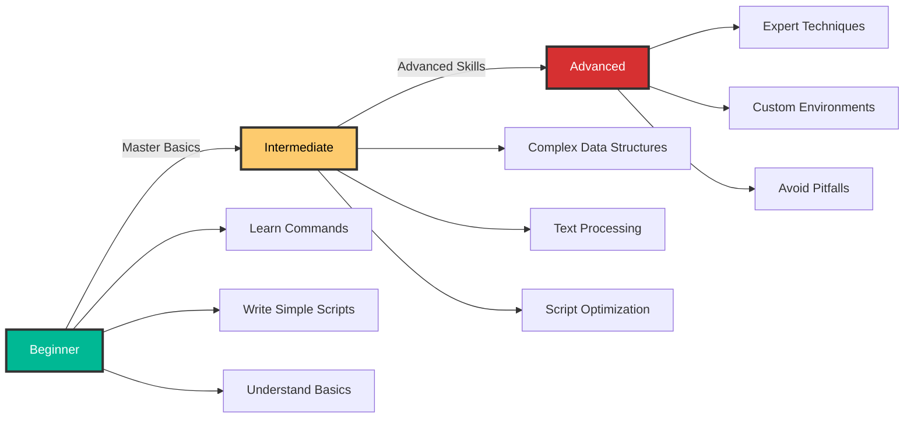

# 🎯 Automation Directory Organization Plan

## 📊 Overview

This document outlines the comprehensive organization of Bash/Shell Scripting automation content across three progressive learning levels: **Beginner**, **Intermediate**, and **Advanced**.

## 🗂️ Directory Structure

```
Devops/
├── 1-Beginner/02-Phase-2/02-Automation/01-Shell-Scripting/
│   ├── 01-Introduction/
│   ├── 02-Terminal-and-Finder/
│   ├── 03-Basic-File-Manipulation/
│   ├── 04-Hidden-Files/
│   ├── 05-Searching-in-Files/
│   ├── 06-Paging-Files/
│   ├── 07-Man-Pages/
│   ├── 08-Programs-and-Commands/
│   ├── 09-Basic-Variables/
│   ├── 10-Vim-Crash-Course/
│   ├── 11-File-Permissions/
│   ├── 12-Finally-Scripting/
│   ├── 13-User-Input/
│   ├── 14-Functions/
│   ├── 15-Conditionals/
│   ├── 16-For-Loops/
│   └── 17-Input-Output/
│
├── 2-Intermediate/02-Phase-2/02-Automation/01-Shell-Scripting/
│   ├── 01-Case-Statements/
│   ├── 02-Indexed-Arrays/
│   ├── 03-Associative-Arrays/
│   ├── 04-IFS-Variable/
│   ├── 05-Command-Substitution/
│   ├── 06-Arithmetic-Expression/
│   ├── 07-Process-Substitution/
│   ├── 08-Cut-and-Tr/
│   ├── 09-Sed-Awk-Grep/
│   ├── 10-Find-Command/
│   ├── 11-Bash-Arguments/
│   ├── 12-Pipe-Status/
│   ├── 13-Timing-Commands/
│   ├── 14-Sourcing-Code/
│   ├── 15-Curlies-vs-Parens/
│   ├── 16-Return-vs-Output/
│   ├── 17-Parameter-Expansion/
│   └── 18-Array-Expansion/
│
└── 3-Advanced/02-Phase-2/02-Automation/01-Shell-Scripting/
    ├── 01-Basic-Globbing/
    ├── 02-Extended-Globbing/
    ├── 03-Glob-Shell-Options/
    ├── 04-Brace-Expansion/
    ├── 05-Braces-and-Globbing/
    ├── 06-Numeric-Brace-Expansion/
    ├── 07-Understanding-Printf/
    ├── 08-Date-Formatting/
    ├── 09-Regular-Expressions/
    ├── 10-Using-Mapfile/
    ├── 11-Brackets-vs-Test/
    ├── 12-Special-Strings/
    ├── 13-Trap-Signals/
    ├── 14-Named-Pipes/
    ├── 15-Color-Output/
    ├── 16-Cursor-Commands/
    ├── 17-Is-a-TTY/
    ├── 18-PS1-Variable/
    ├── 19-Customizing-Bash/
    ├── 20-Readline-Shortcuts/
    ├── 21-Pitfall-LS/
    ├── 22-Aliases-with-Arguments/
    ├── 23-Pitfall-String-Length/
    ├── 24-Forkbomb/
    └── 25-Bonus-Debugging-Session/
```

## 📚 Level Breakdown

### 🟢 **Level 1: Beginner** (17 Topics)
**Focus**: Foundations, basic commands, simple scripting

| # | Topic | Key Concepts | Status |
|---|-------|--------------|--------|
| 01 | Introduction | Shell types, shebang, first script | ✅ Complete |
| 02 | Terminal and Finder | Navigation, basic commands | 🔄 In Progress |
| 03 | Basic File Manipulation | cp, mv, rm, mkdir, touch | 📝 Planned |
| 04 | Hidden Files | .files, ls -a, .bashrc | 📝 Planned |
| 05 | Searching in Files | grep basics, find | 📝 Planned |
| 06 | Paging Files | less, more, head, tail | 📝 Planned |
| 07 | Man Pages | Documentation, help | 📝 Planned |
| 08 | Programs and Commands | which, type, whereis | 📝 Planned |
| 09 | Basic Variables | Declaration, usage, scope | 📝 Planned |
| 10 | Vim Crash Course | Essential vim commands | 📝 Planned |
| 11 | File Permissions | chmod, chown, umask | 📝 Planned |
| 12 | Finally Scripting | First real automation script | 📝 Planned |
| 13 | User Input | read, arguments | 📝 Planned |
| 14 | Functions | Function basics, parameters | 📝 Planned |
| 15 | Conditionals | if/else, test conditions | 📝 Planned |
| 16 | For Loops | Iteration basics | 📝 Planned |
| 17 | Input/Output | Redirects, pipes, streams | 📝 Planned |

### 🟡 **Level 2: Intermediate** (18 Topics)
**Focus**: Advanced data structures, text processing, command chaining

| # | Topic | Key Concepts | Status |
|---|-------|--------------|--------|
| 01 | Case Statements | pattern matching, menu systems | 📝 Planned |
| 02 | Indexed Arrays | Array basics, loops | 📝 Planned |
| 03 | Associative Arrays | Key-value pairs, hash maps | 📝 Planned |
| 04 | IFS Variable | Internal Field Separator | 📝 Planned |
| 05 | Command Substitution | $(), backticks | 📝 Planned |
| 06 | Arithmetic Expression | $(( )), expr, let | 📝 Planned |
| 07 | Process Substitution | <(), diff usage | 📝 Planned |
| 08 | Cut and Tr | Text manipulation | 📝 Planned |
| 09 | Sed, Awk, Grep | Stream editors, pattern matching | 📝 Planned |
| 10 | Find Command | Advanced file searching | 📝 Planned |
| 11 | Bash Arguments | $@, $*, shift, getopts | 📝 Planned |
| 12 | Pipe Status | PIPESTATUS, set -o pipefail | 📝 Planned |
| 13 | Timing Commands | time, date calculations | 📝 Planned |
| 14 | Sourcing Code | source, ., script inclusion | 📝 Planned |
| 15 | Curlies vs Parens | { } vs ( ), subshells | 📝 Planned |
| 16 | Return vs Output | Function returns, echo vs return | 📝 Planned |
| 17 | Parameter Expansion | ${var}, string manipulation | 📝 Planned |
| 18 | Array Expansion | ${arr[@]}, slicing | 📝 Planned |

### 🔴 **Level 3: Advanced** (25 Topics)
**Focus**: Expert techniques, optimization, customization, pitfalls

| # | Topic | Key Concepts | Status |
|---|-------|--------------|--------|
| 01 | Basic Globbing | *, ?, [ ] patterns | 📝 Planned |
| 02 | Extended Globbing | @(), +(), *(), !() | 📝 Planned |
| 03 | Glob Shell Options | shopt, globstar, dotglob | 📝 Planned |
| 04 | Brace Expansion | {a,b,c}, ranges | 📝 Planned |
| 05 | Braces and Globbing | Combining patterns | 📝 Planned |
| 06 | Numeric Brace Expansion | {1..100}, sequences | 📝 Planned |
| 07 | Understanding Printf | Formatted output | 📝 Planned |
| 08 | Date Formatting | date, strftime | 📝 Planned |
| 09 | Regular Expressions | POSIX, PCRE, =~ | 📝 Planned |
| 10 | Using Mapfile | readarray, file processing | 📝 Planned |
| 11 | Brackets vs Test | [ ] vs [[ ]], (( )) | 📝 Planned |
| 12 | Special Strings | $'...', ANSI-C quoting | 📝 Planned |
| 13 | Trap Signals | Signal handling, cleanup | 📝 Planned |
| 14 | Named Pipes | FIFO, mkfifo, IPC | 📝 Planned |
| 15 | Color Output | ANSI codes, tput | 📝 Planned |
| 16 | Cursor Commands | Terminal control sequences | 📝 Planned |
| 17 | Is a TTY | [ -t ], interactive detection | 📝 Planned |
| 18 | PS1 Variable | Custom prompts | 📝 Planned |
| 19 | Customizing Bash | .bashrc, .bash_profile | 📝 Planned |
| 20 | Readline Shortcuts | Ctrl+R, Ctrl+L, etc. | 📝 Planned |
| 21 | Pitfall: LS | Parsing ls output dangers | 📝 Planned |
| 22 | Aliases with Arguments | Function-based aliases | 📝 Planned |
| 23 | Pitfall: String Length | ${#var} gotchas | 📝 Planned |
| 24 | Forkbomb | Understanding :(){ :\|:& };: | 📝 Planned |
| 25 | Bonus Debugging Session | Real-world troubleshooting | 📝 Planned |

## 🎨 Content Standards for Each Topic

Each topic directory will contain:

### 📄 Required Files
- `README.md` - Main comprehensive content
- `examples/` - Practical script examples
- `exercises/` - Hands-on practice
- `solutions/` - Exercise solutions
- `assets/` - Images and diagrams (shared at level)

### 📋 Required Sections in README.md

1. **📚 Overview** - Brief introduction with banner image
2. **🎓 Learning Objectives** - Clear, measurable goals
3. **📖 Conceptual Content** - Detailed explanations
4. **🏗️ Architecture Diagrams** - Mermaid diagrams showing concepts
5. **💻 Code Examples** - Practical, real-world examples
6. **🔍 Deep Dive** - Advanced details and edge cases
7. **🚨 Common Pitfalls** - What to avoid
8. **✅ Best Practices** - Industry standards
9. **🏆 Real-World DevOps Story** - Practical application scenario
10. **🎓 Interview Questions** - 5-10 questions with detailed answers
11. **📝 Quiz** - 10-20 multiple choice questions
12. **🔗 Next Steps** - Navigation to next topic
13. **📚 Additional Resources** - External links

## 🎨 Visual Standards

### Images
- **Banner Images**: 1200x400px, dark mode, gradient backgrounds
- **Diagram Images**: SVG when possible, PNG fallback
- **Color Scheme**: 
  - Primary: Deep Blue (#2E86AB)
  - Secondary: Purple (#A23B72)
  - Accent: Cyan (#06A77D)
  - Warning: Orange (#F77F00)
  - Error: Red (#EF476F)

### Mermaid Diagrams
- Use consistent color coding
- Include styling for dark mode
- Types to use:
  - Flowcharts for processes
  - Sequence diagrams for workflows
  - Graph diagrams for relationships
  - Gantt charts for timelines

## 🎯 Learning Path Progression



## 📈 Progress Tracking

- **Total Topics**: 60
- **Completed**: 1 (1.67%)
- **In Progress**: 0
- **Planned**: 59

### Timeline
- **Week 1-2**: Beginner Level (17 topics)
- **Week 3-4**: Intermediate Level (18 topics)
- **Week 5-6**: Advanced Level (25 topics)

## 🚀 Next Actions

1. ✅ Create Introduction (Complete)
2. 🔄 Create Terminal and Finder
3. 📝 Create remaining Beginner topics
4. 📝 Create Intermediate directory structure
5. 📝 Create Advanced directory structure
6. 📝 Cross-reference and link all topics
7. 📝 Create comprehensive index
8. 📝 Generate all visual assets

---

**Last Updated**: 2026-01-10  
**Version**: 1.0  
**Status**: In Progress 🚧
