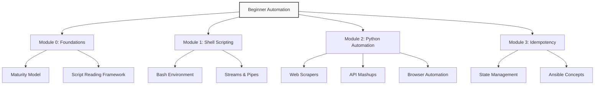

# Automation Basics
*Fundamental Automation for Modern DevOps*

Automating repetitive tasks is the core of DevOps. This module introduces the frameworks, languages, and mindsets required to eliminate manual labor from your workflow.

---

## 🏛️ Automation Learning Path

---

## 📂 Sub-Modules

### 1. **[00-Foundations](./00-Foundations/)**
The "Why" and "How" of automation. Maturity levels and systematic script reading.

### 2. **[01-Shell-Scripting](./01-Shell-Scripting/)**
The native language of Linux. Mastering data streams, logic, and modular functions.

### 3. **[02-Python-Basics](./02-Python-Basics/)**
The "Glue" of DevOps. Web scraping, Selenium browser control, and micro-services.

### 4. **[03-Idempotency](./03-Idempotency/)**
Learn the critical concept of making automation repeatable and safe for production.

---

## 🏗️ Labs & Practice
- **[Automation Labs](./Labs/)**: Hands-on exercises for Shell and Python.

---
**Ready to start?** Begin with **[Automation Foundations](./00-Foundations/README.md)**.
