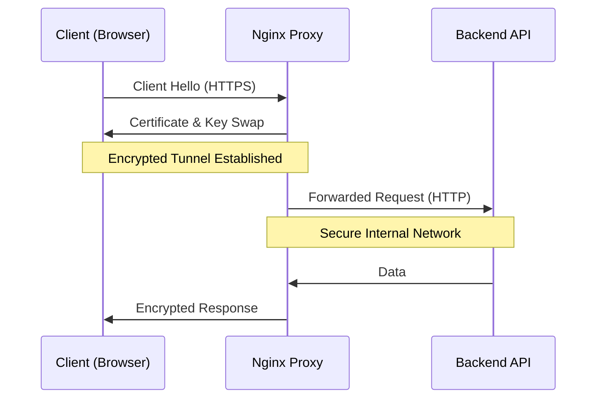

# 🔐 Module 04: Security & SSL Hardening

> **"Unencrypted traffic is a public broadcast. Nginx is the cryptographic safe that ensures your users' data stays private."**



## 📚 Overview
SSL/TLS Termination is the process where an SSL connection is decrypted by the Nginx server before being passed to the backend. This offloads the heavy mathematical work of encryption from your app servers to Nginx, which is highly optimized for it.

In this module, we move beyond just "Enabling HTTPS" to **Hardening** our configuration against modern attacks.

## 🎓 Learning Objectives
- ✅ Understand **SSL Termination** vs. **Passthrough**.
- ✅ Configure Server Blocks for **HTTPS (Port 443)**.
- ✅ Automate certificate renewal with **Certbot (Let's Encrypt)**.
- ✅ Implement **Security Headers** (HSTS, XSS-Protection).
- ✅ Enforce **HTTP to HTTPS Redirects**.

---

## 🏗️ Basic SSL Configuration

```nginx
server {
    listen 443 ssl http2;
    server_name secure-app.com;

    ssl_certificate /etc/letsencrypt/live/app/fullchain.pem;
    ssl_certificate_key /etc/letsencrypt/live/app/privkey.pem;

    # Hardening: Only use safe protocols
    ssl_protocols TLSv1.2 TLSv1.3;
    ssl_prefer_server_ciphers on;

    location / {
        proxy_pass http://localhost:8080;
    }
}

# The "Always Redirect" Server
server {
    listen 80;
    server_name secure-app.com;
    return 301 https://$host$request_uri;
}
```

---

## 🚀 Security Best Practices

### 1. HSTS (HTTP Strict Transport Security)
Tells the browser: "Never, ever try to connect via HTTP for the next year."
```nginx
add_header Strict-Transport-Security "max-age=31536000; includeSubDomains" always;
```

### 2. Disable Old Protocols
TLS 1.0 and 1.1 are broken. Professional Nginx configs only allow **TLS 1.2 and 1.3**.

### 3. File Upload Limits
Prevent "Denial of Service" via huge file uploads.
```nginx
client_max_body_size 10M; # Default is 1M, set what you need.
```

---

## 🏆 Real-World DevOps Story: The 3:00 AM Certification Fire

**The Scenario**: On a Sunday night, a major banking site's entire front page showed a "Your connection is not private" warning. 
**The Discovery**: Their manual SSL certificate had expired. Every single API call failed because the clients refused to talk to an "unsafe" server.
**The Fix**: The team transitioned to **Certbot** and configured a cron job to automatically renew the certificates 30 days before they expire.
**The Lesson**: Manual certificates are a ticking time bomb. **Automation (Certbot)** is the only professional way to manage SSL at scale.

---

## ❓ Interview Preparation

1. **Q: What is SSL Termination?**
   *A: It's when Nginx handles the SSL handshake and decryption. It then forwards the decrypted HTTP traffic to the backend. This centralizes certificate management and saves backend CPU.*

2. **Q: Why should you redirect HTTP to HTTPS with a 301 code?**
   *A: A 301 is a "Permanent" redirect. It tells browsers and search engines to update their bookmarks/index to the secure URL immediately.*

3. **Q: What is 'HTTP/2' and why do we enable it in the listen directive?**
   *A: HTTP/2 is a faster version of the protocol that allows multiple files (CSS, JS) to be sent over a single connection simultaneously (Multiplexing). It requires SSL.*

4. **Q: How can you check if your Nginx SSL setup is actually 'A+ Grade'?**
   *A: Use tools like **SSLLabs** or `openssl s_client`. They verify that you are not using weak ciphers or old protocols.*

5. **Q: What is the 'Server Tokens' directive used for?**
   *A: `server_tokens off;` hides the exact Nginx version in error pages and headers. This is a "Defense in Depth" tactic to make it harder for hackers to find version-specific vulnerabilities.*

---

## 🔗 Next Steps

The gates are locked. Now let's make it go faster.

Proceed to: **[05-Performance-Optimization](../05-Performance-Optimization/README.md)** →
