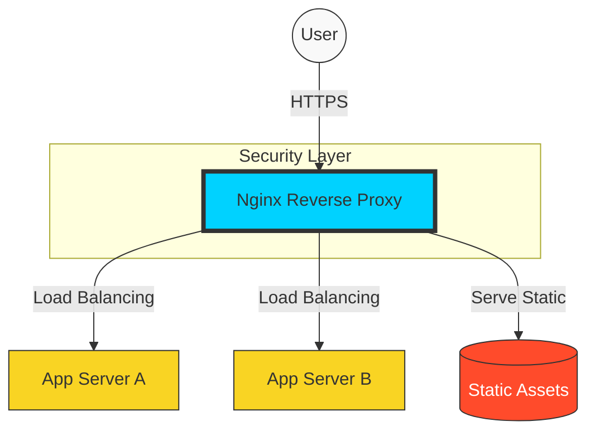

# 🌐 Nginx Mastery: The Edge of Infrastructure

> **"If the internet is a highway, Nginx is the world-class traffic controller. It directs, protects, and accelerates the flow of data to your applications."**

## 📚 Overview
Nginx (pronounced "Engine-X") is a high-performance HTTP server, reverse proxy, and mail proxy. In modern DevOps, it has become the ubiquitous "Edge" service. Whether you are hosting a simple website or a global microservices architecture, Nginx is the layer that handles your SSL certificates, balances traffic across your containers, and protects your backend from direct internet exposure.

## 🎓 Learning Objectives

By the end of this curriculum, you will:
- ✅ Master the **Event-Driven Architecture** that allows Nginx to handle 10,000+ concurrent connections.
- ✅ Implement a **Reverse Proxy** to shield backend applications (Node.js, Python, Java).
- ✅ Configure **Load Balancing** strategies (Round Robin, Least Conn, Ip Hash).
- ✅ Secure applications with **SSL/TLS Termination** and Hardening.
- ✅ Optimize performance through **Caching and Gzip Compression**.
- ✅ Debug complex configuration issues using **Access and Error Logs**.

---

## 🏗️ Curriculum Structure

| # | Module | Topic | Description |
| :--- | :--- | :--- | :--- |
| 01 | **[Architecture & Install](./01-Architecture-and-Installation/)** | The Engine Under the Hood | Worker processes, Event loops, and Basic setup. |
| 02 | **[Reverse Proxy Basics](./02-Reverse-Proxy-Basics/)** | The Protective Shield | Forwarding requests and masking backend identities. |
| 03 | **[Load Balancing](./03-Load-Balancing-Strategies/)** | Scaling the Flow | Distributing traffic across multiple server instances. |
| 04 | **[Security & SSL](./04-Security-and-SSL/)** | Locking the Gates | Let's Encrypt, TLS versions, and Security Headers. |
| 05 | **[Performance Tuning](./05-Performance-Optimization/)** | Racing at the Edge | Caching, Compression, and FastCGI. |

---

## 🚀 Why Nginx for DevOps?

### 1. High Concurrency
Unlike traditional servers (like Apache) that create a new thread for every user, Nginx is **Asynchronous**. One worker process can handle thousands of users simultaneously, making it incredibly light on RAM.

### 2. The Cloud Gatekeeper

In Kubernetes and AWS, Nginx acts as the **Ingress Controller**. It is the single entry point for all traffic, allowing you to manage routing rules in one centralized place.

### 3. Static Content King
Nginx is up to 500% faster than dynamic application servers at serving images, CSS, and JS files. Offloading static assets to Nginx saves your backend CPU for logic.

---

## 🏆 Real-World DevOps Story: The 504 Gateway Timeout Crisis

**The Scenario**: An e-commerce site crashed during a Black Friday sale. The Nginx server was returning **504 Gateway Timeout** errors.
**The Discovery**: The backend database was slow, causing the Python application to take 40 seconds to process requests. Nginx, by default, waits 60 seconds, but because of the massive volume, it ran out of "worker connections."
**The Fix**: The SRE team increased the `worker_connections` in the Nginx config and implemented **Caching** for product pages. Now, 90% of users get served a cached page directly from Nginx memory, never even hitting the slow database.
**The Lesson**: Nginx is your first line of defense. Proper caching can save a failing backend.

---

## ❓ Interview Preparation (Nginx)

1. **Q: What is a Reverse Proxy?**
   *A: A reverse proxy sits in front of backend servers and forwards client requests to them. It provides a single point of entry, handles SSL, and masks the internal IP addresses of your app servers for security.*

2. **Q: How does Nginx handle more traffic than Apache with less RAM?**
   *A: Nginx uses an **Event-Driven, Asynchronous** architecture. Instead of creating a new process/thread per request (which consumes RAM), it uses a small number of worker processes that handle thousands of connections across a single "event loop."*

3. **Q: What is the difference between `proxy_pass` and a redirect?**
   *A: `proxy_pass` is internal; the user's URL doesn't change, and Nginx fetches the data from the backend. A redirect (301/302) sends a command to the user's browser to go to a NEW URL.*

4. **Q: What are Nginx 'Worker Processes'?**
   *A: These are the processes that do the actual work of handling requests. Usually, you set the number of worker processes to match the number of CPU cores available on the server.*

5. **Q: How do you reload Nginx configuration without dropping active connections?**
   *A: Use `nginx -s reload`. This starts new worker processes with the new config and gracefully shuts down the old ones only after they finish their current requests.*

---

## 📝 Preliminary Knowledge Check

1. **Which Nginx directive is used to forward traffic to a backend server?**
   - [ ] a) `server_name`
   - [x] b) `proxy_pass`
   - [ ] c) `listen`

2. **What is the default Nginx configuration file called?**
   - [ ] a) `config.nginx`
   - [x] b) `nginx.conf`
   - [ ] c) `default.site`

3. **Which Load Balancing method sends traffic to the server with the fewest active connections?**
   - [ ] a) Round Robin
   - [x] b) Least Conn
   - [ ] c) IP Hash

4. **True or False: Nginx can be used as both a Web Server and a Load Balancer at the same time.**
   - [x] a) True
   - [ ] b) False

5. **What does the command `nginx -t` do?**
   - [ ] a) Starts the server
   - [x] b) Tests the configuration for syntax errors
   - [ ] c) Shows the version number

---

## 🔗 Next Steps

Ready to build your first high-performance bridge?

Proceed to: **[01-Architecture & Install](./01-Architecture-and-Installation/README.md)** →
