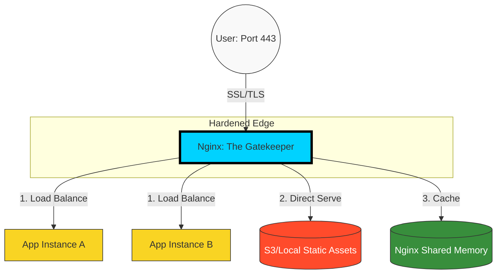

# 🌐 Nginx Mastery: The Edge of Infrastructure

> **"If the internet is a digital highway, Nginx is the world-class traffic controller. It doesn't just route packets; it ensures they are safe, fast, and balanced."**

## 🏗️ High-Level Architecture

Nginx sits at the "Edge," shielding your application servers from the chaos of the public internet.

---

## 📖 Overview

Nginx (pronounced "Engine-X") is the backbone of modern web infrastructure. It functions as a high-performance HTTP server, a sophisticated **Reverse Proxy**, and a robust **Load Balancer**.

For a DevOps engineer, Nginx is the primary tool for:

- **Resilience**: Preventing server overloads via load balancing.
- **Security**: Terminating SSL/TLS and masking backend IP addresses.
- **Performance**: Accelerating content delivery via Gzip and Caching.
- **Observability**: Logging every request that enters the system.

---

## 🎯 Learning Objectives

By the end of this curriculum, you will:

- ✅ **Architect** systems using Nginx's asynchronous, event-driven model.
- ✅ **Deploy** secure reverse proxies that shield sensitive backend logic.
- ✅ **Scale** applications horizontally using advanced load-balancing algorithms.
- ✅ **Harden** infrastructure with Let's Encrypt and advanced security headers.
- ✅ **Optimize** delivery speeds through caching, compression, and fine-tuning.

---

## 🗺️ Curriculum Structure

| Part | Topic | Description |
| :--- | :--- | :--- |
| **[🟢 Part 1](./Part-01-Architecture-and-Foundations/)** | **Foundations** | The Engine Under the Hood. Architecture, Installation, and Reverse Proxying. |
| **[🟡 Part 2](./Part-02-Traffic-Management-and-Performance/)** | **Traffic & Speed** | Moving at Scale. Load balancing strategies and extreme performance tuning. |
| **[🔴 Part 3](./Part-03-Security-and-Hardening/)** | **Security** | Locking the Gates. SSL/TLS termination, WAF basics, and hardening. |

---

## 🏆 Real-World DevOps Story: The Black Friday Save

**The Scenario**: An e-commerce mobile app was crashing every 15 minutes during a massive flash sale. The application logs showed "Connection Pool Exhausted."

**The Discovery**: The backend Python API was struggling with "Slowloris" type behavior—thousands of users were holding open connections just to download a small `logo.png` and `style.css`.

**The Fix**: The SRE team configured Nginx to **Directly Serve** static assets and implemented **Gzip Compression**. By offloading the static file delivery to Nginx's asynchronous worker processes, the backend CPU usage dropped by 60%, allowing it to focus entirely on the checkout logic.

**The Lesson**: Never let your application server do the "heavy lifting" of serving static files. Let Nginx handle the traffic while your app handles the logic.

---

## 🎓 Career Readiness

**Interview Question:** "Explain the difference between a Forward Proxy and a Reverse Proxy."

**Strong Answer:** "A **Forward Proxy** (like a VPN) sits in front of clients and requests data from the internet on their behalf, often used to bypass restrictions or provide anonymity. A **Reverse Proxy** sits in front of servers and handles incoming requests from the internet, distributing them to a private backend. In DevOps, we use Reverse Proxies (like Nginx) to provide a single point of entry, handle SSL, and balance load across a cluster of servers."

---

**Next Step**: Start with **[Part 1: Architecture & Foundations](./Part-01-Architecture-and-Foundations/01-Architecture-and-Installation/)** 🚀
