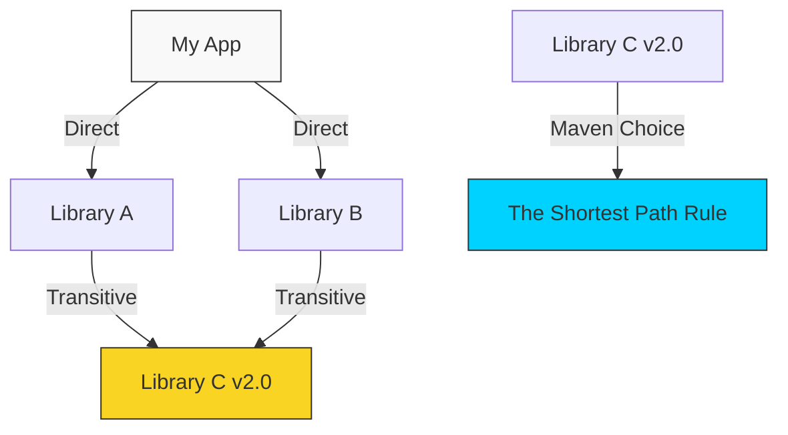

# 📦 Module 04: Dependency Management

> **"A project is only as stable as the ground it stands on. In Maven, dependencies are the foundation, and managing them is the art of balancing agility with stability."**



## 📚 Overview
One of Maven's greatest strengths—and most complex challenges—is its ability to manage **Transitive Dependencies**. You define the libraries you need, and Maven automatically fetches everything they need to run. 

In this module, we will learn how to control this "tree" of libraries using **Scopes**, **Exclusions**, and advanced **Dependency Resolution** techniques.

## 🎓 Learning Objectives
- ✅ Understand **Direct vs. Transitive** dependencies.
- ✅ Master the 5 **Dependency Scopes** (Compile, Test, Provided, Runtime, System).
- ✅ Resolve conflicts using the **Shortest Path Rule**.
- ✅ Use **Exclusions** to remove unwanted transitive libraries.
- ✅ Leverage **BOMs (Bill of Materials)** to manage large enterprise project versions.

---

## 🏗️ Dependency Scopes: The Right Tool for the Job

Not every library should go into your final production JAR. Scopes tell Maven when to include a library.

| Scope | Included in... | Example Case |
| :--- | :--- | :--- |
| `compile` | **Everywhere** | (Default) Commons-Lang, Guava. |
| `test` | **Only Tests** | JUnit, Mockito, Selenium. |
| `provided` | **Compilation** | Servlet API (The Web Server provides this). |
| `runtime` | **Execution** | Database Drivers (JDBC). |
| `system` | **Local Path** | (Avoid) Proprietary JARs provided on disk. |

---

## 🛠️ The Maven Command Center

To see the "Truth" about your dependencies, you must use the CLI:

```bash
# See the full tree of dependencies
mvn dependency:tree

# Find unused dependencies (Cleanup!)
mvn dependency:analyze

# View the final combined POM
mvn help:effective-pom
```

---

## 🚀 Professional Pattern: The Bill of Materials (BOM)

In a microservices architecture, you want every service to use the same version of Spring or Hibernate. Instead of copy-pasting versions, you use a **BOM**.

```xml
<dependencyManagement>
  <dependencies>
    <dependency>
      <groupId>org.springframework.boot</groupId>
      <artifactId>spring-boot-dependencies</artifactId>
      <version>3.1.0</version>
      <type>pom</type>
      <scope>import</scope>
    </dependency>
  </dependencies>
</dependencyManagement>
```

**The Power**: Now, you can add any Spring library without specifying a version, and Maven will look it up in the BOM!

---

## 🏆 Real-World DevOps Story: The Log4j Zero-Day Crisis

**The Scenario**: A major security vulnerability (Log4shell) was discovered in a popular logging library. Every company in the world had to upgrade immediately.
**The Crisis**: Many teams didn't know *where* they were using Log4j because it was hidden deep in their **Transitive Dependencies**.
**The Fix**: DevOps engineers used `mvn dependency:tree -Dincludes=org.apache.logging.log4j` to find every vulnerable instance in seconds. They then used `<dependencyManagement>` in their Parent POMs to force the safe version across hundreds of projects at once.
**The Lesson**: Dependency management isn't just about building code; it's about **Security Compliance**.

---

## ❓ Interview Preparation

1. **Q: How does Maven resolve version conflicts if two libraries require different versions of the same dependency?**
   *A: Maven uses the "Nearest Definition" rule (or Shortest Path). If Dependency A is 1 level away and Dependency B is 2 levels away, Maven chooses the version in Dependency A.*

2. **Q: What is the purpose of the 'provided' scope?**
   *A: It tells Maven that the library is needed to compile the code, but it should NOT be included in the final JAR/WAR because the target environment (like a Tomcat server or a JDK) already provides it.*

3. **Q: When should you use `<exclusions>`?**
   *A: When a library you depend on pulls in a transitive dependency that is buggy, insecure, or clashes with another library in your project.*

4. **Q: What is a Transitive Dependency?**
   *A: A dependency required by your direct dependency. Maven's ability to pull these in automatically is what makes it powerful.*

5. **Q: How can you find why a specific library is being included in your project?**
   *A: Run `mvn dependency:tree`. It will show you the exact chain of parent-child relationships leading to that library.*

---

## 🔗 Next Steps

The libraries are in place. Now let's start the engine.

Proceed to: **[05-Build-Lifecycle](../Build-Lifecycle/README.md)** →