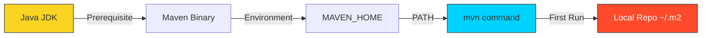

# 🛠️ Module 01: Maven Installation & Setup

> **"A master craftsman is only as good as their tools. Setting up Maven correctly is the first step toward a seamless automation pipeline."**



## 📚 Overview
Maven is a Java-based tool, so the primary prerequisite is a **Java Development Kit (JDK)**. Once Java is configured, "installing" Maven is as simple as extracting a folder and telling your Operating System where to find the `bin` directory.

## 🎓 Learning Objectives
- ✅ Verify and install the **Java Development Kit (JDK)**.
- ✅ Install Maven on **Linux, macOS, and Windows**.
- ✅ Configure the `MAVEN_HOME` and `PATH` global variables.
- ✅ Understand the purpose of the `settings.xml` file.
- ✅ Optimize the **Local Repository** location.

---

## 🚀 Step 1: Java Prerequisite
Maven 3.9+ requires **JDK 8 or higher**. We recommend **JDK 17** for modern compatibility.

```bash
# Check if Java is already installed
java -version

# Ubuntu/Debian Install
sudo apt update && sudo apt install openjdk-17-jdk -y
```

---

## 🏗️ Step 2: Maven Installation

### Option A: Manual Installation (Recommended for Servers)
1. Download the binary from [maven.apache.org](https://maven.apache.org/download.cgi).
2. Extract to `/opt/maven`.
3. Link the binary:
```bash
sudo tar -xzf apache-maven-*.tar.gz -C /opt
sudo ln -s /opt/apache-maven-3.9.x /opt/maven
```

### Option B: Package Managers (Recommended for Laptops)
- **macOS**: `brew install maven`
- **Ubuntu**: `sudo apt install maven`
- **Windows**: `choco install maven`

---

## 📂 Step 3: Global Configuration
To run `mvn` from any terminal, you must update your shell profile (e.g., `~/.bashrc` or `~/.zshrc`):

```bash
export M2_HOME=/opt/maven
export PATH=$M2_HOME/bin:$PATH
```

### The `~/.m2` Directory
The first time you run `mvn -version`, Maven creates a hidden directory in your home folder:
- **`repository/`**: This is your **Local Cache**. Once a library is downloaded here, Maven never downloads it again.
- **`settings.xml`**: Your personal configuration (passwords for servers, mirrors, etc.).

---

## 🏆 Real-World DevOps Story: The 100GB Home Directory

**The Scenario**: A developer at a large company noticed their laptop was running out of space. They discovered their `~/.m2/repository` folder was over **100GB**.
**The Discovery**: Every project they had ever touched, including multiple versions of massive enterprise libraries, was cached locally. Because their company used a "Snapshot" versioning strategy, Maven was downloading new versions multiple times a day.
**The Fix**: The developer added a **Cleanup Cron Job** and moved their local repository to an external high-speed SSD by editing the `<localRepository>` tag in `settings.xml`.
**The Lesson**: In a corporate environment, your local repository is a living thing. Manage it, or it will manage your disk space.

---

## ❓ Interview Preparation

1. **Q: What is the difference between `MAVEN_HOME` and `M2_HOME`?**
   *A: Historically, `M2_HOME` was for Maven 2 and `MAVEN_HOME` for Maven 1. Most modern scripts use `M2_HOME` or just `MAVEN_HOME` interchangeably, but the most important thing is that the `bin` folder is in your `PATH`.*

2. **Q: How do you verify that Maven is correctly using the right JDK?**
   *A: Run `mvn -version`. The output will explicitly list the Maven version, the Java version, and the OS details.*

3. **Q: What is the purpose of `settings.xml`?**
   *A: It is used to configure values that shouldn't be in the project's source code, such as your credentials for a private Nexus repository or proxy settings for your corporate network.*

4. **Q: Where is the default local repository located?**
   *A: In the user's home directory under `~/.m2/repository` (Linux/macOS) or `C:\Users\Name\.m2\repository` (Windows).*

5. **Q: Why does the first Maven build take so much longer than subsequent builds?**
   *A: During the first build, Maven has to download the entire plugin ecosystem and all project dependencies from the Central Repository. In later builds, it pulls them instantly from your local cache.*

---

## 🔗 Next Steps

Installation complete. Now let's see where the files go.

Proceed to: **[02-Project-Structure](../Project-Structure/README.md)** →