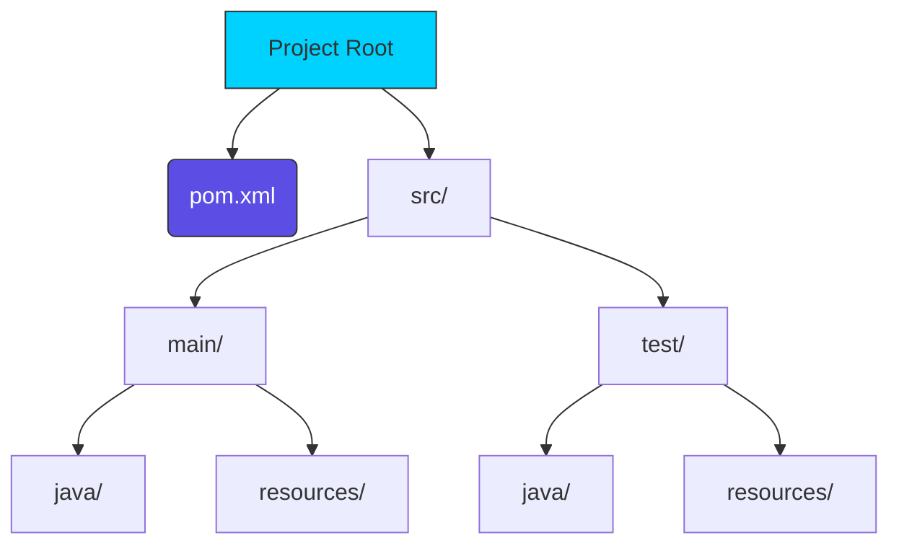

# 🟢 Part 1: Maven Fundamentals

> **"To master Maven, you must first understand the 'Standard.' It doesn't work by magic; it works by convention."**

## 📖 Overview

This part covers the absolute essentials of Apache Maven. We move from the initial installation to understanding the **Standard Directory Layout** and the brain of any Maven project: the **Project Object Model (POM.xml)**.

---

## 🏗️ The Project Blueprint

Maven enforces "Convention over Configuration." If you follow the standard structure, everything "just works."

---

## 🎯 Learning Objectives

By the end of this part, you will:

- ✅ **Install** Maven and configure your environment variables (`JAVA_HOME`, `MAVEN_HOME`).
- ✅ **Navigate** the standard directory hierarchy.
- ✅ **Understand** the GAV coordinates (GroupId, ArtifactId, Version).
- ✅ **Configure** basic project metadata in the `pom.xml`.

---

## 🗺️ Included Modules

1. **[01-Installation](./01-Installation/README.md)**: Setting up the forge. Java verification and Maven setup.
2. **[02-Project-Structure](./02-Project-Structure/README.md)**: The standard layout. Where code, resources, and tests live.
3. **[03-POM-Configuration](./03-POM-Configuration/README.md)**: The XML brain. Coordinating your build.

---

## 🚀 Deep Dive

Looking for a more detailed theoretical background? Check out our **[DEEP_DIVE.md](./DEEP_DIVE.md)**.

---

## 🎓 Career Readiness

**Interview Question:** "What is the 'local repository' and where is it usually located?"

**Strong Answer:** "The local repository is a cache on your local machine where Maven stores all the dependencies it downloads from remote repositories. By default, it is located in the `.m2/repository` folder within the user's home directory. This allows Maven to reuse libraries across multiple projects on the same machine without re-downloading them."

---

**Next Step**: Start with **[01-Installation](./01-Installation/README.md)** 🚀
