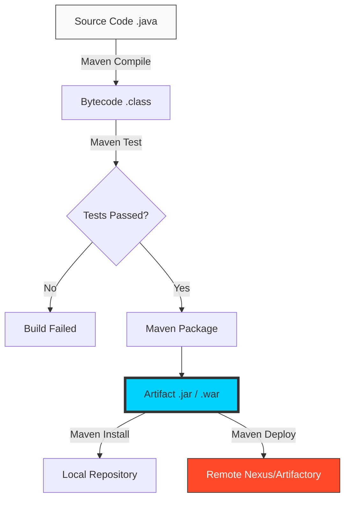

# 🏗️ Apache Maven: The Architect of the Build

> **"If code is the building blocks, Maven is the blueprint and the construction crew. It handles the complexity of gathering dependencies, compiling code, and packaging the final artifact so you can focus on the logic."**

## 📚 Overview

Apache Maven is more than just a build tool; it is a software project management and comprehension tool. Based on the concept of a **Project Object Model (POM)**, Maven can manage a project's build, reporting, and documentation from a central piece of information.

In the DevOps lifecycle, Maven is the heart of the **Continuous Integration (CI)** process. It ensures that every code change is compile-able, testable, and package-able into a consistent, versioned artifact ready for deployment.

## 🎓 Learning Objectives

By the end of this curriculum, you will:
- ✅ Master the **Standard Directory Layout** (Convention over Configuration).
- ✅ Understand the **Project Object Model (POM.xml)** internals.
- ✅ Navigate the **3 Build Lifecycles** (Default, Clean, Site).
- ✅ Resolve **Dependency Conflicts** and avoid "Dependency Hell."
- ✅ Configure **Maven Plugins** to extend build functionality.
- ✅ Integrate Maven with **CI/CD Pipelines** for automated releases.

---

## 🏗️ Curriculum Structure

| # | Module | Topic | Description |
| :--- | :--- | :--- | :--- |
| 01 | **[Installation](./Installation/)** | Setting up the Forge | Installing Java, MAVEN_HOME, and the `mvn` command. |
| 02 | **[Project Structure](./Project-Structure/)** | The Blueprint | Convention over configuration and the folder hierarchy. |
| 03 | **[The POM.xml](./POM-Configuration/)** | The Brain of the Build | GAV coordinates, properties, and plugin management. |
| 04 | **[Dependency Management](./Dependencies/)** | Standing on Shoulders | Scopes, Transitive dependencies, and Exclusions. |
| 05 | **[Build Lifecycles](./Build-Lifecycle/)** | From Source to JAR | Clean, Compile, Test, Package, Install, Deploy. |
| 06 | **[Best Practices](./Best-Practices/)** | Master Level Patterns | Multi-module projects, BOMs, and Versioning. |
| 07 | **[Troubleshooting](./Troubleshooting/)** | Debugging the Build | Reading stack traces and resolving version clashes. |
| 08 | **[CI/CD Integration](./CI-CD-Integration/)** | The Golden Pipeline | Jenkins, GitHub Actions, and Docker optimization. |

---

## 🚀 Why Maven for DevOps?

### 1. Standardization
Before Maven, every Java project had a different build script. Maven introduced the **Standard Directory Layout**. This means a DevOps engineer can walk into any Maven project in the world and immediately know where the source code and tests are located.

### 2. Automated Dependency Resolution
Maven automatically downloads every library your project needs (and the libraries *those* libraries need). It manages versions and prevents you from manually hunting for JAR files on the internet.

### 3. CI/CD Native
Maven is designed to be run by machines. Its consistent output and exit codes make it the perfect partner for Jenkins, GitHub Actions, and GitLab CI.

---

## 🏆 Real-World DevOps Story: The Transit Dependency Nightmare

**The Scenario**: A developer added a simple "Logger" library to the project. Suddenly, the entire application crashed with a `NoSuchMethodError`.
**The Discovery**: The new Logger library required an old version of a "JSON Parser," but the main application required a new version of the same parser. Maven picked the old one because of the "Shortest Path" rule, breaking the main app.
**The Fix**: The SRE team used `mvn dependency:tree` to find the clash and then used a `<dependencyManagement>` block to force the specific version the application needed.
**The Lesson**: In Maven, you aren't just managing the libraries you *know* about; you are managing a massive tree of **Transitive Dependencies**.

---

## ❓ Interview Preparation (Maven)

1. **Q: What is 'Convention over Configuration' in Maven?**
   *A: It means Maven has sensible defaults. For example, it expects source code in `src/main/java` and tests in `src/test/java`. If you follow these conventions, you don't have to write a single line of configuration to build your project.*

2. **Q: What are the 'GAV' Coordinates?**
   *A: It stands for **GroupId** (Organization), **ArtifactId** (Project name), and **Version**. These three uniquely identify any library in the Maven ecosystem.*

3. **Q: Explain the difference between 'Install' and 'Deploy'.**
   *A: `mvn install` puts the final JAR in your **Local Repository** (on your laptop) so other local projects can use it. `mvn deploy` sends it to a **Remote Repository** (like Nexus or Artifactory) so the whole company can use it.*

4. **Q: What is a Transitive Dependency?**
   *A: If Project A depends on Library B, and Library B depends on Library C, then Project A has a transitive dependency on Library C.*

5. **Q: How do you skip tests during a Maven build?**
   *A: Use the flag `-DskipTests` or `-Dmaven.test.skip=true`. (Note: The latter also skips compiling the tests, whereas the first only skips execution).*

---

## 📝 Preliminary Knowledge Check

1. **Which file is the primary configuration file for a Maven project?**
   - [ ] a) `build.gradle`
   - [x] b) `pom.xml`
   - [ ] c) `maven.config`

2. **Which directory contains the final packaged JAR file after a build?**
   - [ ] a) `src/main/resources`
   - [ ] b) `bin/`
   - [x] c) `target/`

3. **What command is used to remove all files generated by the previous build?**
   - [ ] a) `mvn delete`
   - [x] b) `mvn clean`
   - [ ] c) `mvn reset`

4. **True or False: Maven requires you to manually download dependencies from the internet and put them in a lib folder.**
   - [ ] a) True
   - [x] b) False (Maven handles this via the Central Repository)

5. **Which dependency scope should be used for a library required only for running tests?**
   - [ ] a) `compile`
   - [x] b) `test`
   - [ ] c) `provided`

---

## 🔗 Next Steps

Ready to build the artifacts that power the cloud?

Proceed to: **[01-Installation](./Installation/README.md)** →
