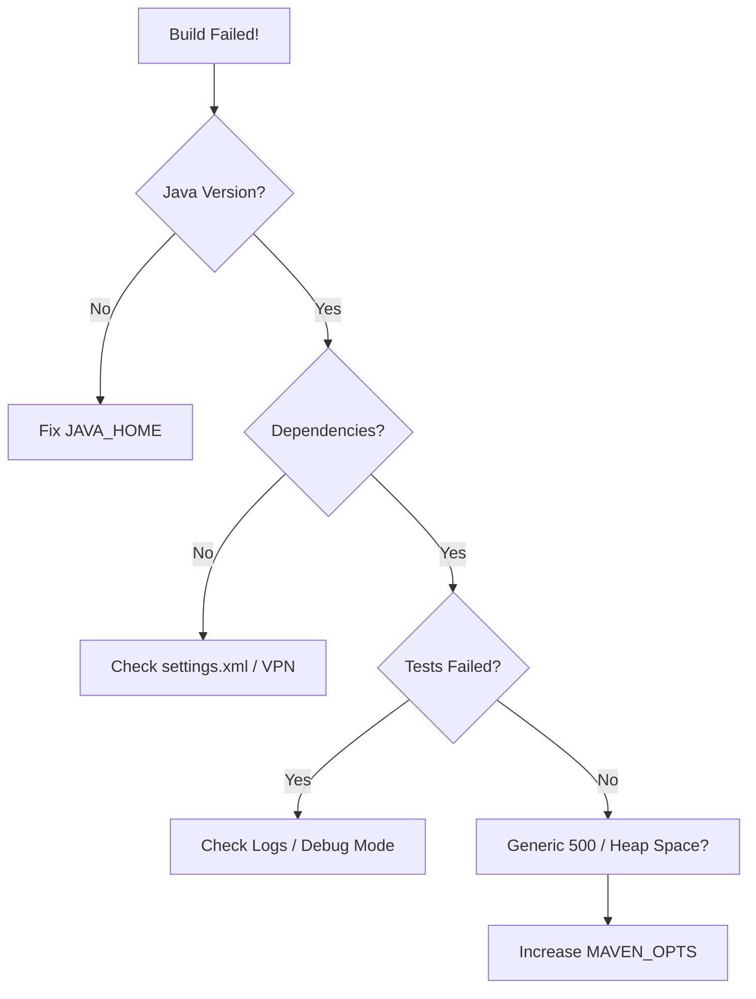

# 🛠️ Module 07: Maven Troubleshooting

> **"A build failure is not a catastrophe; it is a signal. The skill of a DevOps engineer lies in their ability to decode the signal and restore the flow."**



## 📚 Overview
Even the best build scripts fail. Whether it's a corrupted local repository, a network proxy blocking a library, or a "PermGen" memory error, troubleshooting Maven is a core skill for any SRE or developer. 

In this module, we learn the systematic way to debug build failures using Maven's built-in diagnostic tools.

## 🎓 Learning Objectives
- ✅ Use **Debug Mode (`-X`)** to see the full execution trace.
- ✅ Resolve **Corrupted Artifacts** in the local repository.
- ✅ Debug **Network / Repository Connectivity** issues.
- ✅ Manage **MAVEN_OPTS** for memory-intensive builds.
- ✅ Fix the dreaded **"Could not find artifact"** error.

---

## 🏗️ The Debugging Toolkit

| Command | Purpose |
| :--- | :--- |
| `mvn clean install -X` | **Debug**: Shows every internal step Maven takes. |
| `mvn clean install -e` | **Errors**: Shows the full Java stack trace. |
| `mvn clean install -U` | **Update**: Forces Maven to re-check the remote repo for updates. |
| `mvn clean install -o` | **Offline**: Prevents Maven from touching the network. |

---

## 🚀 Common Issues & Fixes

### 1. Corrupted Downloads
If a download is interrupted, Maven might leave a "corrupted" file in your cache.
**The Fix**:
```bash
# Delete the specific folder and force a re-download
rm -rf ~/.m2/repository/com/problem/library
mvn clean install -U
```

### 2. Out of Memory (OOM)
Large projects can run out of Java Heap Space.
**The Fix**:
```bash
export MAVEN_OPTS="-Xmx2048m"
mvn clean install
```

---

## 🏆 Real-World DevOps Story: The Ghost in the Machine

**The Scenario**: A project failed to build on one specific developer's laptop, but worked for everyone else. The error was `ClassNotFoundException`.
**The Discovery**: The developer had manually downloaded a JAR file years ago and put it in their `~/.m2/repository`. That old, broken version was being used instead of the fresh one from the company's Nexus server.
**The Fix**: The SRE team ran `mvn dependency:purge-local-repository`. This wiped every dependency related to the current project and forced a fresh download of the "Source of Truth."
**The Lesson**: The local repository is a cache, and **caches can lie**. If in doubt, **Purge it.**

---

## ❓ Interview Preparation

1. **Q: How do you force Maven to update its snapshot dependencies?**
   *A: Use the `-U` or `--update-snapshots` flag. This tells Maven to ignore its local cache and check the remote repository for newer versions.*

2. **Q: What does 'Offline Mode' (`-o`) do, and when would you use it?**
   *A: It tells Maven to only use the libraries already present in the local repository and never attempt to connect to the internet. This is useful for building on a plane or in a high-security environment with no external access.*

3. **Q: What is the first thing you should check if Maven says it cannot find a library that you know exists?**
   *A: Check your `settings.xml` for correct `<mirrors>` and `<proxies>`. If you are in a corporate network, you likely need a proxy to reach the Central Repository.*

4. **Q: How can you see the detailed logs of why a plugin failed?**
   *A: Run Maven with the `-X` (or `--debug`) flag. It will provide a verbose log including the configuration being passed to the plugin.*

5. **Q: What is the purpose of `MAVEN_OPTS`?**
   *A: It is an environment variable used to pass parameters to the JVM that runs Maven, such as memory limits (`-Xmx`) or system properties.*

---

## 🔗 Next Steps

The tools are mastered. Now it's time to build your own artifacts!

Proceed to: **[Automation Basics](../../01-Automation/README.md)** →