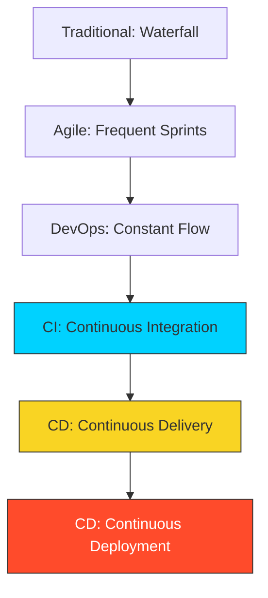

# 📋 Module 01: CI/CD Foundations

> **"CI/CD is not just a tool; it is a culture of high frequency and high confidence."**

## 📚 Overview

Before we touch a single line of YAML, we must understand the "Why." Continuous Integration and Continuous Deployment represent a shift from "Project-based" thinking to "Product-based" thinking. This module covers the essential vocabulary and the fundamental principles that guide a DevOps Engineer's decision-making.

## 🎓 Learning Objectives

- ✅ Define **Continuous Integration (CI)**.
- ✅ Understand the nuance between **Delivery** and **Deployment**.
- ✅ Learn the importance of the **Single Source of Truth** (Git).
- ✅ Master the concept of **"Failing Fast"**.
- ✅ Explore the **Feedback Loop** and its impact on development speed.

---

## 🏗️ The CI/CD Hierarchy

### 1. Continuous Integration (CI)

The practice of merging all developer working copies to a shared mainline several times a day.
- **Requirement**: Automated builds and testing.
- **Goal**: Find and fix bugs quicker.

### 2. Continuous Delivery (CD)

An extension of CI where the code is always in a "Deployable" state.
- **Requirement**: Automated release process to a staging environment.
- **Goal**: Reduce the risk and friction of manual releases.

### 3. Continuous Deployment (CD+)
Every change that passes all stages of your production pipeline is released to your customers.
- **Requirement**: High-quality automated testing and monitoring.
- **Goal**: Maximum speed and zero human intervention.

---

## 🚀 The Core Principles

### I. Single Source of Truth
The version control system (Git) is the only source for building the product. No manual tweaks on servers.

### II. Automate Everything
If you have to do it twice, write a script. Humans are slow and inconsistent; machines are fast and predictable.

### III. Fail Fast
The most expensive part of software development is finding a bug too late. Pipelines should run the fastest/simplest tests first (Linting/Unit) and only proceed to expensive tests (Integration) if the basics pass.

---

## 🏆 Real-World DevOps Story: The Integration Hell

**The Scenario**: In the early 2000s, a software company had 50 developers working on separate "Feature Branches" for six months without ever merging them.
**The Crisis**: When they finally tried to merge all 50 branches together ("The Big Bang Merge"), nothing worked. It took the team **three months** of manual debugging just to get the application to start.
**The Fix**: This experience led to the birth of Modern CI. Today, developers merge their code **every few hours**.
**The Lesson**: Large merges are painful. **Small, frequent merges** are easy.

---

## ❓ Interview Preparation

1. **Q: Why is 'Failing Fast' considered a best practice in CI/CD?**
   *A: It saves time and resources. By running lightweight checks (like linting and unit tests) at the very beginning of the pipeline, we catch the majority of errors in seconds, avoiding the cost of running long-running integration tests or manual reviews on broken code.*

2. **Q: What are the prerequisites for implementing Continuous Deployment?**
   *A: You need a robust suite of automated tests (Unit, Integration, Smoke), a reliable automated rollback mechanism, and high-fidelity monitoring to alert you if a deployment causes a spike in errors.*

3. **Q: How does CI/CD support the 'DevOps' philosophy?**
   *A: It bridges the gap between Development (writing code) and Operations (deploying/running code) by making the transition between the two states automated, transparent, and predictable.*

4. **Q: What is a 'Pipeline as Code'?**
   *A: It is the practice of defining your build and deployment workflows in a version-controlled file (like a `.github/workflows/main.yml`) instead of configuring them manually in a UI.*

5. **Q: What is the 'Feedback Loop' in the context of CI/CD?**
   *A: It is the communication back to the developer after a commit. A fast loop (e.g., "Your build failed in 45 seconds because of a missing semicolon") allows the developer to stay in the flow and fix problems immediately.*

---

## 🔗 Next Steps

The mindset is set. Now let's build the engine.

Proceed to: **[02-GitHub-Actions-Basics](../02-GitHub-Actions-Basics/README.md)** →
