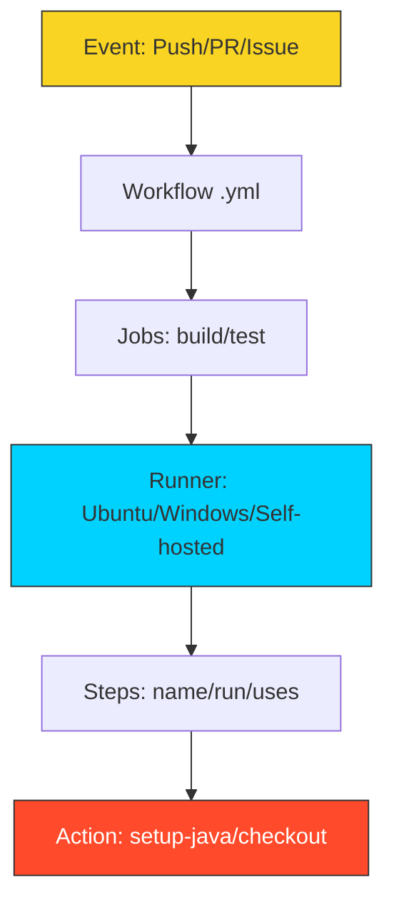

# 🤖 Module 02: GitHub Actions Basics

> **"GitHub Actions is where your repository comes to life. It's not just for CI/CD; it's a platform for automating any event in your software lifecycle."**



## 📚 Overview

GitHub Actions is a powerful automation platform integrated directly into your GitHub repository. It allows you to create **Workflows** that respond to almost any GitHub event. While it's most famous for CI/CD, you can use it to label issues, greet new contributors, or deploy websites.

## 🎓 Learning Objectives

- ✅ Understand the **Workflow Lifecycle** (Event -> Job -> Step).
- ✅ Master the **YAML Syntax** for GitHub Actions.
- ✅ Use **Pre-built Actions** from the GitHub Marketplace.
- ✅ Differentiate between **Shell Commands** and **Actions**.
- ✅ Understand the role of **Runners** (GitHub-hosted vs. Self-hosted).

---

## 🏗️ The Anatomy of a Workflow

Workflows are defined in `.github/workflows/*.yml`.

```yaml
name: My First Workflow
on: [push] # The Event

jobs:
  build_job: # The Job
    runs-on: ubuntu-latest # The Runner
    steps:
      - name: Checkout Code
        uses: actions/checkout@v3 # An Action

      - name: Say Hello
        run: echo "Hello GitHub Actions" # A Shell Command
```

### Key Terms:
- **Event**: The trigger (e.g., `push`, `pull_request`, `schedule`).
- **Job**: A set of steps that run on the same runner. Jobs run in parallel by default.
- **Step**: An individual task. Can be a shell command (`run`) or an action (`uses`).
- **Action**: A reusable application for the GitHub Actions platform.

---

## 🚀 The Marketplace

The **GitHub Marketplace** contains thousands of community-maintained actions.
- `actions/checkout`: Downloads your repository.
- `actions/setup-java`: Installs the JDK.
- `slackapi/slack-github-action`: Sends a message to Slack.

**DevOps Power Tip**: Always use version tags (like `@v3`) to ensure your pipeline doesn't break when an action developer updates their code.

---

## 🏆 Real-World DevOps Story: The Marketplace Malfunction

**The Scenario**: A developer used an unverified action from the marketplace to scan their code. They used the `@latest` tag to always get the newest features.
**The Crisis**: One night, the author of that action was hacked, and a malicious script was injected into the "latest" version. The script stole the company's AWS keys during the next build and started mining Bitcoin.
**The Fix**: The SRE team implemented a policy: Only use verified actions from official publishers (like `actions/` or `google-github-actions/`) and **ALWAYS** pin to a specific version or Git commit hash.
**The Lesson**: Your pipeline has access to your secrets. **Trust but Verify** every action you import.

---

## ❓ Interview Preparation

1. **Q: How do you trigger an action manually?**
   *A: By using the `workflow_dispatch` event in the `on:` block. This creates a "Run workflow" button in the GitHub Actions UI.*

2. **Q: What is the difference between `run` and `uses` in a step?**
   *A: `run` executes a shell command (like `npm install` or `ls -la`). `uses` calls a specific GitHub Action (a reusable package of code, like `actions/checkout`).*

3. **Q: By default, do multiple jobs in a workflow run sequentially or in parallel?**
   *A: They run in **parallel**. To make them run sequentially, you must use the `needs:` keyword (e.g., `job2: needs: job1`).*

4. **Q: What is a 'Runner'?**
   *A: A runner is the virtual machine or container that actually executes the jobs in your workflow. GitHub provides hosted runners for Linux, Windows, and macOS.*

5. **Q: How can you pass data between different steps in the same job?**
   *A: You can use the `$GITHUB_OUTPUT` file or `$GITHUB_ENV` to set environment variables that subsequent steps can read.*

---

## 🔗 Next Steps

You know the syntax. Now let's build complex logic.

Proceed to: **[03-Pipeline-Components](../03-Pipeline-Components/README.md)** →
