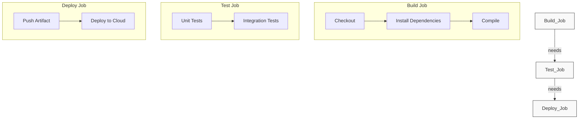

# 🧩 Module 03: Pipeline Components

> **"A good pipeline is like a factory line. Each station adds value, and the final product is only as good as the weakest step in the process."**



## 📚 Overview
Now that we understand the basic syntax of GitHub Actions, it's time to build **Production-Grade Pipelines**. This module covers the advanced logic required to handle multiple environments, secure credentials, and optimize build speeds using caches and parallel execution.

## 🎓 Learning Objectives
- ✅ Orchestrate **Sequential vs. Parallel Jobs**.
- ✅ Securely manage **Secrets and Environment Variables**.
- ✅ Speed up builds with **Dependency Caching**.
- ✅ Use **Matrix Builds** to test across multiple versions.
- ✅ Implement **Conditional Execution** (if/else logic).

---

## 🏗️ Managing State and Secrets

### 1. Secrets (The Safe)
Never put passwords in your YAML. Store them in **Settings > Secrets**.
- **Usage**: `${{ secrets.MY_API_KEY }}`.

### 2. Environment Variables (The Config)
Use the `env:` block to define constants used across your steps.
- **Usage**: `${{ env.DATABASE_URL }}`.

### 3. Caching (The Shortcut)
If your `npm install` takes 5 minutes, use the `actions/cache` action to store the `node_modules` folder and only re-download it if your `package-lock.json` changes.

---

## 🚀 Advanced Pattern: The Matrix Build

Why run one test when you can run ten? Use a **Matrix** to test your code against different OS and Language versions simultaneously.

```yaml
strategy:
  matrix:
    os: [ubuntu-latest, windows-latest, macos-latest]
    java: [11, 17, 21]
```
**Outcome**: GitHub will spawn **9 separate jobs**, ensuring your code works for every customer, regardless of their platform.

---

## 🏆 Real-World DevOps Story: The Million Dollar Secret Leak

**The Scenario**: A developer forgot that GitHub Actions logs are **Public** for public repositories. They used `echo "Deploying with key: $API_KEY"` to debug a failing pipeline.
**The Crisis**: An automated bot scanned the public build logs, found the key within minutes, and used it to provision 1,000 high-end GPU servers for crypto-mining in the company's AWS account.
**The Fix**: The SRE team changed all keys and implemented **Secret Masking**. They also trained the team: GitHub automatically masks secrets with `***`, but only if they are declared correctly in the `secrets` context.
**The Lesson**: Logs are permanent. **Never echo a secret**, even for debugging.

---

## ❓ Interview Preparation

1. **Q: How do you prevent a Deploy job from running if the Test job fails?**
   *A: Use the `needs: [test_job_id]` keyword in the deploy job configuration. This creates a dependency, ensuring the deploy job only starts if the test job completes successfully.*

2. **Q: What is the benefit of a Matrix build?**
   *A: It allows you to maximize "Horizontal Coverage." Instead of writing separate workflows for different versions of Node.js or Python, you can test them all concurrently using a single job definition.*

3. **Q: What is the difference between GITHUB_TOKEN and a Personal Access Token (PAT)?**
   *A: The `GITHUB_TOKEN` is a temporary, secure token provided by GitHub Actions for each run. It has limited permissions and expires after the job. A PAT is manually created by a user and is often used for higher permissions or long-lived tasks.*

4. **Q: How can you optimize a pipeline that takes too long to install dependencies?**
   *A: Use the **Caching** mechanism. By caching the dependency folder (like `.m2/repository` for Maven or `node_modules` for NPM), you can reduce build times by 50-80%.*

5. **Q: What is 'Conditional Execution' (the `if` keyword) used for?**
   *A: It's used to run steps only under certain conditions. For example, `if: github.ref == 'refs/heads/main'` ensures that the "Deploy" step only runs on the main branch.*

---

## 🔗 Next Steps

The pipeline is logical. Now let's make it safe.

Proceed to: **[04-Security-and-Quality-Gates](../04-Security-and-Quality-Gates/README.md)** →
