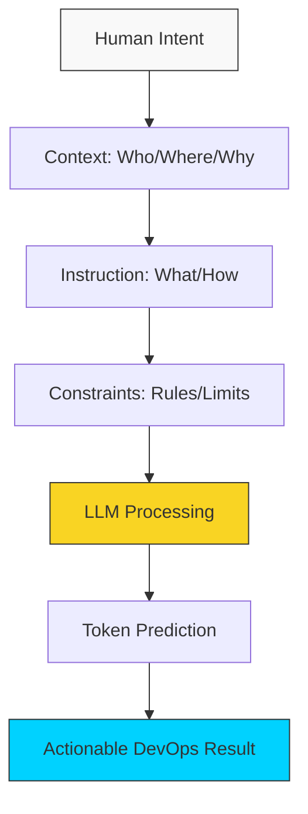

# 🧠 Module 01: Foundations & Mental Models

> **"To command the AI, you must first understand its language. It is not a search engine; it is a calculation engine that predicts the next likely token."**

## 📚 Overview

Before we can use AI for complex DevOps tasks, we must understand the mental models of how Large Language Models (LLMs) operate. This module moves past "asking questions" and introduces the concept of **Intent-Based Communication**. We explore the fundamental difference between a Search Engine (Google) and a Reasoning Engine (GPT/Claude).

## 🎓 Learning Objectives

- ✅ Understand **Tokenization** and how it affects prompt accuracy.
- ✅ Differentiate between **System Prompts** and **User Prompts**.
- ✅ Learn the **Predictive Nature** of LLMs and why they hallucinate.
- ✅ Master the concept of the **"Context Window"**.
- ✅ Adopt the **"Junior Partner"** mental model for AI interaction.

---

## 🏗️ The Core Mental Models

### 1. The Reasoning Engine, Not a Database

LLMs do not "look up" information in a book. They calculate the most likely words to follow your prompt based on patterns they learned during training.

- **DevOps Application**: Ask the AI to "Think step-by-step" before writing a script. This forces the engine to calculate a logical path before committing to code.

### 2. The Context Window

LLMs have a memory limit for each conversation. If you paste a 5,000-line log, the AI might forget the first 1,000 lines.

- **Mastery Tip**: Keep prompts concise. Use "Summarization" to compress long logs before asking for a fix.

### 3. The System Prompt (The Persona)

The System Prompt sets the rules for the AI.

- **Standard**: "You are an AI."
- **DevOps Master**: "You are a Principal Lead SRE with 20 years of experience in high-availability systems. Your code must be POSIX-compliant, include error handling, and be optimized for memory usage."

---

## 🚀 Professional Pattern: Thinking Step-By-Step

When generating a complex automation script, don't just ask for the code. Use **Chain-of-Thought** prompting.

**The Prompt**: *"I need a Bash script to monitor disk space. Before writing the code, list the logic steps you will use to handle different partitions and email notifications."*

**The Result**: The AI will output a logical plan. You can then verify the plan before it writes a single line of potentially dangerous code.

---

## 🏆 Real-World DevOps Story: The Token Trap

**The Scenario**: A developer tried to generate a massive Kubernetes deployment for 50 different microservices in a single prompt. 
**The Crisis**: The AI ran out of "Output Tokens" halfway through the 40th microservice. It stopped in the middle of a YAML block, leaving a broken configuration that caused the build to fail.
**The Fix**: The SRE team learned to **Modularize**. They now prompt for one microservice template first, then ask the AI to "Using the template above, generate the YAML for Service B."
**The Lesson**: Respect the limits. **Modular prompts lead to modular (clean) code.**

---

## ❓ Interview Preparation

1. **Q: What is a 'Hallucination' in an LLM, and how can it break a Linux server?**
   *A: A hallucination is when the AI confidently provides false information. In a Linux context, it might "invent" a flag for a command (e.g., `ls --delete-old`) that doesn't exist, leading to a script crash or, worse, unintended data loss.*

2. **Q: Why is 'Context' the most important part of a prompt?**
   *A: Without context (OS version, language choice, environment specificities), the AI will assume a "Generic" environment. Providing context like "This is for an Ubuntu 22.04 server running Docker 24" ensures the generated commands are compatible.*

3. **Q: What is 'Zero-Shot' vs 'Few-Shot' prompting?**
   *A: Zero-Shot is asking for a task with no examples. Few-Shot is providing 1-3 examples of the desired output style before the actual request. Few-shot drastically improves the consistency of generated YAML or JSON.*

4. **Q: How does the 'Context Window' limit the size of logs you can debug?**
   *A: The context window is the total amount of text the AI can "remember" at once. If your log file is larger than the window, the AI will "forget" the beginning of the log to make room for the end, potentially losing the root cause of an error.*

5. **Q: How can you use 'System Roles' to improve the security of generated code?**
   *A: By telling the AI to "Act as a Security Auditor," you force it to prioritize patterns like input sanitization, least privilege, and credential masking in its output.*

---

## 🔗 Next Steps

The mindset is sharp. Now let's build the toolbox.

Proceed to: **[02-Prompt Toolkit](../02-Prompt-Toolkit/README.md)** →
