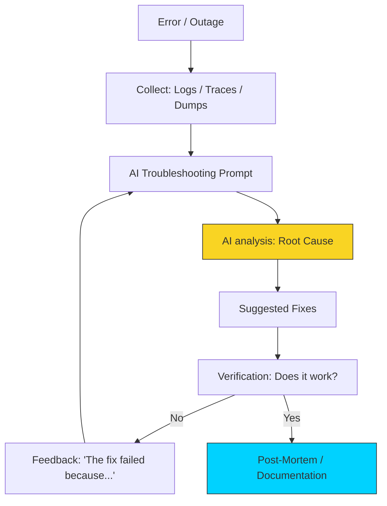

# 🔍 Module 04: Troubleshooting & Debugging

> **"A log file is just a story written in a language that is boring to humans but fascinating to AI. Use AI to find the 'Who-Done-It' in your system traces."**

## 📚 Overview

DevOps engineers spend a significant portion of their time "Fighting Fires." Whether it's a 500 internal server error or a memory leak in a Java app, AI is a world-class diagnostic partner. In this module, we learn how to **interrogate logs**, explain obscure error codes, and use AI to perform **Step-By-Step Debugging**.

## 🎓 Learning Objectives

- ✅ Use AI to **Decode Obscure Logs** (systemd, nginx, k8s).
- ✅ Perform **Root Cause Analysis (RCA)** from error traces.
- ✅ Analyze **Network Packet Captures** (tcpdump) with AI.
- ✅ Debug **Permission and Path** issues in complex scripts.
- ✅ Generate **Post-Mortem Reports** from outage data.

---

## 🏗️ The "Diagnostic" Prompt Strategy

When something breaks, follow this prompt structure:

1. **The Role**: *"Act as a Linux Kernel and Networking Expert."*
2. **The Environment**: *"I am running a Node.js app inside a Docker container on AWS Fargate."*
3. **The Symptom**: *"The app is intermittently timing out when trying to reach the database."*
4. **The Data**: *Paste the last 20 lines of the application logs and 10 lines of the VPC flow logs.*
5. **The Question**: *"Give me the 3 most likely root causes and the commands to verify them."*

---

## 🚀 Case Study: The "Invisible" Memory Leak

AI excels at spotting patterns. If you have a suspect piece of Python or Go code, ask the AI to **"Act as a Memory Profiler."** It can spot non-closed connections, global variables that keep growing, or circular references that the human eye often skims over.

---

## 🏆 Real-World DevOps Story: The 504 Gateway Mystery

**The Scenario**: A major website was throwing "504 Gateway Timeout" errors every day at 12:00 PM. The logs showed Nginx was timing out, but the backend servers looked "Healthy."
**The Discovery**: An engineer fed the Nginx logs and the corresponding AWS Elastic Load Balancer (ELB) logs into an AI.
**The Fix**: The AI noticed a correlation: the timeouts always happened 2 seconds after a specific "Health Check" request. The AI correctly identified that the Nginx `proxy_timeout` was shorter than the backend's response time during a database cleanup job that ran at noon.
**The Result**: The engineer adjusted one line in the Nginx config, and the daily outages vanished.
**The Lesson**: AI can see **correlations across different log sources** that humans miss.

---

## ❓ Interview Preparation

1. **Q: How can AI help in a 'Live Outage' situation?**
   *A: AI can act as a "Force Multiplier" by quickly summarizing thousands of log lines into a few bullet points, explaining rare error codes, and suggesting diagnostic commands (like `netstat`, `top`, or `df`) that you might forget under pressure.*

2. **Q: Can you trust AI to 'Fix' an error automatically?**
   *A: **No.** You should trust AI to **Diagnose**. The fix should always be validated by a human who understands the system's state. AI can suggest the fix, but you must execute it.*

3. **Q: How do you prompt an AI to explain a complex Java stack trace?**
   *A: Paste the trace and use the "Focus" prompt: "Ignore the standard library calls and focus on the 'Caused By' sections in my custom package (com.myapp). What is the root logic error?"*

4. **Q: Why is it helpful to provide the 'Previous State' when debugging?**
   *A: If you say, "This worked yesterday," and provide the changes you made, the AI can perform a "Differential Analysis," identifying exactly which line of code or configuration change induced the current failure.*

5. **Q: How can AI help in writing a 'Post-Mortem'?**
   *A: Once the error is fixed, you can feed the timeline of events and the root cause to the AI and ask it to "Draft a professional Post-Mortem and suggest 3 preventative measures to ensure this never happens again."*

---

## 🔗 Next Steps

The fires are out. Now let's talk about the rules.

Proceed to: **[05-Security & Ethics](../05-Security-and-Ethics/README.md)** →
