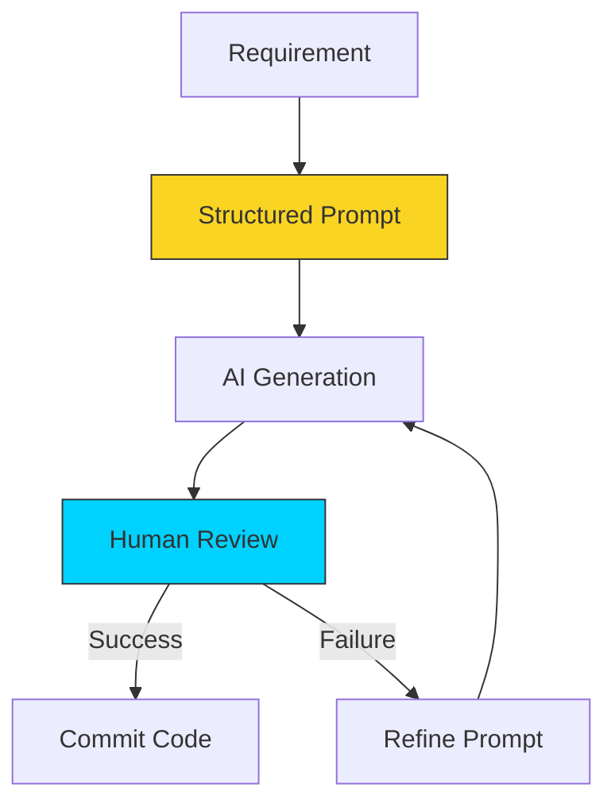

# 🟡 Part 2: DevOps Automation Workflows

> **"Don't ask AI to 'write code.' Ask AI to 'implement a solution.' The difference is in the architecture."**

## 📖 Overview

This is where the rubber meets the road. In this part, we apply our prompt engineering skills to the core tasks of DevOps: **Scripting**, **Infrastructure as Code (IaC)**, and **Troubleshooting**. You will learn how to generate complex Terraform modules, translate legacy scripts, and diagnose cryptic error logs 10x faster than before.

---

## ⚙️ The GenAI Workflow

---

## 🎯 Learning Objectives

By the end of this part, you will:

- ✅ Generate **Idempotent Bash Scripts** with error handling.
- ✅ Create **Terraform Architectures** from high-level descriptions.
- ✅ Use AI to **Explain and Refactor** legacy codebases.
- ✅ Perform **Root Cause Analysis (RCA)** by feeding logs to the AI.
- ✅ Translate code from one language to another (e.g., Python to Go).

---

## 🗺️ Included Modules

1. **[03-Automating-Code-and-IaC](./03-Automating-Code-and-IaC/README.md)**: Generating scripts, YAML, and HCL.
2. **[04-Debugging-with-AI](./04-Debugging-with-AI/README.md)**: Log analysis, error explanation, and bug fixing.

---

## 🎓 Career Readiness

**Interview Question:** "How do you verify code generated by an AI?"

**Strong Answer:** "I treat AI-generated code exactly like code from a junior developer. I review it for logic flaws, security vulnerabilities (like hardcoded secrets), and adherence to our style guide. I **never** copy-paste directly to production. I run it in a sandbox environment first to verify it works as expected."

---

**Next Step**: Start automating in **[03-Automating-Code-and-IaC](./03-Automating-Code-and-IaC/README.md)** 🚀
